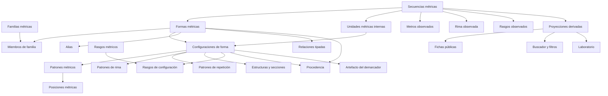

# Arquitectura del dominio de formas métricas

Fecha: 28 de julio de 2026

Estado: borrador de arquitectura para revisión; no implementado

Documentos relacionados:

- [Propuesta conceptual](./propuesta-dominio-metrica.md)
- [Auditoría del vocabulario actual](./informe-auditoria-vocabulario-metrico.md)
- [Matriz de reclasificación](./matriz-reclasificacion-formas-metricas.md)
- [Ejemplos de formalización](./ejemplos-formalizacion-ontologia-metrica.md)

## 1. Decisión arquitectónica

METADRAMA tendrá un dominio métrico propio, separado de `vocabularios`. La base de datos normalizada será la fuente de verdad. Los datos destinados al editor, al buscador público, a las fichas, al laboratorio y al demarcador se obtendrán mediante proyecciones explícitas.

La separación fundamental será:

1. **catálogo formal:** qué formas, configuraciones, patrones y rasgos reconoce el proyecto;
2. **anotación editorial:** qué se ha identificado u observado en una secuencia concreta;
3. **proyecciones derivadas:** qué datos se publican, filtran, agregan o compilan.

No se migrará la jerarquía actual de forma literal.

## 2. Objetivos

- Representar únicamente como formas las identidades métricas que puedan asignarse a una secuencia.
- Separar familias organizativas, configuraciones, patrones y rasgos.
- Expresar alternativas y secuencias ordenadas de metros.
- Distinguir lo fijo, lo admitido, lo preferente, lo variable y lo desconocido.
- Mantener procedencia y estado de revisión.
- Permitir preguntas reproducibles y explicables en el demarcador.
- Producir filtros públicos semánticamente independientes.
- Conservar sin pérdida las anotaciones reales de las obras durante una migración aditiva.
- Permitir evolución futura sin convertir cada nuevo rasgo en una subforma.

## 3. No objetivos de la primera fase

- Codificar desde el inicio todas las variantes históricas de la métrica española.
- Crear una ontología universal independiente de las necesidades de METADRAMA.
- Introducir un modelo generativo en la clasificación en tiempo real.
- Sustituir inmediatamente todos los RPC y resúmenes públicos.
- Eliminar `estrofa_tipo` antes de comprobar la equivalencia de los resultados.
- Resolver mediante un único esquema todas las particularidades de verso, estrofa, serie y poema.

## 4. Datos persistentes y datos regenerables

La migración distingue expresamente dos niveles.

### Datos reales que deben preservarse

- filas de `secuencias_metricas`;
- obra, rango `v_ini`–`v_fin` y número de versos de cada secuencia;
- `estrofa_tipo_id` actual como evidencia de la clasificación realizada;
- subtipos o unidades internas y sus rangos;
- caracterizaciones métricas por rango;
- observaciones editoriales;
- relaciones necesarias para identificar autoría y contexto de la anotación;
- fechas y responsables disponibles.

Antes de modificar estos datos se hará una copia de seguridad y un inventario de uso por UUID. Ninguna entrada utilizada se migrará mediante una regla genérica no revisada.

### Datos que pueden descartarse y regenerarse

- `obras_resumen`;
- `autores_resumen`;
- perfiles, tramos y facetas precomputadas;
- payloads de las fichas públicas de prueba;
- índices o artefactos del laboratorio derivados de esos resúmenes;
- versiones de prueba del nuevo demarcador que no estén publicadas como referencia.

La web todavía no está abierta al público y las fichas actuales son de prueba. No es necesario mantener compatibilidad de contenido con esas proyecciones. Se reconstruirán desde el nuevo modelo una vez validadas las anotaciones reales.

## 5. Problemas del contrato actual

### 5.1. Entidad genérica

`vocabularios` almacena en una misma fila datos terminológicos y datos propios del dominio métrico:

- `termino_padre_id`;
- `patron_especifico`;
- `tipo_forma`;
- `tipo_rima_id`;
- `naturaleza_estrofica_id`;
- `tamanio_unidad_estrofica`;
- `arte_metrico`;
- `numero_silabas`.

Los campos son opcionales para que la tabla pueda albergar otras categorías. Esa flexibilidad impide garantizar que una forma tenga la estructura necesaria y permite estados ambiguos.

### 5.2. Jerarquía convertida en semántica

El padre actual sirve simultáneamente para:

- agrupar;
- heredar;
- decidir qué puede seleccionar el editor;
- validar subtipos internos;
- colapsar perfiles públicos;
- organizar filtros;
- generar familias del demarcador.

Una modificación taxonómica cambia, por tanto, cálculos y comportamiento editorial aunque solo pretendiera reorganizar el vocabulario.

### 5.3. Definición y observación confundidas

`estrofa_tipo_metros` expresa los metros que caracterizan o admite una forma. Los resúmenes actuales los tratan como metros presentes en una obra. Esto puede:

- afirmar como observado un metro que solo era posible;
- omitir un metro heredado por un hijo;
- perder el orden característico de las medidas.

La misma separación es necesaria para la rima y otros rasgos.

### 5.4. Excepción de quintilla

Los hijos de quintilla se ocultan del selector principal y se guardan como subtipos internos por rango. Los demás hijos suelen seleccionarse directamente. La diferencia no procede de una semántica declarada en los datos, sino de una excepción de interfaz.

## 6. Principios del nuevo modelo

1. **Una forma es asignable.** Si una entrada no puede identificar una secuencia, no pertenece a `formas_metricas`.
2. **Una familia organiza.** No se guarda como clasificación de una secuencia.
3. **Una configuración formaliza una alternativa.** Dos configuraciones de una forma no son automáticamente dos formas.
4. **Un patrón describe orden.** Los metros no se reducen a un conjunto sin posiciones.
5. **Un rasgo es transversal.** Puede aparecer en formas diferentes sin duplicarlas.
6. **La ausencia tiene estado.** No se interpreta `null` como herencia automática.
7. **Definición y observación son capas distintas.**
8. **Los datos derivados declaran su procedencia.**
9. **Las relaciones están tipadas.**
10. **La publicación es versionada y reproducible.**

## 7. Modelo conceptual

## 8. Catálogo formal

### 8.1. `formas_metricas`

Representa una identidad métrica seleccionable o una salida editorial residual.

| Campo | Tipo orientativo | Regla |
| --- | --- | --- |
| `forma_id` | `uuid` | Clave estable. Cuando sea posible se reutilizará el UUID legado. |
| `slug` | `text` | Único, normalizado y estable. |
| `nombre` | `text` | Nombre preferido visible. |
| `definicion` | `text` | Definición editorial. |
| `nivel_estructural_id` | FK | Verso, estrofa, serie, composición o forma compuesta. |
| `seleccionable` | `boolean` | Puede asignarse a una secuencia. |
| `residual` | `boolean` | Salida editorial, no candidata ordinaria del demarcador. |
| `estado_revision` | FK o valor controlado | Borrador, revisada, aprobada o retirada. |
| `activo` | `boolean` | Disponible para nuevos usos. |
| `orden` | `integer` | Orden editorial, no jerarquía semántica. |
| `created_at` / `updated_at` | `timestamptz` | Auditoría técnica. |

`arte_metrico` no se almacenará como verdad primaria: se derivará de las configuraciones métricas. El origen español o italiano tampoco actuará como rasgo demarcador; si se conserva, será una relación documentada con una tradición.

### 8.2. `familias_metricas`

Representa agrupaciones editoriales, históricas o de navegación.

Campos mínimos:

- `familia_id`;
- `slug`;
- `nombre`;
- `descripcion`;
- `familia_padre_id`, solo si se necesita una navegación anidada;
- `estado_revision`;
- `orden`;
- `activo`.

Una familia no será asignable a `secuencias_metricas`.

### 8.3. `familias_formas`

Relación potencialmente muchos-a-muchos:

- `familia_id`;
- `forma_id`;
- `es_principal`;
- `orden`;
- `nota`.

`es_principal` permitirá ofrecer un árbol sencillo en las interfaces sin negar otras pertenencias válidas.

### 8.4. `forma_aliases`

- `alias_id`;
- `forma_id`;
- `nombre`;
- `slug_normalizado`;
- `tipo_alias`: equivalente, variante gráfica, nombre histórico o abreviatura;
- `idioma`;
- `preferente`;
- `fuente_id`, si procede.

Los alias no tendrán configuraciones ni podrán asignarse como formas independientes.

### 8.5. `forma_relaciones`

Relaciones entre dos formas reales:

- `forma_origen_id`;
- `forma_destino_id`;
- `tipo_relacion_id`;
- `direccion`;
- `nota`;
- `estado_revision`;
- `fuente_id`.

Tipos iniciales posibles:

- `subtipo_de`;
- `variante_historica_de`;
- `derivada_de`;
- `relacionada_con`;
- `contrasta_con`.

`equivalente_de` se reservará para equivalencias conceptuales reales. Los nombres alternativos irán en `forma_aliases`.

## 9. Configuraciones formales

### 9.1. `configuraciones_forma`

Una configuración es una realización estructural admitida por una forma.

| Campo | Función |
| --- | --- |
| `configuracion_id` | Clave estable. |
| `forma_id` | Forma a la que pertenece. |
| `slug` / `nombre` | Identificación editorial de la alternativa. |
| `descripcion` | Explicación de la configuración. |
| `principal` | Configuración prototípica de la forma. |
| `demarcable` | Puede intervenir en la compilación del demarcador. |
| `grado` | Fija, canónica, admitida, rara o irregular documentada. |
| `estado_revision` | Flujo de aprobación. |
| `activo` | Disponible para nuevos usos. |

Una configuración puede existir sin recibir un nombre público. Los patrones `ababa` y `abbab` de quintilla, por ejemplo, pueden ser configuraciones internas sin convertirse en opciones del selector principal.

### 9.2. `patrones_metricos`

Describe el comportamiento de las medidas dentro de una configuración:

- `patron_metrico_id`;
- `configuracion_id`;
- `ambito`: unidad, estrofa, serie, sección o composición;
- `tipo`: secuencia fija, conjunto permitido, secuencia repetible o abierta;
- `longitud_minima`;
- `longitud_maxima`;
- `descripcion`;
- `estado_revision`.

### 9.3. `patron_metrico_posiciones`

Conserva el orden cuando existe:

- `patron_metrico_id`;
- `posicion`;
- `metro_id`;
- `opcional`;
- `grupo_repeticion`;
- `alternativa`;
- `nota`.

Para una sextilla manriqueña se podrán declarar posiciones ordenadas como `8, 8, 4, 8, 8, 4`. Las alternativas no se reducirán al conjunto `{4, 8}`.

Los metros podrán mantenerse inicialmente como catálogo controlado existente, pero deberán quedar tras una FK de dominio validada. En una fase posterior podrá valorarse extraer también `metro` de `vocabularios`.

### 9.4. `patrones_rima`

- `patron_rima_id`;
- `configuracion_id`;
- `esquema`;
- `regimen_rima_id`;
- `ambito`;
- `fijeza`: fijo, admitido, preferente, libre o no aplicable;
- `descripcion`;
- `estado_revision`.

Convenciones mínimas:

- letras iguales representan correspondencia de rima;
- mayúsculas y minúsculas podrán codificar arte métrico solo si se conserva expresamente esa convención;
- `-` o `X` representarán verso no rimado con una única política documentada;
- el timbre asonante no se incrustará en la identidad de la forma.

### 9.5. `estructuras_secciones`

Necesaria para villancico, zéjel, sextina, canción y otras formas compuestas:

- `seccion_id`;
- `configuracion_id`;
- `seccion_padre_id`;
- `tipo_seccion_id`;
- `orden`;
- `repeticiones_min`;
- `repeticiones_max`;
- `versos_min`;
- `versos_max`;
- `patron_metrico_id`, si la sección tiene uno;
- `patron_rima_id`, si la sección tiene uno.

La relación recursiva se limitará a la estructura interna de una configuración y no sustituirá las familias.

### 9.6. `patrones_repeticion`

Representa repeticiones que no son reducibles al esquema de rima:

- `patron_repeticion_id`;
- `configuracion_id`;
- `tipo`: palabra final, verso, estribillo, sección u otro valor controlado;
- `ambito`;
- `regla`;
- `fijeza`;
- `descripcion`;
- `estado_revision`.

Cuando el orden sea relevante, `patron_repeticion_posiciones` declarará:

- bloque o iteración;
- posición;
- posición de origen o referencia;
- etiqueta funcional;
- condición opcional.

Esta dimensión permite formalizar, por ejemplo, la permutación de palabras finales de la sextina o la repetición del estribillo de una forma compuesta sin confundirlas con rima convencional.

## 10. Rasgos métricos

### 10.1. `rasgos_metricos`

Catálogo de propiedades transversales:

- `rasgo_id`;
- `slug`;
- `nombre`;
- `definicion`;
- `tipo_valor`: booleano, categoría, número o texto controlado;
- `observable_por_editor`;
- `util_demarcador`;
- `activo`.

Ejemplos:

- pie quebrado;
- mayoría de finales esdrújulos;
- dístico final;
- pareados intercalados;
- rima interna encadenada;
- timbre de asonancia;
- irregularidad.

### 10.2. `rasgo_valores`

Para rasgos categóricos:

- `rasgo_valor_id`;
- `rasgo_id`;
- `slug`;
- `nombre`;
- `orden`.

### 10.3. `configuracion_rasgos`

Declara cómo interviene un rasgo en una configuración:

- `configuracion_id`;
- `rasgo_id` o `rasgo_valor_id`;
- `modalidad`: requerido, admitido, preferente o excluido;
- valor o umbral, cuando corresponda;
- fuente y nota.

No se utilizará esta tabla como EAV general para tamaño, metros o rima: esas dimensiones conservan tablas específicas.

## 11. Procedencia y revisión

### 11.1. `fuentes_metricas`

- `fuente_id`;
- tipo bibliográfico;
- autoría;
- título;
- año;
- datos de publicación;
- DOI o URL;
- cita normalizada;
- nota.

### 11.2. Enlaces de procedencia

Las afirmaciones podrán vincular fuentes con:

- formas;
- configuraciones;
- patrones;
- relaciones;
- rasgos.

La implementación deberá conservar integridad referencial. Se prefieren tablas de enlace específicas o una tabla con FKs opcionales y una restricción que exija exactamente un destino, frente a un par polimórfico sin FK.

Cada enlace podrá declarar:

- localizador o página;
- fragmento resumido;
- responsable de la interpretación;
- nivel de confianza;
- estado de revisión.

## 12. Anotación editorial

### 12.1. `secuencias_metricas.forma_metrica_id`

Se añadirá de manera aditiva y coexistirá temporalmente con `estrofa_tipo_id`.

Reglas:

- solo puede apuntar a una forma activa y seleccionable;
- no puede apuntar a una familia, patrón, alias o rasgo;
- una clasificación residual debe quedar identificada como tal;
- desconocido se expresa mediante ausencia de clasificación, no mediante una falsa forma.

### 12.2. `secuencia_configuraciones`

Permite indicar que toda una secuencia corresponde a una configuración:

- `secuencia_id`;
- `configuracion_id`;
- `origen`: editor, migración o inferencia;
- `certeza`;
- `observaciones`.

Debe validarse que la configuración pertenezca a la forma asignada.

### 12.3. `unidades_metricas`

Sustituirá conceptualmente los subtipos internos:

- `unidad_id`;
- `secuencia_id`;
- `v_ini`;
- `v_fin`;
- `configuracion_id`;
- `orden`;
- `observaciones`.

Una unidad representa una realización interna: por ejemplo, una quintilla concreta dentro de una tirada de quintillas. No afirma que `ababa` sea una forma independiente.

### 12.4. Observaciones específicas

Se recomiendan tablas explícitas:

- `secuencia_metros_observados`;
- `secuencia_rima_observada`;
- `secuencia_rasgos_observados`.

Todas podrán incluir:

- `secuencia_id`;
- `v_ini` y `v_fin`;
- valor observado;
- `origen`;
- `certeza`;
- `observaciones`.

Esto permite distinguir:

- lo observado directamente;
- lo inferido necesariamente desde la configuración;
- lo desconocido;
- lo meramente posible.

Las caracterizaciones de rango actuales podrán reutilizarse o migrarse cuando su semántica coincida. No se debe crear un segundo sistema paralelo sin revisar primero sus categorías.

## 13. Estados semánticos

Para rasgos opcionales y restricciones se adoptarán estados explícitos:

- `declarado`;
- `heredado` solo durante compatibilidad o cuando exista una regla formal;
- `variable`;
- `no_fijo`;
- `no_aplica`;
- `desconocido`.

En el modelo nuevo se evitará que la herencia dependa simplemente de que un campo sea `null`.

## 14. Proyecciones y consumidores

### 14.1. Editor

Contrato propuesto:

1. seleccionar forma;
2. seleccionar configuración, si se conoce;
3. registrar observaciones;
4. añadir unidades internas cuando existan;
5. revisar advertencias de compatibilidad sin bloquear borradores incompletos.

El selector mostrará formas, no todas las entidades del catálogo. Las familias solo organizarán visualmente las opciones.

### 14.2. Fichas públicas

La proyección deberá suministrar:

- forma canónica y etiqueta;
- configuración identificada;
- unidades internas;
- rasgos publicables;
- clave estable de color.

No es necesario conservar el contenido ni el contrato de las fichas públicas de prueba. El payload se rediseñará y se regenerará desde las anotaciones migradas.

### 14.3. Buscador público

Las facetas se separarán:

- formas;
- familias;
- metros observados o necesariamente implicados;
- regímenes de rima;
- configuraciones;
- rasgos.

No se presentará una lista combinada de formas y subtipos.

Para consultas eficientes podrán materializarse tablas como:

- `obra_formas_presentes`;
- `obra_metros_presentes`;
- `obra_rimas_presentes`;
- `obra_rasgos_presentes`.

Cada fila derivada debería conservar `origen` —observado o implicado— cuando la diferencia afecte al significado del filtro.

### 14.4. Laboratorio

Los perfiles composicionales se calcularán sobre formas canónicas. Las configuraciones y rasgos serán dimensiones separadas. Esto evita que dos obras parezcan muy diferentes solo porque una codificó un esquema de rima como hijo y otra no.

### 14.5. Demarcador

Un compilador generará un artefacto versionado a partir de:

- formas activas, aprobadas, seleccionables y no residuales;
- configuraciones aprobadas y demarcables;
- patrones y rasgos observables;
- textos de pregunta revisados.

El artefacto incluirá:

- versión de esquema;
- revisión del catálogo;
- huella de la fuente;
- candidatos;
- alternativas completas;
- procedencia de cada regla;
- fecha y responsable de publicación.

La versión pública no cambiará con cada edición del catálogo. Solo cambiará mediante una acción de publicación.

## 15. Datos derivados e invalidación

Se introducirá una revisión global o huella del catálogo métrico. Servirá para:

- saber con qué revisión se calculó un resumen;
- marcar como obsoletas las proyecciones afectadas;
- recompilar el demarcador;
- comparar resultados antes y después de una decisión del IP.

Cambios puramente editoriales, como una etiqueta, podrán resolverse en lectura sin recalcular perfiles. Cambios semánticos, como reasignar una configuración o alterar una regla métrica, deberán invalidar las obras afectadas o ejecutar una regeneración global controlada.

## 16. Integridad, permisos y auditoría

### Integridad

- `slug` único por entidad.
- No se eliminan físicamente formas ya utilizadas; se retiran.
- Una configuración solo pertenece a una forma.
- Una configuración asignada debe corresponder a la forma de la secuencia.
- Las posiciones de un patrón son únicas y consecutivas cuando el patrón es fijo.
- Las familias no son seleccionables.
- Las relaciones `subtipo_de` no pueden formar ciclos.
- Las unidades internas deben quedar dentro del rango de su secuencia.
- Los solapamientos se validarán según el tipo de unidad, no mediante una prohibición universal.

### Permisos

- público: lectura de catálogo y configuraciones publicadas;
- editor: lectura del catálogo aprobado y escritura de anotaciones dentro de sus capacidades;
- IP o rol autorizado: edición, revisión y aprobación del catálogo;
- publicación del demarcador: acción privilegiada y auditada.

### Historial

Como mínimo se conservarán `created_at`, `updated_at` y responsable. Para decisiones críticas conviene un historial de revisiones o un registro de cambios que permita reconstruir qué reglas estaban vigentes cuando se generó un artefacto.

## 17. Compatibilidad y migración

### 17.1. Matriz de correspondencias

La base necesitará dos tablas temporales o permanentes de trazabilidad:

`migracion_terminos_metricos`

- un registro por `vocabularios.termino_id`;
- clasificación de origen;
- decisión;
- estado de revisión;
- certeza;
- notas.

`migracion_termino_destinos`

- un término legado puede producir varios destinos;
- `forma_id`;
- `configuracion_id`;
- `patron_rima_id`;
- `rasgo_id`;
- tipo de operación: conservar, fusionar, transformar, retirar o revisar.

Esto es necesario porque `soneto_de_esdrújulos`, por ejemplo, se transforma en la forma soneto y un rasgo, no en un único registro equivalente.

### 17.2. Reutilización de UUID

Cuando una entrada actual sobreviva como forma canónica, se recomienda reutilizar su UUID en `formas_metricas`. Facilita el backfill y la trazabilidad, aunque durante la transición el mismo valor exista en dos tablas diferentes.

Las entradas transformadas en patrones o rasgos conservarán su UUID legado solo en la tabla de correspondencias.

### 17.3. Protección de las anotaciones durante el cambio

Durante la transición de los datos reales:

- `estrofa_tipo_id` seguirá existiendo;
- se añadirá `forma_metrica_id`;
- se conservará una instantánea de las filas originales;
- cada fila migrada registrará la regla y los destinos aplicados;
- se compararán recuentos, rangos y cobertura antes de habilitar la escritura nueva;
- ninguna escritura nueva dependerá indefinidamente de dos fuentes.

No es obligatorio mantener lectura dual para las proyecciones públicas. Podrán vaciarse y regenerarse después del corte. La escritura dual sobre anotaciones se evitará si es posible; si resulta necesaria, se limitará a una fase corta y controlada.

### 17.4. Auditoría obligatoria antes del backfill

Se generará un informe con:

- número de secuencias total y por `estrofa_tipo_id`;
- términos activos e inactivos realmente utilizados;
- secuencias que apuntan a raíces, hijos o entradas pendientes;
- número y rango de `secuencias_subtipos_estrofa`;
- caracterizaciones por rango relacionadas con métrica;
- referencias huérfanas o inconsistentes;
- obras afectadas por cada regla de reclasificación.

Ese informe será la línea base de aceptación de la migración.

## 18. Fases de implementación

### Fase 0 — decisión semántica y línea base

- revisar la matriz de 119 entradas;
- inventariar todas las anotaciones reales y hacer copia de seguridad;
- aprobar qué es forma, familia, configuración, patrón, rasgo, alias o residual;
- resolver las decisiones marcadas con certeza baja;
- aprobar vocabulario de relaciones y estados.

Criterio de salida: las 119 entradas tienen destino aprobado o una excepción explícita y existe una línea base verificable de todas las anotaciones.

### Fase 1 — esquema aditivo

- crear tablas del catálogo;
- crear restricciones, RLS y tipos TypeScript;
- crear administración inicial;
- no cambiar todavía secuencias ni superficies públicas.

Criterio de salida: el catálogo nuevo puede editarse y validarse en paralelo.

### Fase 2 — importación del catálogo

- insertar formas y familias;
- crear configuraciones, patrones y rasgos;
- cargar fuentes disponibles;
- generar correspondencias;
- comparar automáticamente la cobertura.

Criterio de salida: ninguna entrada legada queda sin destino.

### Fase 3 — migración de anotaciones

- añadir `forma_metrica_id`;
- backfill de secuencias;
- transformar hijos que eran patrones o rasgos;
- migrar `secuencias_subtipos_estrofa` a unidades/configuraciones;
- producir informes de discrepancias.

Criterio de salida:

- toda anotación usada por una obra tiene representación nueva o incidencia documentada;
- coinciden los recuentos de secuencias y rangos;
- ninguna asignación antigua queda sin correspondencia;
- cada transformación compuesta conserva forma, configuración y rasgos;
- una restauración de la copia de seguridad ha quedado ensayada.

### Fase 4 — editor

- sustituir el selector de vocabulario por el selector del dominio;
- añadir configuración y observaciones;
- eliminar la excepción específica de quintilla;
- mantener lectura de registros legados durante la transición.

Criterio de salida: los editores pueden crear y modificar secuencias sin escribir `estrofa_tipo_id`.

### Fase 5 — proyecciones públicas

- vaciar las proyecciones de prueba anteriores;
- rediseñar fichas, catálogo, autores y laboratorio;
- recalcular perfiles canónicos;
- generar facetas separadas;
- regenerar todos los resúmenes desde las anotaciones migradas;
- validar semánticamente las nuevas facetas.

Criterio de salida: las superficies públicas no consultan la jerarquía de `estrofa_tipo`.

### Fase 6 — demarcador

- compilar desde formas y configuraciones aprobadas;
- probar rutas objetivo;
- publicar una versión revisada;
- conservar temporalmente el demarcador legacy.

Criterio de salida: el resultado no depende de `termino_padre_id`.

### Fase 7 — retirada

- hacer `estrofa_tipo` de solo lectura;
- retirar FKs y servicios legados cuando no tengan consumidores;
- conservar tablas de correspondencia e historial;
- eliminar columnas métricas de `vocabularios` solo si ninguna otra categoría las usa.

## 19. Pruebas de aceptación

Casos mínimos:

1. Copla real con 8 sílabas.
2. Copla real con 8 y 4 sílabas.
3. Quintilla con unidades internas de varios esquemas.
4. Romance con timbre asonante sin crear una nueva forma.
5. Soneto con finales esdrújulos.
6. Sextilla manriqueña con patrón ordenado.
7. Silva con datos parcialmente desconocidos.
8. Villancico con secciones.
9. Sextina como composición 6 × 6 + 3.
10. Forma residual irregular sin competir como candidata normal.
11. Filtro de metro que no atribuye medidas meramente posibles.
12. Perfil de obra que no cuenta patrones como formas distintas.
13. Igual número de secuencias antes y después de la migración.
14. Igualdad exacta de obra, `v_ini`, `v_fin` y `n_versos`.
15. Toda asignación legada puede trazarse hasta sus destinos nuevos.
16. Todos los subtipos internos conservan su rango como unidad o incidencia revisable.

## 20. Riesgos

| Riesgo | Mitigación |
| --- | --- |
| Reclasificar erróneamente una entrada usada | Matriz revisada, correspondencias y lectura dual. |
| Perder anotaciones de hijos actuales | Copia de seguridad, backfill por tipo de destino y auditoría de cada UUID usado. |
| Sobremodelar antes de conocer los casos | Implementar primero el núcleo y ampliar secciones complejas con casos reales. |
| Duplicar fuentes de verdad | Definir por fase qué tablas admiten escritura. |
| Arrastrar errores de resúmenes de prueba | Descartarlos y regenerarlos desde el modelo nuevo. |
| Convertir rasgos en EAV incontrolado | Tablas específicas para dimensiones centrales y catálogo cerrado de rasgos. |
| Hacer el editor demasiado complejo | Divulgación progresiva: forma primero, detalles opcionales después. |

## 21. Decisiones pendientes del IP

- Inventario final de formas canónicas.
- Política décima / espinela.
- Política octava real / octava real regular.
- Tratamiento de copla real con pie quebrado.
- Alcance de “copla de pie quebrado”.
- Identidad de las variantes de silva y sus umbrales.
- Redondilla cruzada frente a cuarteta.
- Si los metros de romancillo constituyen formas o configuraciones.
- Tratamiento de terceto octosílabo.
- Qué salidas residuales deben estar disponibles para el editor.
- Qué rasgos son observables y útiles para el demarcador.

Estas decisiones afectan a la carga del catálogo, pero no impiden aprobar la separación arquitectónica ni crear el esquema aditivo.
