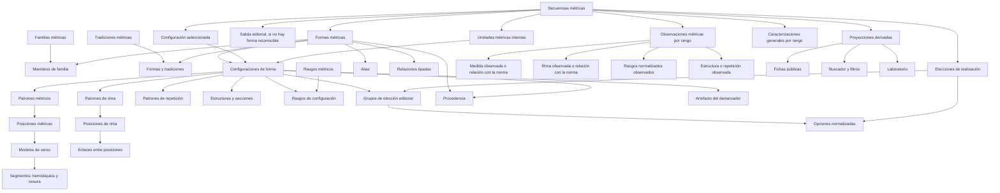

# Arquitectura del dominio de formas métricas

Fecha: 28 de julio de 2026

Estado: primera fase aditiva implementada en `develop`; catálogo pendiente de revisión

La implementación actual incluye las tablas del catálogo, la carga provisional
de la matriz, el gestor `/dashboard/metrica` y la compilación de pruebas
internas del demarcador. No se ha migrado ninguna declaración de las
secuencias.

Documentos relacionados:

- [Propuesta conceptual](./propuesta-dominio-metrica.md)
- [Auditoría del vocabulario actual](./informe-auditoria-vocabulario-metrico.md)
- [Matriz de reclasificación](./matriz-reclasificacion-formas-metricas.md)
- [Ejemplos de formalización](./ejemplos-formalizacion-ontologia-metrica.md)

## 1. Decisión arquitectónica

METADRAMA tendrá un dominio métrico propio, separado de `vocabularios`. La base de datos normalizada será la fuente de verdad. Los datos destinados al editor, al buscador público, a las fichas, al laboratorio y al demarcador se obtendrán mediante proyecciones explícitas.

La separación fundamental será:

1. **catálogo formal:** qué formas, configuraciones, patrones y rasgos reconoce el proyecto;
2. **anotación editorial:** qué se ha identificado u observado en una secuencia concreta;
3. **proyecciones derivadas:** qué datos se publican, filtran, agregan o compilan.

No se migrará la jerarquía actual de forma literal.

## 2. Objetivos

- Representar únicamente como formas las identidades métricas que puedan asignarse a una secuencia.
- Separar familias organizativas, configuraciones, patrones y rasgos.
- Expresar alternativas y secuencias ordenadas de metros.
- Distinguir lo fijo, lo admitido, lo preferente, lo variable y lo desconocido.
- Mantener procedencia y estado de revisión.
- Permitir preguntas reproducibles y explicables en el demarcador.
- Producir filtros públicos semánticamente independientes.
- Conservar sin pérdida las anotaciones reales de las obras durante una migración aditiva.
- Permitir evolución futura sin convertir cada nuevo rasgo en una subforma.

## 3. No objetivos de la primera fase

- Codificar desde el inicio todas las variantes históricas de la métrica española.
- Crear una ontología universal independiente de las necesidades de METADRAMA.
- Introducir un modelo generativo en la clasificación en tiempo real.
- Sustituir inmediatamente todos los RPC y resúmenes públicos.
- Eliminar `estrofa_tipo` antes de comprobar la equivalencia de los resultados.
- Resolver mediante un único esquema todas las particularidades de verso, estrofa, serie y poema.

## 4. Datos persistentes y datos regenerables

La migración distingue expresamente dos niveles.

### Datos reales que deben preservarse

- filas de `secuencias_metricas`;
- obra, rango `v_ini`–`v_fin` y número de versos de cada secuencia;
- `estrofa_tipo_id` actual como evidencia de la clasificación realizada;
- subtipos o unidades internas y sus rangos;
- caracterizaciones métricas por rango;
- observaciones editoriales;
- relaciones necesarias para identificar autoría y contexto de la anotación;
- fechas y responsables disponibles.

Antes de modificar estos datos se hará una copia de seguridad y un inventario de uso por UUID. Ninguna entrada utilizada se migrará mediante una regla genérica no revisada.

### Datos que pueden descartarse y regenerarse

- `obras_resumen`;
- `autores_resumen`;
- perfiles, tramos y facetas precomputadas;
- payloads de las fichas públicas de prueba;
- índices o artefactos del laboratorio derivados de esos resúmenes;
- versiones de prueba del nuevo demarcador que no estén publicadas como referencia.

La web todavía no está abierta al público y las fichas actuales son de prueba. No es necesario mantener compatibilidad de contenido con esas proyecciones. Se reconstruirán desde el nuevo modelo una vez validadas las anotaciones reales.

## 5. Problemas del contrato actual

### 5.1. Entidad genérica

`vocabularios` almacena en una misma fila datos terminológicos y datos propios del dominio métrico:

- `termino_padre_id`;
- `patron_especifico`;
- `tipo_forma`;
- `tipo_rima_id`;
- `naturaleza_estrofica_id`;
- `tamanio_unidad_estrofica`;
- `arte_metrico`;
- `numero_silabas`.

Los campos son opcionales para que la tabla pueda albergar otras categorías. Esa flexibilidad impide garantizar que una forma tenga la estructura necesaria y permite estados ambiguos.

### 5.2. Jerarquía convertida en semántica

El padre actual sirve simultáneamente para:

- agrupar;
- heredar;
- decidir qué puede seleccionar el editor;
- validar subtipos internos;
- colapsar perfiles públicos;
- organizar filtros;
- generar familias del demarcador.

Una modificación taxonómica cambia, por tanto, cálculos y comportamiento editorial aunque solo pretendiera reorganizar el vocabulario.

### 5.3. Definición y observación confundidas

`estrofa_tipo_metros` expresa los metros que caracterizan o admite una forma. Los resúmenes actuales los tratan como metros presentes en una obra. Esto puede:

- afirmar como observado un metro que solo era posible;
- omitir un metro heredado por un hijo;
- perder el orden característico de las medidas.

La misma separación es necesaria para la rima y otros rasgos.

### 5.4. Excepción de quintilla

Los hijos de quintilla se ocultan del selector principal y se guardan como subtipos internos por rango. Los demás hijos suelen seleccionarse directamente. La diferencia no procede de una semántica declarada en los datos, sino de una excepción de interfaz.

## 6. Principios del nuevo modelo

1. **Una forma es asignable.** Si una entrada no posee identidad normativa, no puede
   registrarse como `tipo_registro = forma`; solo puede compartir la tabla como salida
   editorial explícitamente discriminada.
2. **Una familia organiza.** No se guarda como clasificación de una secuencia.
3. **Una configuración formaliza una alternativa.** Dos configuraciones de una forma no son automáticamente dos formas.
4. **Un patrón describe orden.** Los metros no se reducen a un conjunto sin posiciones.
5. **Un rasgo es transversal.** Puede aparecer en formas diferentes sin duplicarlas.
6. **La ausencia tiene estado.** No se interpreta `null` como herencia automática.
7. **Definición y observación son capas distintas.**
8. **Los datos derivados declaran su procedencia.**
9. **Las relaciones están tipadas.**
10. **La publicación es versionada y reproducible.**
11. **La tradición es una dimensión histórica.** No transmite rasgos estructurales por herencia.
12. **La secuencia distingue norma, realización y diferencia.** Las alternativas admitidas que tengan valor analítico se eligen explícitamente; lo no registrado como desviación se considera conforme con la configuración y con esas elecciones.
13. **La ontología se reutiliza.** Las observaciones apuntan a metros, rimas, estructuras y rasgos normalizados; no crean un vocabulario métrico paralelo.
14. **La complejidad reside en el catálogo.** El editor de obras solo elige forma, configuración cuando proceda, alternativas observadas y diferencias reales.

## 7. Modelo conceptual



## 8. Catálogo formal

### 8.1. `formas_metricas`

Representa una identidad métrica seleccionable o una salida editorial residual.

| Campo | Tipo orientativo | Regla |
| --- | --- | --- |
| `forma_id` | `uuid` | Clave estable. Cuando sea posible se reutilizará el UUID legado. |
| `slug` | `text` | Único, normalizado y estable. |
| `nombre` | `text` | Nombre preferido visible. |
| `definicion` | `text` | Definición editorial. |
| `nivel_estructural_id` | FK | Verso, estrofa, serie, composición o forma compuesta. |
| `tipo_registro` | valor controlado | `forma` o `salida_editorial`. La segunda no admite configuración normativa. |
| `seleccionable` | `boolean` | Puede asignarse a una secuencia. |
| `residual` | `boolean` | Solo se ofrece cuando no encaja una forma más precisa; puede marcar una forma estructurada residual o una salida editorial. |
| `estado_revision` | FK o valor controlado | Borrador, revisada, aprobada o retirada. |
| `activo` | `boolean` | Disponible para nuevos usos. |
| `orden` | `integer` | Orden técnico opcional. No se muestra en la edición ordinaria ni expresa jerarquía semántica. |
| `created_at` / `updated_at` | `timestamptz` | Auditoría técnica. |

`arte_metrico` no se almacenará como verdad primaria: se derivará de las configuraciones métricas. El origen español o italiano tampoco actuará como rasgo demarcador; si se conserva, será una relación documentada con una tradición.

### 8.2. `familias_metricas`

Representa agrupaciones estructurales, comparativas o de navegación. Las tradiciones históricas se modelan por separado para evitar que «española» o «italiana» funcionen como padres que transmiten rasgos métricos.

Campos mínimos:

- `familia_id`;
- `slug`;
- `nombre`;
- `descripcion`;
- `familia_padre_id`, solo si se necesita una navegación anidada;
- `estado_revision`;
- `orden`, únicamente si en el futuro se necesita una presentación manual;
- `activo`.

Una familia no será asignable a `secuencias_metricas`.

### 8.3. `familias_formas`

Relación potencialmente muchos-a-muchos:

- `familia_id`;
- `forma_id`;
- `es_principal`;
- `orden`, únicamente como preferencia técnica de presentación;
- `nota`.

`es_principal` permitirá ofrecer un árbol sencillo en las interfaces sin negar otras pertenencias válidas.

### 8.4. `tradiciones_metricas` y `formas_tradiciones`

`tradiciones_metricas` representa ámbitos históricos o culturales respaldados por fuentes. Nombres como tradición española, italiana o provenzal son categorías posibles, no pertenencias que deban inferirse ni precargarse como hechos:

- `tradicion_id`;
- `slug`;
- `nombre`;
- `descripcion`;
- ámbito cronológico y geográfico opcional;
- `estado_revision`;
- `activo`.

`formas_tradiciones` expresa una relación muchos-a-muchos:

- `forma_id`;
- `tradicion_id`;
- `tipo_relacion`: origen, adaptación, difusión o uso;
- `es_principal`;
- `fuente_id`;
- cronología y nota, cuando procedan.

Una forma podrá proceder de una tradición, adaptarse en otra y pertenecer simultáneamente a familias estructurales. La tradición podrá utilizarse como faceta o nodo de una red histórica, pero no como pregunta ordinaria del demarcador ni como propiedad heredable.

### 8.5. `denominaciones_metricas`

- `alias_id`;
- exactamente un destino: forma, configuración, patrón métrico, patrón de rima,
  sección o patrón de repetición;
- `nombre`;
- `slug_normalizado`;
- `tipo_alias`: equivalente, variante gráfica, nombre histórico o abreviatura;
- `idioma`;
- `preferente`;
- `fuente_id`, si procede.

Las denominaciones no crean configuraciones ni pueden asignarse como formas
independientes. Deben apuntar al nivel exacto que nombran: «Cuarteta», por ejemplo,
puede denominar el patrón cruzado `abab` de redondilla sin extenderse a sus demás
realizaciones.

### 8.6. `forma_relaciones`

Relaciones entre dos formas reales:

- `forma_origen_id`;
- `forma_destino_id`;
- `tipo_relacion`;
- `cantidad_min` y `cantidad_max`, solo para relaciones compositivas;
- `orden_composicion`, cuando intervienen varios tipos de componente;
- `nota`;
- `estado_revision`;
- `fuente_id`.

Tipos iniciales posibles:

- `subtipo_de`;
- `variante_historica_de`;
- `derivada_de`;
- `compuesta_por`;
- `relacionada_con`;
- `contrasta_con`.

`equivalente_de` se reservará para equivalencias conceptuales reales. Los nombres
alternativos irán en `denominaciones_metricas`.

`subtipo_de` expresa taxonomía; `compuesta_por`, arquitectura. Por ejemplo, la copla
manriqueña es subtipo de doble sextilla y está compuesta por dos sextillas. Ninguna de
esas relaciones convierte automáticamente `sextilla` en padre taxonómico.

## 9. Configuraciones formales

### 9.1. `configuraciones_forma`

Una configuración es una realización estructural admitida por una forma.

| Campo | Función |
| --- | --- |
| `configuracion_id` | Clave estable. |
| `forma_id` | Forma a la que pertenece. |
| `slug` / `nombre` | Identificación editorial de la alternativa. |
| `descripcion` | Explicación de la configuración. |
| `principal` | Configuración prototípica opcional. Puede no existir ninguna y solo puede existir una por forma. |
| `demarcable` | Puede intervenir en la compilación del demarcador. |
| `grado` | Fija, canónica, admitida, rara o irregular documentada. |
| `numero_versos` | Número fijo total; solo se declara directamente en estrofas y composiciones simples. |
| `estado_revision` | Flujo de aprobación. |
| `activo` | Disponible para nuevos usos. |

Una configuración puede existir sin recibir un nombre público. Un cambio que solo afecta a
la distribución de la rima no crea por sí mismo otra configuración: `ababa` y `abbab`, por
ejemplo, son patrones alternativos de la misma configuración de quintilla.

### 9.2. `patrones_metricos`

Describe el comportamiento de las medidas dentro de una configuración:

- `patron_metrico_id`;
- `configuracion_id`;
- `nombre`, breve y necesario para distinguir varios patrones en una misma configuración;
- `ambito`: estrofa, serie, sección o composición;
- `tipo`: secuencia fija, conjunto permitido, secuencia repetible o abierta;
- `descripcion`;
- `estado_revision`.

El valor técnico legado `unidad` se conserva temporalmente para poder revisar la importación, pero no se ofrecerá para crear patrones nuevos. Toda aparición debe precisarse como estrofa, serie, sección o composición.

`numero_versos` describe la extensión fija de una estrofa o composición simple. No se
almacena para versos, series ni formas compuestas: en estas últimas, la extensión se obtiene
de las secciones y sus repeticiones. La antigua `naturaleza_estrofica_id` no se conserva en
la configuración, porque duplicaba el nivel estructural y mezclaba en un mismo eje estrofa,
serie, composición, composición interna e irregularidad. En patrones posicionales, la
longitud se calcula a partir de las posiciones: las obligatorias determinan el mínimo y el
total de obligatorias y opcionales determina el máximo. No se almacena una segunda
extensión en `patrones_metricos`.

### 9.3. `patron_metrico_posiciones`

Conserva el orden cuando existe:

- `patron_metrico_id`;
- `posicion`;
- `metro_id` o `modelo_verso_id`, con una restricción de exclusividad;
- `opcional`;
- `grupo_repeticion`;
- `alternativa`;
- `nota`.

Para una sextilla manriqueña se podrán declarar posiciones ordenadas como `8, 8, 4, 8, 8, 4`. Las alternativas no se reducirán al conjunto `{4, 8}`.

Los metros podrán mantenerse inicialmente como catálogo controlado existente, pero deberán quedar tras una FK de dominio validada. En una fase posterior podrá valorarse extraer también `metro` de `vocabularios`.

### 9.4. `modelos_verso` y `modelo_verso_segmentos`

El número total de sílabas no basta para representar versos compuestos. `modelos_verso` describirá la estructura interna esperada:

- `modelo_verso_id`;
- `metro_id`, si existe un metro total normalizado;
- `tipo`: simple o compuesto;
- `silabas_totales`;
- presencia y tipo de cesura;
- patrón acentual, solo cuando sea necesario y observable;
- descripción y estado de revisión.

`modelo_verso_segmentos` conservará:

- `modelo_verso_id`;
- `posicion`;
- `silabas`;
- función, como primer o segundo hemistiquio;
- pausa posterior;
- alternativa y nota.

Así puede distinguirse un dodecasílabo compuesto `6 + 6` de cualquier verso de doce sílabas sin convertir esa diferencia en texto libre. Este nivel es necesario, entre otros casos, para la copla de arte mayor.

### 9.5. `patrones_rima`

- `patron_rima_id`;
- `configuracion_id`;
- `esquema`;
- `regimen_rima_id`;
- `ambito`;
- `comportamiento`: secuencia fija, secuencia repetible, restricciones combinatorias o distribución libre;
- `fijeza`: fijo, admitido, preferente, libre o no aplicable;
- `descripcion`;
- `estado_revision`.

Convenciones mínimas:

- letras iguales representan correspondencia de rima;
- mayúsculas y minúsculas podrán codificar arte métrico solo si se conserva expresamente esa convención;
- `-` o `X` representarán verso no rimado con una única política documentada;
- las vocales concretas de una asonancia no se incrustarán en la identidad de la forma.

`comportamiento` aporta la lógica computable y `fijeza` expresa el grado de obligatoriedad de esa lógica. El esquema textual queda como representación humana. Por ejemplo, el romance se almacena como ciclo repetible de dos posiciones —impar suelto y par en la clase `a`—, aunque se muestre como `-a-a-a…`.

### 9.6. `patron_rima_posiciones`, `patron_rima_enlaces` y restricciones

Un esquema de letras aislado no expresa todos los casos. `patron_rima_posiciones` permitirá declarar:

- bloque, sección y posición;
- ubicación de la rima: final o interior del verso;
- clase funcional de rima;
- verso suelto esperado;
- opcionalidad y nota.

`patron_rima_enlaces` expresará correspondencias entre posiciones:

- posición de origen;
- posición de destino o desplazamiento al bloque siguiente;
- tipo de enlace;
- obligatoriedad.

Esto permite formalizar:

- `ABA | BCB | CDC`, donde la rima central de un terceto pasa a las posiciones exteriores del siguiente;
- la relación entre vuelta y estribillo en villancico o zéjel;
- la rima del final de un verso con un grupo interior del siguiente en el endecasílabo suelto encadenado.

`patron_rima_restricciones` conservará reglas combinatorias cerradas cuando la identidad no dependa de un único esquema, por ejemplo:

- número de clases de rima;
- máximo de versos consecutivos con la misma rima;
- prohibición de pareado final;
- admisión o exclusión de versos sueltos.

No se introducirán porcentajes exactos para traducir expresiones como «mayoría». Esas expresiones se conservarán como modalidades cualitativas —definitoria, habitual, admitida o destacable— salvo que una fuente y un objetivo analítico justifiquen expresamente otra cosa.

### 9.6.1. `combinaciones_patrones_configuracion`

Se utiliza cuando una configuración admite varios patrones métricos y varios patrones
de rima, pero no todas sus parejas son válidas. Cada fila enlaza:

- una configuración;
- un patrón métrico de esa configuración;
- un patrón de rima de esa configuración;
- un nombre y un `slug` estables;
- su condición preferente o admitida;
- estado de revisión, orden y término de origen.

La combinación no es una forma ni una configuración adicional. Es una tipología
elegible de la misma norma. El sexteto-lira, por ejemplo, contiene cinco patrones
métricos y tres de rima, pero solo siete combinaciones reconocidas por el proyecto.
Sin esta entidad, dos desplegables independientes producirían quince parejas posibles
o se necesitarían siete configuraciones artificiales.

### 9.7. `estructuras_secciones`

Necesaria para villancico, zéjel, sextina, canción y otras formas compuestas:

- `seccion_id`;
- `configuracion_id`;
- `seccion_padre_id`;
- `tipo_seccion_id`;
- `orden`;
- `repeticiones_min`;
- `repeticiones_max`;
- `versos_min`;
- `versos_max`;
- `configuracion_referenciada_id`, si la sección realiza una configuración ya
  formalizada de otra forma;
- `patron_metrico_id`, si la sección tiene uno;
- `patron_rima_id`, si la sección tiene uno.

Cuando una sección tiene extensión o repetición fija, se almacena el mismo valor en el
extremo mínimo y máximo. Esto mantiene una única representación capaz de expresar también
intervalos reales: `3–3` significa tres versos; `2–4`, una extensión variable; y un máximo
nulo, ausencia de límite superior. La interfaz solicita un solo número para el caso fijo.

La relación recursiva se limitará a la estructura interna de una configuración y no sustituirá las familias.

La configuración referenciada permite composición sin duplicación. Una novena puede
declarar secciones que realizan una redondilla y una quintilla, y sus preguntas
editoriales reutilizan los patrones normalizados de esas configuraciones. La sección
sigue perteneciendo a la novena; la referencia solo aporta la norma del componente.

### 9.8. `patrones_repeticion`

Representa repeticiones que no son reducibles al esquema de rima:

- `patron_repeticion_id`;
- `configuracion_id`;
- `tipo`: palabra final, verso, estribillo, sección u otro valor controlado;
- `ambito`;
- `regla`;
- `fijeza`;
- `descripcion`;
- `estado_revision`.

Cuando el orden sea relevante, `patron_repeticion_posiciones` declarará:

- bloque o iteración;
- posición;
- posición de origen o referencia;
- etiqueta funcional;
- condición opcional.

Esta dimensión permite formalizar, por ejemplo, la permutación de palabras finales de la sextina o la repetición del estribillo de una forma compuesta sin confundirlas con rima convencional.

### 9.9. `grupos_eleccion_metrica` y `opciones_eleccion_metrica`

El catálogo debe distinguir entre una posibilidad formalizada y una posibilidad que interesa
preguntar al editor. Un dato con un único resultado se deriva de la configuración; no genera
un control redundante. Cuando existen alternativas admitidas con valor para el corpus, un
grupo de elección declara:

- configuración;
- pregunta y ayuda editorial;
- dimensión: medida, rima, estructura, repetición o rasgo;
- alcance: una vez por secuencia o en cada unidad interna aplicable;
- sección a la que se aplica, cuando corresponda;
- cardinalidad mínima y máxima;
- posibilidad de aplicar una respuesta a todas las unidades equivalentes;
- orden, actividad y estado de revisión.

Cada opción referencia mediante FK una entidad ya normalizada: metro, patrón métrico,
patrón de rima, sección, patrón de repetición, rasgo o valor de rasgo. Esta capa no es un EAV
abierto ni duplica la ontología. Define qué parte de la ontología se presenta como elección
editorial.

Una opción puede declarar efectos de interfaz separados de su valor semántico:

- `materializa_seccion_id`: la respuesta implica una sección material cuyo rango debe
  conservarse;
- `extension_desde_seccion_id`: la longitud de esa sección se deriva de otra realización.
- `posicion_unidad`: el valor normalizado se aplica a una posición concreta dentro de la
  unidad, como un tetrasílabo en una copla real.

Así, «repetición total» sigue siendo un patrón de repetición, pero puede materializar un
represa con la extensión de la primera aparición del estribillo, sea una cabeza inicial o
un estribillo posterior a la primera copla. Una respuesta implícita no crea versos ficticios.

Ejemplos:

- la quintilla puede ofrecer sus esquemas admitidos como opciones de rima;
- el villancico puede preguntar `abba` o `abab` en cada mudanza;
- un conjunto permitido de hexasílabos y octosílabos puede admitir una o ambas respuestas;
- la presencia de una sección opcional se registra mediante su unidad, sin duplicarla con
  una respuesta booleana;
- los modos total, parcial e implícito de un estribillo deben ser patrones de repetición
  diferenciados si interesa analizarlos por separado.
- una configuración con pies quebrados puede ofrecer posiciones numeradas que apuntan
  todas al metro corto, sin crear un rasgo distinto para cada verso.

## 10. Rasgos métricos

### 10.1. `rasgos_metricos`

Catálogo de propiedades transversales:

- `rasgo_id`;
- `slug`;
- `nombre`;
- `definicion`;
- `tipo_valor`: booleano, categoría, número o texto controlado;
- `observable_por_editor`;
- `util_demarcador`;
- `activo`.

Ejemplos:

- pie quebrado;
- mayoría de finales esdrújulos;
- dístico final;
- pareados intercalados;
- rima interna encadenada;
- vocales de la asonancia, si se decide tratarlas como rasgo consultable.

`Hipométrico`, `hipermétrico`, ruptura de rima o alteración de una sección no se modelarán automáticamente como rasgos. Son relaciones entre una realización y su configuración normativa y pertenecen a la capa de observaciones por rango.

### 10.2. `rasgo_valores`

Para rasgos categóricos:

- `rasgo_valor_id`;
- `rasgo_id`;
- `slug`;
- `nombre`;
- `orden`.

### 10.3. `configuracion_rasgos`

Declara cómo interviene un rasgo en una configuración:

- `configuracion_id`;
- `rasgo_id` o `rasgo_valor_id`;
- `modalidad`: definitorio, requerido, habitual, admitido, preferente o excluido;
- valor normalizado, cuando corresponda;
- fuente y nota.

No se utilizará esta tabla como EAV general para tamaño, metros o rima: esas dimensiones conservan tablas específicas.

## 11. Procedencia y revisión

### 11.1. `fuentes_metricas`

- `fuente_id`;
- tipo bibliográfico;
- autoría;
- título;
- año;
- datos de publicación;
- DOI o URL;
- cita normalizada;
- nota.

### 11.2. Enlaces de procedencia

Las afirmaciones podrán vincular fuentes con:

- formas;
- configuraciones;
- patrones;
- relaciones;
- rasgos.

La implementación deberá conservar integridad referencial. Se prefieren tablas de enlace específicas o una tabla con FKs opcionales y una restricción que exija exactamente un destino, frente a un par polimórfico sin FK.

Cada enlace podrá declarar:

- localizador o página;
- fragmento resumido;
- responsable de la interpretación;
- nivel de confianza;
- estado de revisión.

## 12. Anotación editorial

### 12.1. `secuencias_metricas.forma_metrica_id`

Se añadirá de manera aditiva y coexistirá temporalmente con `estrofa_tipo_id`.

Reglas:

- solo puede apuntar a una forma activa y seleccionable;
- no puede apuntar a una familia, patrón, alias o rasgo;
- una clasificación residual debe quedar identificada como tal;
- desconocido se expresa mediante ausencia de clasificación, no mediante una falsa forma.

### 12.2. `secuencia_configuraciones`

Permite indicar que toda una secuencia corresponde a una configuración:

- `secuencia_id`;
- `configuracion_id`;
- `observaciones`.

Debe validarse que la configuración pertenezca a la forma asignada.

No se pedirán al editor certeza, estado de revisión ni confirmación separada. La selección se realiza como parte de la caracterización completa de la secuencia. La procedencia técnica de una fila migrada podrá conservarse automáticamente en la migración o en el historial, sin formar parte del formulario.

Cuando una forma tenga una única configuración inequívoca, la interfaz podrá omitir la pregunta y el sistema resolverá esa configuración como norma efectiva, esté o no marcada como prototípica. Si existen alternativas relevantes, la selección será explícita.

### 12.3. `unidades_metricas`

Sustituirá conceptualmente los subtipos internos:

- `unidad_id`;
- `secuencia_id`;
- `unidad_padre_id`, cuando una sección pertenece a otra unidad;
- `seccion_id`;
- `v_ini`;
- `v_fin`;
- `orden`;
- `observaciones`.

Una unidad representa una realización interna: por ejemplo, una quintilla concreta dentro de una tirada de quintillas. No afirma que `ababa` sea una forma independiente.

La configuración efectiva pertenece a la secuencia. La unidad referencia una sección de esa
configuración; no necesita repetir `configuracion_id`. Las formas cerradas también podrán
materializar una unidad por realización cuando una secuencia admita varias apariciones y
cada una deba conservar elecciones propias, como varios sonetos consecutivos con distintos
esquemas de tercetos.

### 12.4. `secuencia_elecciones_metricas`

Las elecciones guardan qué posibilidad admitida apareció realmente:

- `secuencia_id`;
- `unidad_id`, solo cuando la pregunta se responde por unidad;
- `grupo_eleccion_id`;
- `opcion_eleccion_id`;
- observaciones excepcionales, normalmente vacías.

La configuración, el alcance, la pertenencia de la opción al grupo y sus cardinalidades se
validan en base de datos. Una elección no es una desviación: `abba` y `abab` pueden ser dos
respuestas ordinarias a la misma pregunta de una configuración de villancico.

La implementación de prueba usa tablas con el sufijo `editor_metrico`; la migración futura de
anotaciones conservará esta semántica y enlazará las realizaciones definitivas con
`secuencias_metricas`.

### 12.5. Convención de mundo cerrado

Una secuencia guardada se considera completamente caracterizada respecto de la forma,
configuración y grupos de elección aplicables:

```text
realización efectiva =
    forma
    + configuración normativa
    + elecciones entre alternativas admitidas
    + unidades o secciones realizadas
    + desviaciones registradas
```

La ausencia de una desviación significa conformidad con la norma y con las elecciones
registradas. No significa pendiente, desconocido ni falta de revisión. La ausencia de una
respuesta obligatoria, en cambio, impide guardar: no se interpreta como conformidad. En
consecuencia:

- no se crea una tabla de cobertura de revisión;
- no se pide certeza editorial;
- no se duplica en la secuencia todo lo que ya declara la configuración;
- los resultados únicos se derivan sin pregunta;
- las alternativas admitidas se registran solo mediante grupos declarados por el catálogo;
- si cambia una norma, las secuencias afectadas se adaptan o invalidan mediante una migración o regeneración técnica.

Las alternativas cerradas apuntan a una opción catalogada. Las formas abiertas pueden
declarar un control de esquema observado: almacena una cadena normalizada y validada
contra la longitud de la unidad sin crear una entidad normativa nueva por cada patrón
encontrado. Esta vía se reserva para dominios finitos en estructura pero no enumerables
de manera útil en la interfaz, como la distribución consonante variable de un sexteto.

Cuando una secuencia no pueda describirse razonablemente desde una forma conocida, el
editor utilizará una salida editorial, en lugar de acumular un número arbitrario de
desviaciones sobre una forma que ya no resulta reconocible. Estas entradas comparten la
tabla y el selector por razones operativas, pero
`formas_metricas.tipo_registro = salida_editorial` declara expresamente que no son
formas y que carecen de configuración normativa.

Se distinguen dos salidas mínimas:

- `irregular`: Versificación irregular, para dos o más versos;
- `verso_aislado`: un único verso no integrable en las secuencias contiguas.

El término métrico `verso suelto` permanece reservado para una posición sin rima o para
una serie de versos blancos.

Una salida residual puede conservar estructura positiva suficiente para ser analizable.
`copla_de_pie_quebrado`, por ejemplo, declara unidades de 5 a 12 versos, octosílabo
dominante, consonancia y el rasgo `pie_quebrado`; el editor concreta la medida y las
posiciones de los quebrados. Sigue siendo residual porque no compite con sextilla, copla
manriqueña u otras formas más precisas. El demarcador la ofrece solo cuando sus respuestas
han descartado las candidatas ordinarias compatibles.

### 12.6. `secuencia_observaciones_metricas`

Funcionará como cabecera común para localizar diferencias o rasgos destacables:

- `observacion_metrica_id`;
- `secuencia_id`;
- `v_ini`;
- `v_fin`;
- `dimension`: medida, rima, estructura, repetición o rasgo;
- `relacion_norma_id`, cuando la observación sea comparativa;
- `observaciones`;
- auditoría técnica automática.

No constituye un vocabulario paralelo de irregularidades. Los detalles reutilizan las mismas entidades normalizadas que definen el catálogo.

### 12.7. Detalles normalizados por dimensión

Se utilizarán tablas explícitas enlazadas a `secuencia_observaciones_metricas`:

- `secuencia_metros_observados`;
- `secuencia_rima_observada`;
- `secuencia_rasgos_observados`;
- `secuencia_estructura_observada`;
- `secuencia_repeticion_observada`.

#### Medida

`secuencia_metros_observados` podrá indicar:

- `metro_observado_id` o medida exacta, si se conoce;
- `relacion_norma`: menor, mayor o diferente, si solo se conoce la relación.

Si la configuración espera ocho sílabas y el editor registra siete, `hipométrico` se deriva. Los casos legados que solo afirman hipometría o hipermetría se migrarán conservando `menor_que_norma` o `mayor_que_norma` y dejando la medida exacta sin inventar.

#### Rima

`secuencia_rima_observada` no exigirá reconstruir una nueva rima cuando el proyecto no almacena el texto ni todas las correspondencias. Podrá expresar:

- falta una rima esperada;
- aparece rima donde se esperaba verso suelto;
- cambia el régimen asonante o consonante;
- se rompe un esquema o encadenamiento;
- existe otra diferencia respecto de la norma.

El régimen, patrón o vocales de asonancia observados serán opcionales y solo se guardarán cuando el editor pueda sostenerlos. `Rima defectuosa` se sustituirá por la etiqueta descriptiva «Rima diferente de la esperada».

#### Rasgos

`secuencia_rasgos_observados` referenciará los mismos `rasgo_id` y `rasgo_valor_id` que `configuracion_rasgos`. Por ejemplo, `final_acentual_predominante = esdrujulo` podrá aplicarse a un rango sin crear un subtipo de soneto o terceto.

#### Estructura y repetición

Las observaciones de estructura o repetición podrán apuntar a secciones, posiciones o reglas del catálogo y declarar omisión, adición, sustitución o ruptura. El editor no reconstruirá el patrón completo: indicará el rango y la diferencia mínima que pueda afirmar.

### 12.8. Relación con las caracterizaciones por rango actuales

Se conserva la idea de localizar fenómenos mediante `v_ini` y `v_fin`, pero no dos modelos métricos:

| Entrada actual | Destino |
| --- | --- |
| `hipometrico`, `hipermetrico` | Medida observada o relación con la norma. |
| `rima_defectuosa` | Relación cualitativa con el patrón de rima. |
| `mayoria_agudas`, `mayoria_esdrujulas` | Rasgos métricos observados normalizados. |
| `cantado`, `prosa` | `secuencias_caracterizaciones_rango`, como fenómenos no métricos. |
| `laguna` | Caracterización o incidencia textual por rango. |

La interfaz podrá presentar observaciones métricas y otras caracterizaciones en un bloque coordinado, aunque cada dominio conserve integridad referencial propia.

## 13. Estados semánticos

Para el catálogo, los rasgos opcionales y las restricciones adoptarán estados explícitos:

- `declarado`;
- `heredado` solo durante compatibilidad o cuando exista una regla formal;
- `variable`;
- `no_fijo`;
- `no_aplica`;
- `desconocido`.

En el modelo nuevo se evitará que la herencia dependa simplemente de que un campo sea `null`. Estos estados describen el catálogo y sus fuentes; no introducen estados de revisión o certeza en el formulario de secuencias. En una secuencia guardada, la ausencia de una observación se interpreta según la convención de mundo cerrado del apartado 12.5.

## 14. Proyecciones y consumidores

### 14.1. Editor

El dominio tendrá dos superficies distintas.

#### Administración del catálogo

La administración se separará del editor genérico de `vocabularios`. Una ruta como `/dashboard/metrica` ofrecerá:

- catálogo buscable de formas;
- secciones de identidad, configuraciones, familias, tradiciones, relaciones y fuentes;
- constructores específicos para posiciones métricas, rima, secciones y repeticiones;
- descripción humana y grafo de previsualización;
- validaciones e impacto sobre secuencias existentes;
- guardado transaccional de la forma y sus configuraciones.

El IP no editará filas o JSON directamente. La vista de grafo será secundaria: servirá para comprender y auditar, no como interfaz principal de escritura.

#### Caracterización de secuencias

Contrato mínimo:

1. seleccionar forma;
2. seleccionar configuración solo cuando existan alternativas relevantes;
3. responder únicamente los grupos de elección declarados para esa configuración;
4. completar unidades internas solo en las configuraciones cuya estructura lo exige;
5. añadir diferencias respecto de la configuración y de las alternativas admitidas, si las hay.

El selector mostrará formas, no todas las entidades del catálogo. Las familias solo
organizarán visualmente las opciones. Los grupos de elección se compilarán desde la
configuración seleccionada. El bloque «Desviaciones respecto de lo admitido» permanecerá
vacío y opcional por defecto.

No se pedirá al editor que reconstruya esquemas, enlaces de rima, secciones o repeticiones.
Elegirá entre las posibilidades normalizadas que el catálogo marque como registrables. Si un
grupo se aplica a varias unidades, la interfaz permitirá aplicar una respuesta general y
corregir solo las excepciones.

El formulario será adaptativo. Una forma simple no mostrará secciones, patrones ya fijados ni
controles vacíos. En una forma compuesta, la interfaz construirá la jerarquía declarada por el
catálogo: creará las partes obligatorias, derivará rangos y extensiones fijas y presentará como
acciones únicamente las partes opcionales. La complejidad de la ontología solo será visible
cuando la realización que se registra sea realmente compleja.

### 14.2. Fichas públicas

La proyección deberá suministrar:

- forma canónica y etiqueta;
- configuración identificada;
- unidades internas;
- rasgos publicables;
- clave estable de color.

No es necesario conservar el contenido ni el contrato de las fichas públicas de prueba. El payload se rediseñará y se regenerará desde las anotaciones migradas.

### 14.3. Buscador público

Las facetas se separarán:

- formas;
- familias;
- tradiciones;
- metros observados o necesariamente implicados;
- regímenes de rima;
- configuraciones;
- rasgos.

No se presentará una lista combinada de formas y subtipos.

Para consultas eficientes podrán materializarse tablas como:

- `obra_formas_presentes`;
- `obra_metros_presentes`;
- `obra_rimas_presentes`;
- `obra_rasgos_presentes`.

Cada fila derivada debería conservar `origen` —observado o implicado— cuando la diferencia afecte al significado del filtro.

### 14.4. Laboratorio

Los perfiles composicionales se calcularán sobre formas canónicas. Las configuraciones y rasgos serán dimensiones separadas. Esto evita que dos obras parezcan muy diferentes solo porque una codificó un esquema de rima como hijo y otra no.

### 14.5. Demarcador

Un compilador generará un artefacto versionado a partir de:

- formas activas, aprobadas, seleccionables y no residuales;
- configuraciones aprobadas y demarcables;
- patrones, orden estructural de secciones y rasgos observables;
- textos de pregunta revisados.

El artefacto incluirá:

- versión de esquema;
- revisión del catálogo;
- huella de la fuente;
- candidatos;
- alternativas completas;
- procedencia de cada regla;
- fecha y responsable de publicación.

La versión pública no cambiará con cada edición del catálogo. Solo cambiará mediante una acción de publicación.

### 14.6. Grafos y redes

PostgreSQL seguirá siendo la fuente de verdad. Las relaciones tipadas permitirán generar grafos para:

- navegación por familias y tradiciones;
- auditoría de nodos huérfanos, ciclos y contradicciones;
- análisis de impacto de un cambio;
- visualización de derivaciones o adaptaciones históricas;
- redes derivadas de similitud formal.

Las redes de similitud o influencia no se almacenarán como relaciones canónicas sin revisión. Se calcularán desde rasgos, configuraciones o fuentes y declararán su método. Para el tamaño inicial del catálogo no se necesita una base de datos de grafos.

La interoperabilidad externa podrá resolverse mediante `referencias_externas` con entidad local, sistema, URI y relación —equivalencia exacta, aproximada, término más amplio o más estrecho—. Esto permitirá mapear a POSTDATA, TEI u otros repertorios y exportar JSON-LD o RDF sin sustituir el modelo relacional.

### 14.7. Análisis, autoría y datación

La convención de mundo cerrado permite derivar perfiles reproducibles:

- distribución de formas y configuraciones;
- transiciones entre formas;
- frecuencia de rasgos;
- desviaciones de medida, rima, estructura o repetición respecto de cada configuración;
- posición y concentración de las diferencias;
- tasas sobre los versos o unidades de la secuencia.

La ausencia de una observación en una secuencia guardada contará como conformidad, no como dato pendiente. No se añadirán campos editoriales de certeza o revisión. Los cambios posteriores de norma deberán invalidar o recalcular técnicamente las proyecciones afectadas.

Estos rasgos podrán alimentar modelos de atribución o datación, pero no garantizan por sí solos una conclusión: deberán controlarse forma, género, extensión, cronología y dependencia entre secuencias de una misma obra. La evaluación separará obras completas entre entrenamiento y prueba. Sin texto, el modelo describirá la señal métrica estructurada, no elecciones léxicas ni terminaciones fónicas no anotadas.

## 15. Datos derivados e invalidación

Se introducirá una revisión global o huella del catálogo métrico. Servirá para:

- saber con qué revisión se calculó un resumen;
- marcar como obsoletas las proyecciones afectadas;
- recompilar el demarcador;
- comparar resultados antes y después de una decisión del IP.

Cambios puramente editoriales, como una etiqueta, podrán resolverse en lectura sin recalcular perfiles. Cambios semánticos, como reasignar una configuración o alterar una regla métrica, deberán invalidar las obras afectadas o ejecutar una regeneración global controlada.

## 16. Integridad, permisos y auditoría

### Integridad

- `slug` único por entidad.
- No se eliminan físicamente formas ya utilizadas; se retiran.
- Una configuración solo pertenece a una forma.
- Una configuración asignada debe corresponder a la forma de la secuencia.
- Las posiciones de un patrón son únicas y consecutivas cuando el patrón es fijo.
- Las familias no son seleccionables.
- Las relaciones `subtipo_de` no pueden formar ciclos.
- Las cantidades solo aparecen en relaciones `compuesta_por` y su mínimo no puede
  superar el máximo.
- Las unidades internas deben quedar dentro del rango de su secuencia.
- Los solapamientos se validarán según el tipo de unidad, no mediante una prohibición universal.

### Permisos

- público: lectura de catálogo y configuraciones publicadas;
- editor: lectura del catálogo aprobado y escritura de anotaciones dentro de sus capacidades;
- IP o rol autorizado: edición, revisión y aprobación del catálogo;
- publicación del demarcador: acción privilegiada y auditada.

### Historial

Como mínimo se conservarán `created_at`, `updated_at` y responsable. Para decisiones críticas conviene un historial de revisiones o un registro de cambios que permita reconstruir qué reglas estaban vigentes cuando se generó un artefacto.

## 17. Compatibilidad y migración

### 17.1. Matriz de correspondencias

La base necesitará dos tablas temporales o permanentes de trazabilidad:

`migracion_terminos_metricos`

- un registro por `vocabularios.termino_id`;
- clasificación de origen;
- decisión;
- estado de revisión;
- certeza de la correspondencia técnica, no de la anotación editorial;
- notas.

`migracion_termino_destinos`

- un término legado puede producir varios destinos;
- `forma_id`;
- `configuracion_id`;
- `patron_rima_id`;
- `rasgo_id`;
- `tradicion_id`, cuando una etiqueta legada se transforme en relación histórica;
- tipo de operación: conservar, fusionar, transformar, retirar o revisar.

Esto es necesario porque `soneto_de_esdrújulos`, por ejemplo, se transforma en la forma soneto y un rasgo, no en un único registro equivalente.

### 17.2. Reutilización de UUID

Cuando una entrada actual sobreviva como forma canónica, se recomienda reutilizar su UUID en `formas_metricas`. Facilita el backfill y la trazabilidad, aunque durante la transición el mismo valor exista en dos tablas diferentes.

Las entradas transformadas en patrones o rasgos conservarán su UUID legado solo en la tabla de correspondencias.

### 17.3. Protección de las anotaciones durante el cambio

Durante la transición de los datos reales:

- `estrofa_tipo_id` seguirá existiendo;
- se añadirá `forma_metrica_id`;
- se conservará una instantánea de las filas originales;
- cada fila migrada registrará la regla y los destinos aplicados;
- se compararán recuentos, rangos y cobertura antes de habilitar la escritura nueva;
- ninguna escritura nueva dependerá indefinidamente de dos fuentes.

No es obligatorio mantener lectura dual para las proyecciones públicas. Podrán vaciarse y regenerarse después del corte. La escritura dual sobre anotaciones se evitará si es posible; si resulta necesaria, se limitará a una fase corta y controlada.

### 17.4. Auditoría obligatoria antes del backfill

Se generará un informe con:

- número de secuencias total y por `estrofa_tipo_id`;
- términos activos e inactivos realmente utilizados;
- secuencias que apuntan a raíces, hijos o entradas pendientes;
- número y rango de `secuencias_subtipos_estrofa`;
- caracterizaciones por rango relacionadas con métrica;
- correspondencia de `hipometrico`, `hipermetrico`, `rima_defectuosa` y finales acentuales con las observaciones normalizadas;
- referencias huérfanas o inconsistentes;
- obras afectadas por cada regla de reclasificación.

Ese informe será la línea base de aceptación de la migración.

## 18. Fases de implementación

### Fase 0 — decisión semántica y línea base

- revisar la matriz de 119 entradas;
- inventariar todas las anotaciones reales y hacer copia de seguridad;
- aprobar qué es forma, familia, tradición, configuración, patrón, rasgo, alias o residual;
- resolver las decisiones marcadas con certeza baja;
- aprobar vocabulario de relaciones y estados.

Criterio de salida: las 119 entradas tienen destino aprobado o una excepción explícita y existe una línea base verificable de todas las anotaciones.

### Fase 1 — esquema aditivo

- crear tablas del catálogo;
- crear restricciones, RLS y tipos TypeScript;
- crear administración inicial;
- no cambiar todavía secuencias ni superficies públicas.

Criterio de salida: el catálogo nuevo puede editarse y validarse en paralelo.

Estado en `develop`: el dashboard permite mantener formas, configuraciones,
familias, tradiciones, alias, relaciones, modelos de verso, patrones métricos,
patrones de rima, secciones, repeticiones, rasgos y fuentes. La matriz inicial
queda como trazabilidad secundaria y no condiciona la validación del catálogo.

### Fase 2 — importación del catálogo

- insertar formas, familias y tradiciones;
- crear configuraciones, patrones y rasgos;
- cargar fuentes disponibles;
- generar correspondencias;
- comparar automáticamente la cobertura.

Criterio de salida: ninguna entrada legada queda sin destino.

### Fase 3 — migración de anotaciones

- añadir `forma_metrica_id`;
- backfill de secuencias;
- transformar hijos que eran patrones o rasgos;
- migrar `secuencias_subtipos_estrofa` a unidades/configuraciones;
- migrar irregularidades métricas por rango a observaciones normalizadas sin inventar valores exactos;
- conservar `cantado`, `prosa` y `laguna` en su dominio general;
- producir informes de discrepancias.

Criterio de salida:

- toda anotación usada por una obra tiene representación nueva o incidencia documentada;
- coinciden los recuentos de secuencias y rangos;
- ninguna asignación antigua queda sin correspondencia;
- cada transformación compuesta conserva forma, configuración y rasgos;
- una restauración de la copia de seguridad ha quedado ensayada.

### Fase 4 — editor

- sustituir el selector de vocabulario por el selector del dominio;
- añadir configuración y el bloque opcional de diferencias;
- eliminar la excepción específica de quintilla;
- mantener lectura de registros legados durante la transición.

Criterio de salida: los editores pueden crear y modificar secuencias sin escribir `estrofa_tipo_id`.

### Fase 5 — proyecciones públicas

- vaciar las proyecciones de prueba anteriores;
- rediseñar fichas, catálogo, autores y laboratorio;
- recalcular perfiles canónicos;
- generar facetas separadas;
- regenerar todos los resúmenes desde las anotaciones migradas;
- validar semánticamente las nuevas facetas.

Criterio de salida: las superficies públicas no consultan la jerarquía de `estrofa_tipo`.

### Fase 6 — demarcador

- compilar desde formas y configuraciones aprobadas;
- probar rutas objetivo;
- publicar una versión revisada;
- conservar temporalmente el demarcador legacy.

Criterio de salida: el resultado no depende de `termino_padre_id`.

### Fase 7 — retirada

- hacer `estrofa_tipo` de solo lectura;
- retirar FKs y servicios legados cuando no tengan consumidores;
- conservar tablas de correspondencia e historial;
- eliminar columnas métricas de `vocabularios` solo si ninguna otra categoría las usa.

## 19. Pruebas de aceptación

Casos mínimos:

1. Copla real con 8 sílabas.
2. Copla real con 8 y 4 sílabas.
3. Quintilla con unidades internas de varios esquemas.
4. Romance con vocales de asonancia normalizadas sin crear una nueva forma.
5. Soneto con finales esdrújulos.
6. Sextilla manriqueña con patrón ordenado.
7. Silva con una diferencia cualitativa respecto de la rima, sin porcentaje artificial.
8. Villancico con secciones.
9. Sextina como composición 6 × 6 + 3.
10. Salidas editoriales Versificación irregular y Verso aislado, sin configuraciones ni
    competencia como candidatas normales.
11. Filtro de metro que no atribuye medidas meramente posibles.
12. Perfil de obra que no cuenta patrones como formas distintas.
13. Igual número de secuencias antes y después de la migración.
14. Igualdad exacta de obra, `v_ini`, `v_fin` y `n_versos`.
15. Toda asignación legada puede trazarse hasta sus destinos nuevos.
16. Todos los subtipos internos conservan su rango como unidad o incidencia revisable.
17. Verso de medida exacta distinta del patrón, con hipometría o hipermetría derivada.
18. Verso legado marcado solo como hipométrico, sin inventar su número de sílabas.
19. Rima diferente de la esperada sin exigir terminación o esquema no documentados.
20. Secuencia sin observaciones interpretada como plenamente conforme con su configuración.
21. Tercetos `ABA | BCB | CDC` cuyo enlace persiste entre unidades.
22. Copla de arte mayor con hemistiquios y cesura modelados.
23. Forma vinculada a tradiciones italiana y española sin herencia estructural.

## 20. Riesgos

| Riesgo | Mitigación |
| --- | --- |
| Reclasificar erróneamente una entrada usada | Matriz revisada, correspondencias y lectura dual. |
| Perder anotaciones de hijos actuales | Copia de seguridad, backfill por tipo de destino y auditoría de cada UUID usado. |
| Sobremodelar antes de conocer los casos | Implementar primero el núcleo y ampliar secciones complejas con casos reales. |
| Duplicar fuentes de verdad | Definir por fase qué tablas admiten escritura. |
| Arrastrar errores de resúmenes de prueba | Descartarlos y regenerarlos desde el modelo nuevo. |
| Convertir rasgos en EAV incontrolado | Tablas específicas para dimensiones centrales y catálogo cerrado de rasgos. |
| Hacer el editor demasiado complejo | Divulgación progresiva: forma primero, detalles opcionales después. |
| Interpretar una ausencia como dato pendiente | Documentar y aplicar de forma uniforme la convención de mundo cerrado. |
| Inventar precisión en datos legados | Conservar relaciones cualitativas cuando no exista medida o rima exacta. |
| Cambiar una norma y reinterpretar silenciosamente secuencias | Invalidación o migración técnica de las proyecciones y anotaciones afectadas. |

## 21. Decisiones pendientes del IP

- Inventario final de formas canónicas.
- Alcance definitivo de la familia `decimas`; la raíz duplicada ya se ha transformado
  en familia y la espinela conserva la identidad seleccionable.
- Política octava real / octava real regular.
- Tratamiento de copla real con pie quebrado.
- Alcance de “copla de pie quebrado”.
- Identidad y definición cualitativa de las variantes de silva.
- Los metros hexasílabo y heptasílabo del romancillo son configuraciones exactas de
  `romance`: comparten arquitectura y solo cambia la medida. La antigua raíz ambigua no
  se conserva como entidad seleccionable.
- Tratamiento de terceto octosílabo.
- Qué salidas residuales deben estar disponibles para el editor.
- Qué rasgos son observables y útiles para el demarcador.

Estas decisiones afectan a la carga del catálogo, pero no impiden aprobar la separación arquitectónica ni crear el esquema aditivo.
