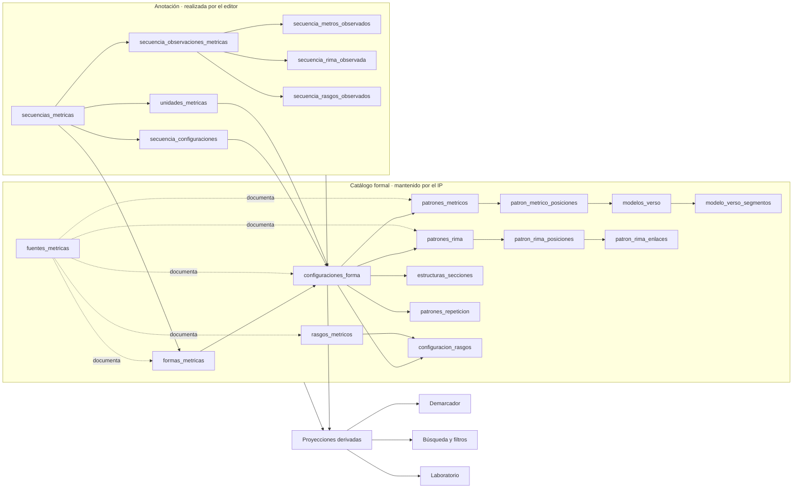
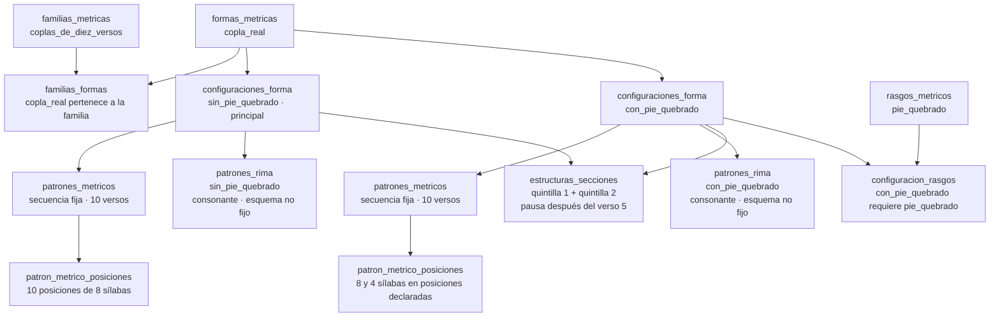
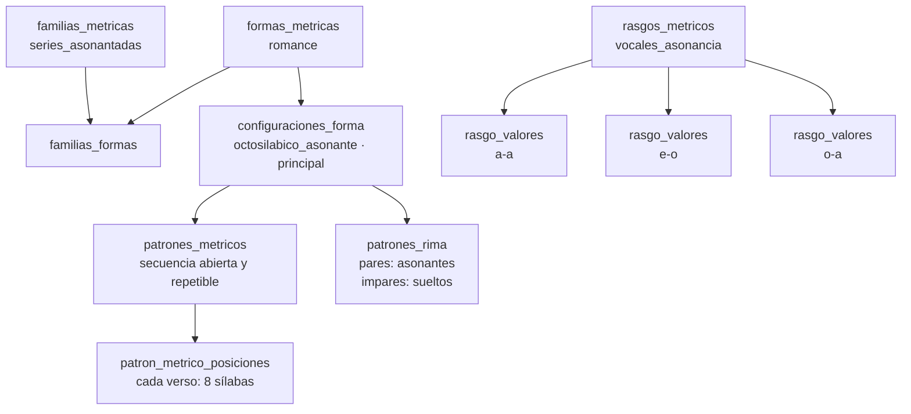
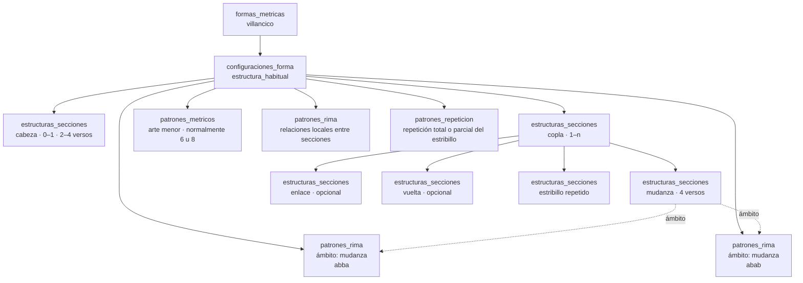
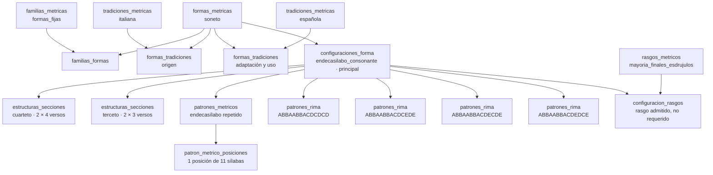
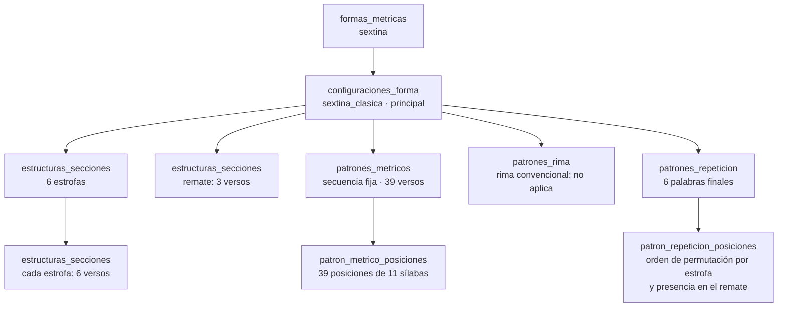
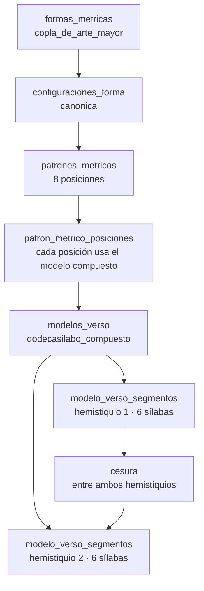
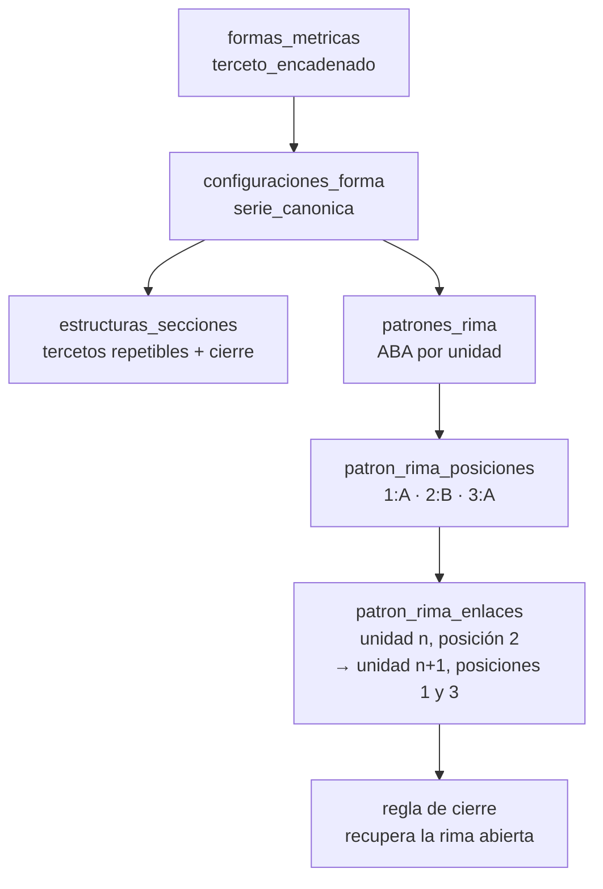
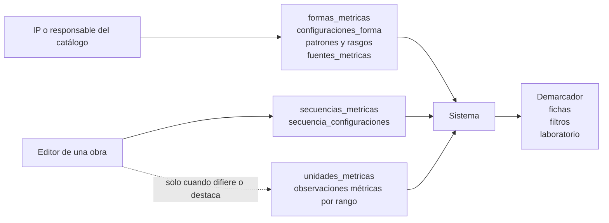

# Ejemplos de formalización con la ontología métrica

Fecha: 28 de julio de 2026

Estado: documento explicativo del modelo propuesto

Documentos relacionados:

- [Propuesta conceptual](./propuesta-dominio-metrica.md)
- [Arquitectura del dominio métrico](./arquitectura-dominio-metrica.md)
- [Matriz de reclasificación](./matriz-reclasificacion-formas-metricas.md)

## 1. Propósito

Este documento muestra cómo se caracterizarán diferentes formas métricas mediante las tablas del dominio. Los ejemplos separan:

1. la definición estable mantenida por el IP;
2. la caracterización de una secuencia realizada por el editor;
3. los datos derivados para demarcación, búsqueda y análisis.

La riqueza del catálogo no implica que el editor tenga que rellenar todas sus tablas. El editor selecciona una forma, una configuración solo cuando sea necesario y las diferencias que observe. En una secuencia guardada, todo lo no señalado como diferencia se considera conforme con la configuración.

## 2. Tablas y responsabilidades

### Catálogo formal

Estas tablas definen la ontología y son mantenidas por el IP o por responsables autorizados:

| Tabla | Función |
| --- | --- |
| `formas_metricas` | Identidades métricas asignables. |
| `familias_metricas` | Agrupaciones organizativas no asignables. |
| `familias_formas` | Pertenencia de formas a familias. |
| `tradiciones_metricas` | Tradiciones históricas o culturales no heredables. |
| `formas_tradiciones` | Origen, adaptación, difusión o uso de una forma en una tradición. |
| `forma_aliases` | Nombres alternativos. |
| `forma_relaciones` | Relaciones tipadas entre formas. |
| `configuraciones_forma` | Realizaciones estructurales admitidas por una forma. |
| `patrones_metricos` | Tipo, alcance y longitud de los patrones de medida. |
| `patron_metrico_posiciones` | Medida ordenada de cada posición. |
| `modelos_verso` | Estructura simple o compuesta de un verso. |
| `modelo_verso_segmentos` | Hemistiquios, cesura y segmentos internos. |
| `patrones_rima` | Régimen, esquema, alcance y fijeza de la rima. |
| `patron_rima_posiciones` | Posiciones finales o internas de rima. |
| `patron_rima_enlaces` | Correspondencias entre versos, unidades o secciones. |
| `patron_rima_restricciones` | Reglas combinatorias como las de la quintilla. |
| `estructuras_secciones` | Partes internas y repeticiones de una forma compuesta. |
| `patrones_repeticion` | Repetición de palabras, versos, estribillos o secciones. |
| `patron_repeticion_posiciones` | Orden y correspondencias de una repetición. |
| `rasgos_metricos` | Propiedades transversales. |
| `rasgo_valores` | Valores controlados de un rasgo. |
| `configuracion_rasgos` | Rasgos requeridos, admitidos, preferentes o excluidos. |
| `fuentes_metricas` | Fuentes bibliográficas normalizadas. |

### Anotación editorial

Estas tablas describen una obra concreta:

| Tabla | Función |
| --- | --- |
| `secuencias_metricas` | Rango de la secuencia y forma identificada. |
| `secuencia_configuraciones` | Configuración reconocida en la secuencia. |
| `unidades_metricas` | Unidades internas y sus rangos. |
| `secuencia_observaciones_metricas` | Rango, dimensión y relación con la norma. |
| `secuencia_metros_observados` | Medida exacta o relación menor/mayor que la esperada. |
| `secuencia_rima_observada` | Diferencia de rima y detalle opcional. |
| `secuencia_rasgos_observados` | Rasgos normalizados adicionales. |
| `secuencia_estructura_observada` | Alteraciones de estructura o secciones. |
| `secuencia_repeticion_observada` | Alteraciones de repeticiones y enlaces. |

### Datos derivados

El sistema combina catálogo y anotación para generar:

- candidatas y preguntas del demarcador;
- facetas de forma, metro, rima, configuración y rasgo;
- perfiles métricos de obras y autores;
- representaciones estructuradas para fichas;
- advertencias de coherencia para los editores.

## 3. Esquema general

## 4. Copla real

### Definición ontológica

### Ejemplo de secuencia

Supongamos una secuencia de diez versos con el patrón observado:

`8, 8, 4, 8, 8 | 8, 8, 4, 8, 8`

| Tabla | Registro conceptual |
| --- | --- |
| `secuencias_metricas` | Rango de diez versos y `forma_metrica_id = copla_real`. |
| `secuencia_configuraciones` | `configuracion_id = con_pie_quebrado`. |

El patrón 8/4 y el rasgo pie quebrado ya se infieren de la configuración. No se duplican como observaciones. Solo se crearía una observación si alguno de los versos difiriera del patrón.

### Interacción del editor

| Nivel | Acción |
| --- | --- |
| Mínimo | Seleccionar “Copla real”. |
| Recomendado | Indicar “Con pie quebrado”. |
| Avanzado | Registrar la secuencia exacta de medidas. |

### Utilidad

- El demarcador compara dos configuraciones completas sin descartar la forma por aparecer tetrasílabos.
- La búsqueda puede combinar forma `copla_real`, metro 4 y rasgo pie quebrado.
- El perfil general sigue contando una sola forma: copla real.

## 5. Romance

### Definición ontológica

### Ejemplo de secuencia

Una serie octosilábica presenta asonancia `e-o` en los versos pares.

| Tabla | Registro conceptual |
| --- | --- |
| `secuencias_metricas` | Rango de la serie y `forma_metrica_id = romance`. |
| `secuencia_configuraciones` | Puede omitirse si solo existe una configuración principal inequívoca. |
| `secuencia_rasgos_observados` | Opcional: `vocales_asonancia = e-o` como valor destacable. |

### Interacción del editor

| Nivel | Acción |
| --- | --- |
| Mínimo | Seleccionar “Romance”. |
| Recomendado | Ninguna acción adicional. |
| Avanzado | Registrar las vocales de la asonancia, si se conocen y resultan útiles. |

### Utilidad

- El demarcador usa metro, extensión y régimen de rima, pero no exige las vocales concretas.
- El buscador puede ofrecer `e-o` como faceta avanzada.
- Todos los valores pertenecen a la misma forma y pueden estudiarse como una dimensión independiente.

## 6. Villancico

### Definición ontológica

### Ejemplo de secuencia

Un villancico presenta cabeza de tres versos, mudanza octosilábica `abba`, vuelta y repetición del estribillo.

| Tabla | Registro conceptual |
| --- | --- |
| `secuencias_metricas` | Rango completo y `forma_metrica_id = villancico`. |
| `secuencia_configuraciones` | `configuracion_id = estructura_habitual`. |
| `unidades_metricas` | Rangos de cabeza, mudanza, vuelta y estribillo. |

La medida, el esquema de la mudanza y los enlaces con vuelta y estribillo proceden de la configuración. Solo se anotan si difieren.

### Interacción del editor

| Nivel | Acción |
| --- | --- |
| Mínimo | Seleccionar “Villancico”. |
| Recomendado | Ninguna acción adicional. |
| Avanzado | Abrir “Describir estructura interna” y delimitar sus secciones. |

### Utilidad

- La ficha puede representar la arquitectura real de la composición.
- El buscador puede localizar villancicos con mudanza en redondilla o con determinada medida.
- El demarcador pregunta por estribillo, mudanza y vuelta solo cuando esas preguntas ayudan.

## 7. Soneto

### Definición ontológica

### Ejemplo de secuencia

Un soneto endecasílabo presenta el esquema `ABBAABBACDCEDE` y mayoría de finales esdrújulos.

| Tabla | Registro conceptual |
| --- | --- |
| `secuencias_metricas` | Rango de 14 versos y `forma_metrica_id = soneto`. |
| `secuencia_configuraciones` | Configuración endecasílaba con patrón `ABBAABBACDCEDE`. |
| `secuencia_rasgos_observados` | Mayoría de finales esdrújulos. |
| `unidades_metricas` | Opcional: dos cuartetos y dos tercetos con sus rangos. |

### Interacción del editor

| Nivel | Acción |
| --- | --- |
| Mínimo | Seleccionar “Soneto”. |
| Recomendado | Ninguna acción adicional para el soneto prototípico. |
| Avanzado | Elegir esquema de tercetos y registrar rasgos prosódicos. |

### Utilidad

- Los esquemas de tercetos se comparan sin multiplicar el número de formas.
- El rasgo esdrújulo puede cruzarse con otras formas métricas.
- El demarcador identifica el soneto por su estructura básica antes de preguntar por el esquema exacto.

## 8. Sextina

### Definición ontológica

### Ejemplo de secuencia

Una sextina conserva seis palabras finales, las permuta a lo largo de seis estrofas y las recupera en el remate.

| Tabla | Registro conceptual |
| --- | --- |
| `secuencias_metricas` | Rango completo y `forma_metrica_id = sextina`. |
| `secuencia_configuraciones` | `configuracion_id = sextina_clasica`. |
| `unidades_metricas` | Seis estrofas y un remate con sus rangos. |

El metro y la ausencia de rima convencional se infieren de la configuración. Las palabras concretas pertenecen a la realización de la obra y solo se almacenarían si el proyecto incorpora ese nivel de edición; no son necesarias para caracterizar la secuencia.

### Interacción del editor

| Nivel | Acción |
| --- | --- |
| Mínimo | Seleccionar “Sextina”. |
| Recomendado | Ninguna acción adicional. |
| Avanzado | Delimitar estrofas y remate o registrar las palabras finales. |

### Utilidad

- La forma se describe sin forzarla dentro de un patrón de rima convencional.
- La ficha puede mostrar 6 × 6 + 3.
- El demarcador puede preguntar por la permutación de palabras finales cuando las demás respuestas todavía dejan varias candidatas.

## 9. Copla de arte mayor

### Definición ontológica

El catálogo no reduce la forma al conjunto `{12}`: conserva que cada verso está compuesto por dos hemistiquios de seis sílabas separados por cesura.

### Interacción del editor

| Nivel | Acción |
| --- | --- |
| Mínimo | Seleccionar “Copla de arte mayor”. |
| Recomendado | Ninguna acción adicional. |
| Diferencia | Indicar el verso y una medida o segmentación diferente, si la hay. |

## 10. Terceto encadenado

### Definición ontológica

La secuencia resultante es `ABA | BCB | CDC | …`. El enlace pertenece al catálogo; no se pide al editor que conecte manualmente los versos.

### Interacción del editor

| Nivel | Acción |
| --- | --- |
| Mínimo | Seleccionar “Terceto encadenado”. |
| Recomendado | Ninguna acción adicional. |
| Diferencia | Marcar el rango donde se rompe el encadenamiento o cambia el cierre. |

## 11. Norma más diferencias

### Medida exacta conocida

Una redondilla octosilábica presenta siete sílabas en el tercer verso:

| Tabla | Registro conceptual |
| --- | --- |
| `secuencias_metricas` | Forma `redondilla`. |
| `secuencia_configuraciones` | Configuración octosilábica `abba`. |
| `secuencia_observaciones_metricas` | Rango del tercer verso, dimensión `medida`. |
| `secuencia_metros_observados` | `metro_observado = 7`; el sistema deriva `menor_que_norma` e hipometría. |

### Solo se conoce la relación

Para una caracterización legada que únicamente dice `hipometrico`:

| Tabla | Registro conceptual |
| --- | --- |
| `secuencia_observaciones_metricas` | Rango de un verso, dimensión `medida`. |
| `secuencia_metros_observados` | `relacion_norma = menor_que_norma`; medida exacta ausente. |

No se inventan seis o siete sílabas.

### Rima diferente sin texto anotado

Un romance rompe la correspondencia esperada en un tramo, pero la base no contiene los finales de verso:

| Tabla | Registro conceptual |
| --- | --- |
| `secuencias_metricas` | Forma `romance`. |
| `secuencia_configuraciones` | Configuración octosilábica asonante. |
| `secuencia_observaciones_metricas` | Rango afectado, dimensión `rima`. |
| `secuencia_rima_observada` | `relacion_norma = ruptura_de_correspondencia`; sin terminación inventada. |

### Ausencia de diferencias

Si el editor guarda una secuencia sin observaciones métricas, el sistema interpreta que cumple completamente la configuración. No existe un estado adicional «revisada» ni una casilla de certeza.

## 12. Qué escribe cada persona

El IP formaliza una vez las propiedades generales. El editor identifica la forma y añade únicamente diferencias o rasgos destacables. Lo no anotado se considera conforme con la configuración.

## 13. Regla de diseño de la interfaz

Para cualquier forma:

1. **Siempre visible:** rango y forma.
2. **Pregunta contextual:** configuración, solo cuando diferencia alternativas relevantes.
3. **Diferencias desplegables:** medida, rima, estructura, repetición o rasgo, filtradas por la configuración.
4. **Precisión opcional:** medida exacta o detalle de rima solo cuando se conoce.
5. **Datos derivados:** no se vuelven a pedir al editor.

La ontología aumenta la precisión y la reutilización de los datos, pero la interfaz aplica divulgación progresiva para mantener una edición breve. El editor no declara certeza ni estado de revisión: guardar la secuencia cierra su caracterización bajo la convención de mundo cerrado.
