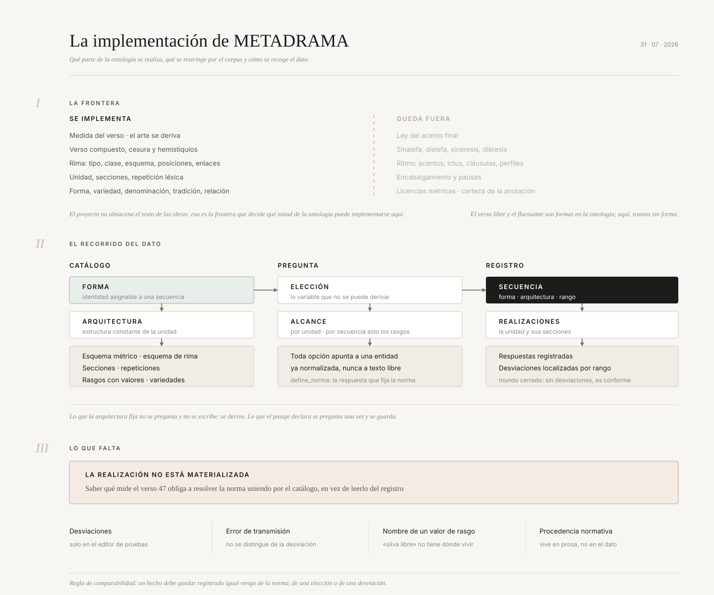
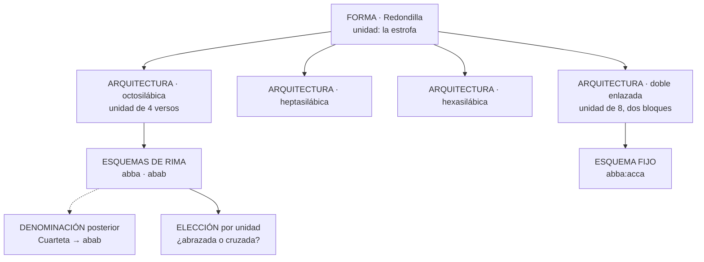
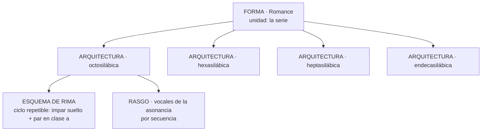
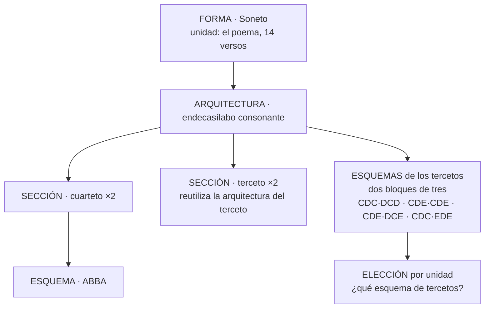
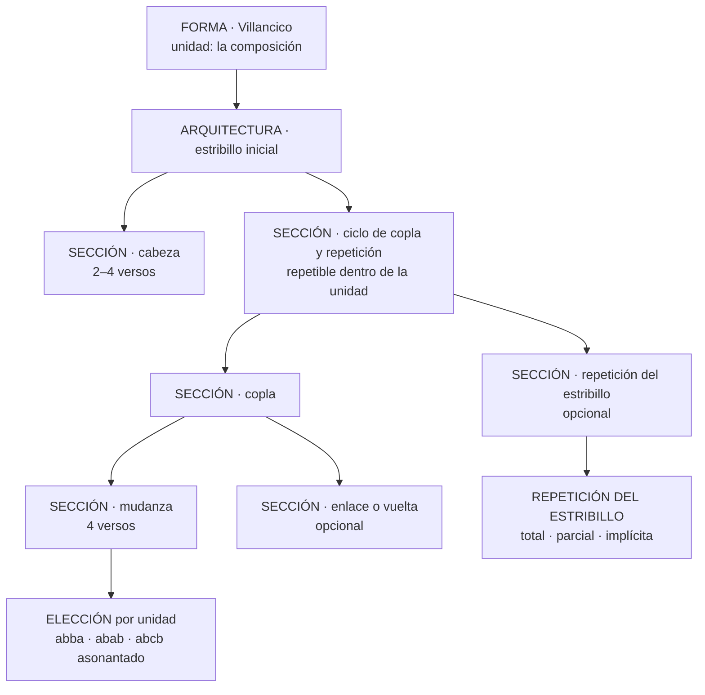
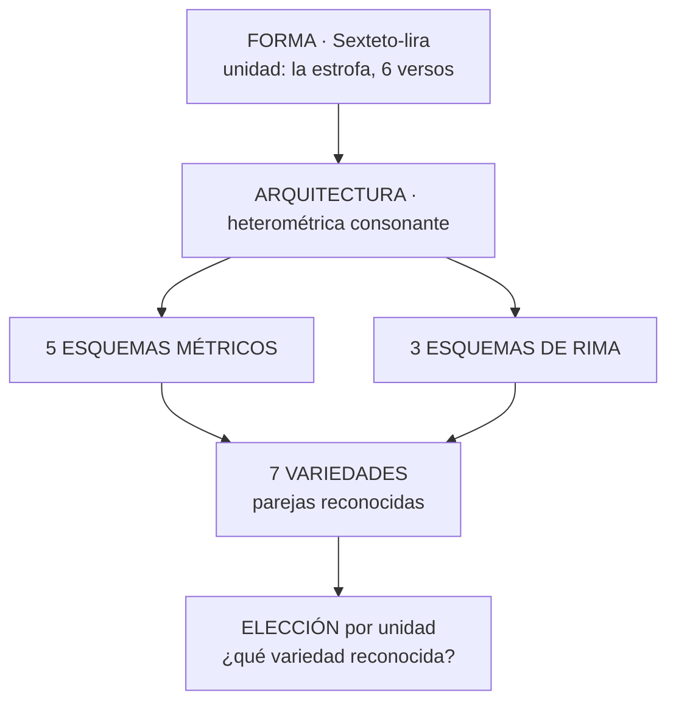

# El modelo métrico aplicado

Estado: vigente · contrastado contra la base el 10 de agosto de 2026

Este documento explica **qué parte de la [ontología del verso español](./ontologia-verso-espanol.md)
implementa METADRAMA, qué restringe por su corpus, cómo recoge el dato y cómo se organiza
técnicamente**. La ontología describe las posibilidades del verso; aquí empiezan las decisiones.

*El 10 de agosto de 2026 absorbió el antiguo «Arquitectura técnica del dominio métrico», que
repetía sus principios y su convención de mundo cerrado y solo tenía de propio las capas, los
consumidores y las garantías. Eran dos documentos del modelo aplicado.*



## Dónde está la verdad

**Ningún documento repite la especificación de columnas.** Cuando lo hizo quedó desfasado en dos
días, y la versión de entonces está en
[historico/especificacion-tablas-2026-07-28.md](./historico/especificacion-tablas-2026-07-28.md).

| Pregunta | Dónde se responde |
| --- | --- |
| Qué tablas, columnas y restricciones existen | La base: `npx supabase db dump --linked -f esquema.sql` |
| Si los datos son coherentes con los criterios | `npm run audit:metrica` |
| Si el gestor declara campos que no existen | `npm run audit:campos` |
| Qué es cada fenómeno del verso | [La ontología](./ontologia-verso-espanol.md) |
| En qué nivel se registra un hecho | [Criterios de nivel](./criterios-de-nivel.md) |
| Qué decidió el proyecto sobre una forma | El catálogo mismo, en `/formas` |
| Qué se revisó y qué quedó abierto | [Estado de la revisión](./revision-del-catalogo-estado.md) |
| Qué sigue pendiente | [CONTEXTO](./CONTEXTO-PARA-CONTINUAR.md#qué-queda-pendiente) |

## Las decisiones que gobiernan el modelo

**Esta es la lista, y no hay otra.** Hasta el 10 de agosto de 2026 vivía repetida en tres sitios
—aquí, en el README del dominio y en CONTEXTO— con redacciones que ya no coincidían.

*Qué es el modelo*

1. Las formas métricas constituyen un **dominio propio**, separado del vocabulario genérico.
2. **Forma, arquitectura, esquema métrico, esquema de rima, variedad, sección, repetición, rasgo,
   elección, denominación, tradición y relación son conceptos distintos.** No existe el concepto
   de familia ni se reproduce la antigua jerarquía padre/hijo: agrupar formas para contar es una
   categoría del estudio y se declara en la proyección.
3. **El nivel de cada hecho se decide con la pregunta de la variación**: lo que puede cambiar
   dentro de una secuencia es esquema, variedad o rasgo; lo constante que no cambia el nombre es
   arquitectura; lo que obligaría a cortar la secuencia es otra forma.
4. **Las formas se distinguen de los tramos sin forma por su tipo de registro.** Una forma general
   —la copla de pie quebrado, el sexteto— no ha llegado a especializarse, pero es forma plena y no
   se equipara a `Versificación irregular` ni a `Verso aislado`.
5. **El metro es una entidad del dominio**, con sus sílabas y, si es compuesto, sus hemistiquios y
   su cesura. El arte mayor o menor se deriva, no se almacena.
6. **Las tradiciones son pertenencias muchos-a-muchos, sin herencia estructural.**
7. **Los esquemas de rima separan su comportamiento computable de la notación legible.**
8. **Un componente ya formalizado se reutiliza; no se copia.** Lo que la sección reutiliza hereda
   de su forma lo que no declare por su cuenta.
9. **El ritmo acentual queda fuera del alcance del proyecto.**

*De dónde sale lo que el catálogo afirma*

10. **El criterio especializado del IP se conserva.** La bibliografía documenta contrastes y
    permite revisarlos, pero no lo sobrescribe silenciosamente.
11. **Las fuentes son publicaciones bibliográficas identificables**, no páginas web ni vídeos. Una
    URL puede localizar una publicación digital; no es por sí sola la autoridad.
12. **No se traducen las palabras de las fuentes a porcentajes inventados.** El matiz vive en la
    modalidad y en valores cerrados y ordenados, no en umbrales que nadie sostiene.

*Cómo se registra*

13. **La anotación sigue `norma + elecciones + diferencias`, en mundo cerrado.** Una secuencia
    guardada sin diferencias cumple la norma; no se piden certeza, revisión ni pendiente.
14. **El editor responde lo mínimo.** Los resultados únicos se derivan y solo se preguntan las
    alternativas con valor analítico.
15. **Las alternativas admitidas no son desviaciones**, y las desviaciones reutilizan metros,
    rimas, estructuras, repeticiones y rasgos ya normalizados: no hay vocabulario paralelo.
16. **Las caracterizaciones no métricas por rango** —cantado, prosa, laguna— se conservan en su
    dominio general.

*Qué se guarda y qué se calcula*

17. **La base de datos es la fuente de verdad.** El artefacto del demarcador, las fichas públicas
    y las redes son proyecciones regenerables.
18. **El catálogo no guarda lo que puede calcular.** El formulario del editor no se escribe: sus
    respuestas y sus enunciados se derivan. Lo que no se pueda derivar no es una excepción que
    justifique escribirlo a mano: es una carencia del catálogo, y la solución es declararla.

## Para qué sirve modelar así

Es la pregunta que justifica el trabajo, y conviene tenerla escrita antes que ninguna tabla.

**Un nombre métrico es una abreviatura de un conjunto de características.** «Silva de
consonantes», «endecasílabo suelto», «copla manriqueña» no son cosas: son etiquetas que la
tradición puso a combinaciones que le parecieron estables. Un repertorio que guarde solo el
nombre puede contar cuántas silvas hay, y nada más.

Este catálogo guarda **el nombre y cada característica por separado**, como dato. Y de ahí salen
tres cosas que con solo el nombre no se pueden hacer:

**Se puede preguntar por rasgos que cruzan formas.** Cuántos pasajes riman más de la mitad de sus
versos, se llamen como se llamen; en cuáles los pareados organizan la serie; qué formas comparten
terminación esdrújula. La pregunta no la limita la clasificación previa.

**Se puede revisar la clasificación con el propio corpus.** Si las cuatro silvas que Morley y
Bruerton distinguen no se separan en los datos, el dato lo dirá, y esa arquitectura se retirará
con evidencia y no por intuición. Cuando la característica solo vive en el nombre, la
clasificación no se puede poner a prueba sin rehacerla entera.

**Se puede fechar y atribuir sobre magnitudes, no sobre etiquetas.** Navarro Tomás data la silva
dramática en 1588 diciendo que Lope empezó a rimar pasajes que antes iban sueltos. Esa afirmación
es una hipótesis sobre **una magnitud que sube en el tiempo** —cuánta rima hay—, y solo se puede
contrastar si esa magnitud está guardada aparte del nombre. Con «silva» y «endecasílabo suelto»
como cajas cerradas, la transición es invisible: cada pasaje cae en una o en otra y el proceso
desaparece.

*Esa es también la razón de que los dos ejes se separaran. Mientras «cuánta rima hay» y «cómo se
organiza» compartían escala, la frontera entre las dos formas estaba escrita en el eje
equivocado, y la pregunta de Navarro Tomás no se podía formular.*

## Los dos ejes de la rima libre

Cuando la norma no fija qué versos riman, hacen falta dos medidas independientes:

| Rasgo | Qué mide | Escala |
| --- | --- | --- |
| `densidad_de_rima` | Cuántos versos riman frente a los que quedan sueltos | ninguna · esporádica · mayoritaria · total |
| `organizacion_en_pareados` | Qué figura dibujan los que riman | ninguna · ocasionales · habituales · predominantes · regulares |

Son independientes: una silva libre rima casi todo **sin** formar pareados, y un endecasílabo
suelto con algún dístico intercalado forma pareados **sin apenas** rimar.

**La densidad se declara solo donde la norma deja el reparto abierto**, y se calcula en los demás
casos por dos caminos: desde las posiciones del propio esquema —el romance rima la mitad de sus
versos porque su ciclo `[----]…` lo fija— o desde las secciones que reutilizan otra forma —la
copla real son dos quintillas y hereda la suya—. Una guarda exige que toda arquitectura activa
diga su densidad o deje calcularla por alguno de los dos.

> **Pendiente, cuando se escriba esa derivación.** Contar los versos rimados no basta: `ABAB` y
> `ABCABC` riman todos sus versos y no tienen la misma textura, porque reparten esos versos entre
> distinto número de clases. La densidad y la **concentración de la rima** son dos cosas, y hoy
> solo está modelada la primera.

## Cuánto fija la norma cada cosa

Lo dice **`modalidad`**, con la misma escala en las cinco tablas que la usan, y reporta lo que
sostiene la bibliografía declarada, no lo que muestre el corpus:

| Valor | Qué dice |
| --- | --- |
| `definitoria` | **Sin esto, la arquitectura no sería la que es.** No es una realización: es la norma |
| `habitual` | Las fuentes la dan como la corriente |
| `admitida` | Las fuentes la documentan sin destacarla |
| `excepcional` | Las fuentes la documentan advirtiendo que es rara |

**`definitoria` no compite en frecuencia con las otras tres**, y conviene tenerlo claro porque
invita a confundirse. Los treinta y nueve esquemas definitorios caen en tres formas —treinta y uno
son el único de su arquitectura, cinco son el esquema abierto que declara el criterio, y tres son
una parte complementaria, como el pareado final de la canción— y las tres dicen lo mismo. Cuando
un definitorio convive con hermanos graduados, como la quintilla con sus ocho tipologías, lo que
hay no es una lista de cinco alternativas: hay **una norma y sus realizaciones**.

*En agosto de 2026 se sospechó que la columna mezclaba dos ejes, necesidad y frecuencia, y que
había que partirla. Se comprobó y no: ningún definitorio es descrito como raro, y no puede serlo,
porque lo que la norma exige está siempre. El razonamiento está en
[la revisión de vocabularios](../revision-de-vocabularios.md#un-cabo-que-result%C3%B3-no-serlo).*

**Que la norma no fije algo no se declara con un valor: se declara no declarándolo**, y se
comprueba. Un esquema de rima es abierto cuando no tiene ni una posición, y entonces su norma son
sus restricciones. Y la herencia tampoco depende de que un campo sea nulo: una sección que
reutiliza otra arquitectura lo dice con `arquitectura_referenciada_id` y hereda de ella lo que no
declare por su cuenta.

*`arquitecturas_forma` no admite `definitoria`, y es coherente: una realización no define su
forma. Y `arquitectura_rasgos` usa solo `definitoria` y `admitida`, que es lo único que tiene
sentido ahí —un rasgo caracteriza la arquitectura o solo se admite en ella—.*

## Las tres capas

| Capa | Qué guarda | Dónde |
| --- | --- | --- |
| **Catálogo formal** | Qué formas, arquitecturas, esquemas y rasgos reconoce el proyecto | 25 tablas, editadas hoy en `/dashboard/metrica` |
| **Anotación editorial** | Qué se identificó u observó en una secuencia concreta | Solo en las tablas de prueba `*_editor_metrico`; las secuencias reales siguen en el vocabulario legado |
| **Proyecciones derivadas** | Qué se publica, filtra, agrega o compila | Vistas y artefactos regenerables |

La base normalizada es la fuente de verdad. El artefacto del demarcador, las fichas públicas y
las redes son proyecciones: se regeneran, no se corrigen a mano.

## 1 · Qué problema resolvió aquí

El vocabulario anterior era una jerarquía de padres e hijos. Bajo un mismo árbol convivían
cosas de naturaleza distinta: formas métricas, variantes de una forma, esquemas de rima,
nombres históricos, tradiciones nacionales y propiedades que pueden aparecer en muchas formas
a la vez. `romance` era padre de `romance_e-a`; `redondilla` lo era de `redondilla_cruzada` y
de `redondilla_hexasilaba`. Pero `e-a` es un timbre observado, `cruzada` es una disposición de
rima y `hexasílaba` es una medida: tres familias distintas colgando del mismo tipo de arista.

Eso tenía tres consecuencias prácticas. Reorganizar el vocabulario cambiaba cálculos y
comportamiento editorial aunque solo se pretendiera ordenar nombres. El editor tenía que
elegir entre decenas de hijos que no eran alternativas comparables. Y cualquier recuento
—cuántas formas usa un autor, cuánto se parecen dos obras— mezclaba familias y producía cifras
que no significaban lo mismo en cada forma.

## 2 · Qué se implementa y qué no

| Plano de la ontología | Estado |
| --- | --- |
| Medida del verso y arte | Implementado. El arte se deriva |
| Ley del acento final | **No implementado.** No se almacena el texto, así que no hay cómputo que verificar |
| Sinalefa, diéresis, sinéresis, hiato | **No implementado.** Exigen el texto |
| Verso compuesto, cesura y hemistiquios | Implementado en el metro |
| Ritmo: acentos, ictus, cláusulas, perfiles | **No implementado.** La escansión queda fuera del análisis |
| Rima: tipo, clase, esquema, posiciones, enlaces | Implementado |
| Timbre de la rima | Implementado como propiedad observada, con valores catalogados |
| Unidad, secciones, repetición interna | Implementado |
| Repetición léxica | Implementado |
| Encabalgamiento y pausas | **No implementado.** Exige el texto y no entra en el análisis |
| Forma, general y específica | Implementado |
| Realización estructural, variedad, denominación, tradición, relación | Implementado |
| Variación admitida | Implementado como elección |
| Norma declarada por el pasaje | Implementado |
| Desviación | Implementado en el editor de pruebas; no sobre las secuencias reales |
| Licencia métrica | **No implementado.** Exige el texto |
| Procedencia y certeza de la anotación | **No implementado**, por decisión: rige mundo cerrado |
| Verso libre y fluctuante como formas | **No implementados como formas.** Se tratan como tramos sin forma |

La mayoría de las ausencias tienen una sola causa: **el proyecto no almacena el texto de las
obras**. Sin texto no hay sílabas que contar, ni acentos que situar, ni sintaxis que
atraviese una pausa. Es la frontera que decide qué mitad de la ontología es implementable
aquí.

## 3 · Lo que el proyecto restringe

Nada de lo que sigue es un hecho de la métrica española. Son decisiones de alcance, tomadas
con el IP para el teatro del Siglo de Oro.

| Decisión | Qué se decidió |
| --- | --- |
| Alcance del catálogo | Prioriza lo que necesita el teatro del Siglo de Oro, pero el modelo y el catálogo aspiran a admitir formas documentadas fuera del corpus sin presentarse todavía como repertorio exhaustivo de la métrica española |
| Repertorios cerrados | Cuando una forma tiene un repertorio finito de esquemas o de medidas, ese cierre es decisión del corpus y está anotado en la ficha |
| Delimitación de formas generales | El sexteto se delimita como seis versos de arte mayor consonantes, más estricto que la definición bibliográfica |
| Certeza editorial | No se pregunta. Rige mundo cerrado |
| Ritmo | Fuera de alcance |
| Agrupamientos de formas | No se modelan. Contar por «décimas» es una categoría del estudio; se declarará en la capa de proyección |
| Variantes ajenas al corpus | Pueden incorporarse cuando la bibliografía autorizada las documenta y ayudan a mantener un modelo general; su ausencia del corpus se conserva como dato de alcance |
| Verso libre y fluctuante | Se tratan como tramos sin forma, no como formas. Si el corpus documentara alguno, sería una forma con su norma |

Las dudas todavía abiertas están en
[cuestiones para el IP](./revisiones-formas/cuestiones-para-el-ip.md).

## 4 · Cómo se recoge el dato

Aquí vive la maquinaria que la ontología no tiene: el editor, las preguntas y las respuestas.

### La secuencia

La **secuencia** es el pasaje que el editor delimita por sus versos inicial y final. Dentro
de una secuencia hay una sola forma y una sola realización estructural, que en la base se
llama **arquitectura**. Cuántas unidades contiene no se declara: se deriva del rango y de la
extensión que la arquitectura declara para su unidad.

> **Definición operativa de unidad.** La unidad es la realización que no cuelga de ninguna
> otra y no realiza ninguna sección. Todo lo demás cuelga de ella.

### El procedimiento de nivel

La ontología dice que una forma fija unas cosas y admite variación en otras. Este es el
procedimiento que traduce eso a las tablas.

> **1 · ¿Admite la norma que esto varíe de una unidad a otra dentro de la misma secuencia?**
>
> - Sí → **esquema**, **variedad** o **rasgo**.
> - No, pero si cambiara seguirías llamándolo igual → **arquitectura**.
> - No, y si cambiara tendrías que abrir otra secuencia → otra **forma**.
>
> **2 · ¿Lo fija la norma o lo declara el pasaje?**
> Catálogo o respuesta del editor.
>
> **3 · Si vive en el catálogo, ¿es constante en la secuencia o posicional dentro de la
> unidad?**
> Constante → **arquitectura**. Posicional → **esquema**.

De aquí sale el **alcance** de cada pregunta: lo que puede variar se pregunta por unidad; lo
que es constante ya lo dice la arquitectura y no se pregunta. El alcance de secuencia queda
reservado a los rasgos, que describen el pasaje sin cambiar su estructura.

| Hecho | Ejemplo | Dónde vive |
| --- | --- | --- |
| Medida de una forma isosilábica | la redondilla octosilábica | arquitectura |
| Extensión de la unidad | la redondilla doble, de ocho versos | arquitectura |
| Sucesión de medidas que la norma fija | la lira, `7-11-7-7-11` | esquema métrico `secuencia` |
| Medida única repetida | el soneto, `11-repetido` | esquema métrico `ciclo` |
| Conjunto de medidas que la norma admite | la silva, 7 y 11 sin orden | esquema métrico `conjunto` |
| Esquema de rima que la norma fija | la espinela, `abbaaccddc` | esquema de rima |
| Esquema de rima entre los admitidos | `abba` o `abab` en la redondilla | respuesta por unidad |
| Esquema que inventa el pasaje | la estancia de una canción | respuesta por unidad, con norma declarada |
| Posición de un quebrado que la norma no fija | la copla de pie quebrado | respuesta por unidad |
| Medida de una sección que puede variar | la cabeza del villancico | respuesta por unidad, por sección |
| Grado de organización en pareados | endecasílabo suelto, silva, pareado | rasgo con valores ordenados |

**La medida es arquitectura cuando la forma es isosilábica, y solo entonces.** El romance, la
redondilla, la sextilla, el sexteto y el terceto encadenado tienen una arquitectura por
medida. Solo se pregunta cuando lo que varía es una **posición** dentro de la unidad —dónde
cae un quebrado y cuánto mide— o la medida de una **sección**.

El pareado es la excepción: su norma dice que dos versos riman y nada más, así que no tiene
repertorio de medidas y la declara el pasaje.

**El tipo del esquema métrico dice si es un ciclo o una secuencia, no cuántos versos abarca.**
Un esquema isosilábico se declara con una sola posición repetida —`11-repetido`— y cuántas
veces se repite lo dice la extensión de la unidad. `secuencia` queda para los esquemas en que
las medidas cambian, como la lira. Los ciclos heterométricos que sí se repiten —`8-8-4` de la
sextilla de pie quebrado, `7-5` de la seguidilla— se declaran desarrollados, porque conviven con
esquemas hermanos que no son cíclicos.

### La elección

Una **elección** es lo que el catálogo pregunta cuando la respuesta no se puede derivar y la
diferencia tiene valor analítico. Es una decisión de recogida de datos, no una entidad de la
métrica: si otro proyecto infiriera lo mismo con un algoritmo, el modelo del objeto sería
idéntico y no habría ninguna pregunta.

> **Toda opción apunta por clave foránea a una entidad ya normalizada** —un metro, un
> esquema, una sección, una repetición, una variedad, un valor de rasgo—. Nunca a texto
> libre.

Una elección **nunca es una desviación**: `abba` y `abab` son dos respuestas ordinarias a la
misma pregunta.

### La norma declarada por el pasaje

Para las formas cuyo esquema lo fija su primera realización, el editor no elige entre
alternativas catalogadas: **declara la norma de ese pasaje**, con una respuesta abierta
validada contra la extensión de la unidad. No se crea una entidad nueva por cada esquema
observado.

Se marca con el booleano `define_norma`, y no con un alcance nuevo, porque lo que distingue
esa respuesta de una elección ordinaria es **cuántas veces puede responderse distinto**, no
dónde se pregunta: la pregunta se sigue haciendo en cada realización y lo que se añade es que
todas deben coincidir dentro del ámbito que las contiene.

Se responde en cada realización y no una sola vez, a propósito: así una que se salga podrá
registrarse como desviación localizada en vez de obligar a partir la secuencia.

### Mundo cerrado

Una secuencia guardada sin desviaciones se considera conforme con su norma y con las
respuestas registradas. La ausencia no significa pendiente, desconocido ni sin revisar; por
eso no se pide certeza y los resultados únicos se derivan en lugar de preguntarse.

La ausencia de una respuesta **obligatoria**, en cambio, impide guardar: eso no se interpreta
como conformidad.

### Cómo se registra una secuencia

```text
forma
+ arquitectura
+ elecciones entre alternativas admitidas
+ realizaciones de las secciones, cuando la unidad tenga partes
+ desviaciones localizadas
```

Y si no hay forma reconocible:

```text
tramo sin forma + rango + observación directa
```

Un **tramo sin forma** declara que el análisis no reconoce una norma en ese pasaje. Es una
categoría operativa: `versificación irregular` para dos o más versos, `verso aislado` para
uno solo. No compite como candidato ni entra en los recuentos de diversidad de formas.

## 5 · Cinco arquetipos del catálogo

### Estrofa repetible · redondilla



La medida es constante en la tirada, así que es arquitectura. Ninguna declara una sección: la
unidad es la estrofa y cuántas hay se deriva del rango.

### Serie no estrófica · romance



La secuencia contiene una sola unidad, de extensión libre. El timbre de la asonancia se
registra como rasgo observado: no crea subformas.

### Composición cerrada · soneto



Las repeticiones `×2` son internas a la unidad. Que un pasaje contenga tres sonetos seguidos
se deriva del rango, y cada uno conserva su elección de tercetos.

El esquema de los tercetos cuelga de la arquitectura y no de la sección, y es el único caso de
los arquetipos en que eso ocurre: describe cómo se entrelazan las rimas de un terceto con las
del otro, así que habla de las dos realizaciones a la vez. **Sus posiciones van en dos bloques
de tres**, no en una tirada de seis: el soneto no tiene un pasaje de seis versos seguidos, y
declararlo así hacía saltar como anomalía el blanco que separa los tercetos. Que una pregunta
abarque las dos realizaciones de una sección no obliga a fundirlas.

#### La regla de reutilización

Sale de este caso y vale para todo el catálogo.

> **Una sección que remite a otra arquitectura hereda de ella lo que la hace esa forma** —su
> medida, su extensión, su identidad—. Lo que la arquitectura contenedora declara para esa
> sección gana sobre lo heredado; lo heredado es el valor por defecto.

Los tercetos del soneto *son* tercetos: de ahí sale que midan once sílabas y tengan tres versos.
Lo que no heredan es la rima, porque riman entre sí y la forma Terceto pregunta otra cosa —qué
verso queda suelto—. Para eso no hace falta ninguna pieza nueva: el esquema específico se declara
en el soneto y se reparte en bloques.

Y hay que distinguir **dónde se responde** de **de qué trata**, que son dos cosas y hasta el 10
de agosto de 2026 viajaban en una:

| Campo | Qué dice |
| --- | --- |
| `grupos_eleccion_metrica.seccion_id` | Dónde se responde: el editor plantea la pregunta **en cada realización** de esa sección |
| `esquemas_rima.seccion_id` | De qué trata la respuesta, sin decir dónde se pregunta |

Los tercetos necesitan las dos por separado: la respuesta es una sola por soneto —si el grupo
declarase la sección, el editor preguntaría dos veces— pero habla de los tercetos, y de ahí toma
su sujeto el enunciado, «Tercetos · Esquema de rima».

### Composición con estribillo · villancico



Las secciones opcionales solo se materializan si aparecen. La medida se declara en la sección
que aporta los versos y la repetición del estribillo la deriva de su primera aparición: una
cabeza hexasílaba con coplas octosílabas es un villancico, no dos secuencias. Una repetición
implícita no crea versos que no existen. En la arquitectura sin cabeza, la
secuencia inicial agrupa la primera copla y la primera aparición del estribillo; la continuación
agrupa los ciclos posteriores sin convertir esos contenedores en partes métricas nuevas.

### Estrofa con variedades · sexteto-lira



Sin variedades, dos preguntas independientes ofrecerían quince parejas y once no existen.

## 6 · Distancias conocidas entre diseño e implementación

Además de lo que el apartado 2 declara fuera de alcance, hay decisiones tomadas que el dato
todavía no refleja.

| Diseño | Estado |
| --- | --- |
| La realización se registra por verso, con la procedencia de cada hecho | **No implementada.** Hoy la realización guarda punteros al catálogo y lo que fija la arquitectura no se escribe: hay que resolverlo uniendo por el catálogo |
| Capa de desviaciones sobre las secuencias reales | Solo existe en el editor de pruebas |
| Error de transmisión distinto de desviación del autor | No modelado |
| Denominación de un valor de rasgo | No soportada: un nombre solo puede colgar de una forma, arquitectura, esquema, sección, repetición o variedad, nunca de un valor de rasgo. **Los dos ejemplos que se citaban aquí ya no lo son**: «silva libre» nombra la arquitectura `Silva · Libre` y «romance heroico» es denominación de `Romance · Endecasilábica`. Comprobado el 9 de agosto de 2026: la limitación sigue existiendo, pero hoy no deja ningún nombre sin sitio |
| Marca de procedencia normativa en el dato | La separación entre métrica española y decisión del corpus vive en prosa, no en el catálogo |

La primera es la más importante: incumple la
[regla de comparabilidad](./ontologia-verso-espanol.md#comparabilidad) de la ontología, que
exige que un hecho quede registrado igual venga de la norma, de una elección o de una
desviación.

## 7 · Los seis errores que este modelo evita

1. **Convertir una variante en una forma.** Un esquema de rima distinto no es otra forma; una
   medida distinta, casi nunca.
2. **Convertir una observación en una definición.** Que una forma admita octosílabos no
   significa que un pasaje los tenga.
3. **Confundir la unidad con el pasaje.** Una tirada de redondillas no es una forma distinta
   de la redondilla.
4. **Hacer que la taxonomía gobierne el comportamiento.** Reordenar nombres no puede cambiar
   cálculos ni lo que el editor puede elegir.
5. **Usar la herencia para no decidir.** Un campo vacío no significa «lo mismo que el padre».
6. **Codificar el mismo fenómeno en niveles distintos según la forma.** Es lo que hace
   incomparables las cifras entre obras y autores, y el que más cuesta detectar: exige
   contrastar el catálogo por rasgos y no por nombres.

## 8 · Correspondencia con la base

| Concepto | Tabla |
| --- | --- |
| Forma · tramo sin forma | `formas_metricas` |
| Realización estructural · arquitectura | `arquitecturas_forma` |
| Esquema métrico | `esquemas_metricos` · `esquema_metrico_posiciones` · `esquema_metrico_opciones` |
| Esquema de rima | `esquemas_rima` · `esquema_rima_posiciones` · `esquema_rima_enlaces` · `esquema_rima_restricciones` |
| Variedad | `variedades_arquitectura` |
| Metro | `metros` · `metro_segmentos` |
| Sección | `estructuras_secciones` |
| Repetición métrica o léxica | `repeticiones_metricas` · `repeticion_posiciones` |
| Rasgo | `rasgos_metricos` · `rasgo_valores` · `arquitectura_rasgos` |
| Elección | `grupos_eleccion_metrica` · `opciones_eleccion_metrica` (vista derivada) |
| Norma declarada por el pasaje | `grupos_eleccion_metrica.define_norma` |
| Denominación | `denominaciones_metricas` |
| Tradición | `tradiciones_metricas` · `formas_tradiciones` |
| Relación | `forma_relaciones` |
| Realización de la unidad y sus secciones | `realizaciones_editor_metrico` |
| Respuesta registrada | `elecciones_editor_metrico` |
| Desviación | `desviaciones_editor_metrico` |

Dos avisos de vocabulario. **Combinación** significa en la tradición hispánica la estrofa
misma —Domínguez Caparrós titula así el capítulo dedicado a las estrofas castellanas— y
**patrón métrico** significa en la métrica computacional el patrón acentual del verso.
Ninguno de los dos se usa aquí con esos sentidos, y por eso el catálogo dice *arquitectura* y
*esquema*.

## 9 · Qué garantiza la base

*Contrastado contra los disparadores vivos el 10 de agosto de 2026. La versión anterior de este
apartado enumeraba nueve garantías «implementadas como restricciones y disparadores» y **varias
no existían**: no hay control de ciclos para `subtipo_de` —que además no se usa en ninguna fila—
ni una regla que impida borrar una forma en uso.*

Lo que de verdad valida un disparador, y solo eso:

| Qué se impide | Dónde |
| --- | --- |
| Que una forma con norma no tenga arquitectura, o que un tramo sin forma la tenga | `arquitecturas_forma`, `formas_metricas` |
| Que un grupo de elección pregunte algo incoherente con su dimensión o su alcance | `grupos_eleccion_metrica` |
| Que una variedad apunte a esquemas de otra arquitectura | `variedades_arquitectura` |
| Que una respuesta del editor no esté entre las que su pregunta ofrece, o caiga en una posición que no existe | `elecciones_editor_metrico` |
| Que una unidad se salga del rango de su secuencia o rompa la estructura declarada | `realizaciones_editor_metrico`, `secuencias_editor_metrico` |
| Que una desviación no se apoye en las entidades normalizadas del catálogo | `desviaciones_editor_metrico` |

Y dos automatismos que no impiden sino que mantienen: `sincronizar_posiciones_esquema_rima_fijo`
deriva las posiciones de un esquema desde su notación, y `marcar_catalogo_metrico_actualizado`
sube la revisión del catálogo en las veinte tablas que lo componen.

**Lo demás son claves foráneas y `CHECK`**, que es donde vive la mayor parte de la integridad: la
unicidad de cada `slug` en su ámbito, que una arquitectura pertenezca a una sola forma, que una
restricción excluya un esquema hermano y no ajeno, que una respuesta guarde exactamente una
entidad. Se leen del volcado del esquema, no de aquí.

## 10 · Proyecciones y consumidores

**El gestor del catálogo** (`/dashboard/metrica`) mantiene todo lo anterior. Está previsto
reducirlo a ver y editar prosa, y que lo estructural pase por migración: en una semana
aparecieron cuatro vocabularios y listas de campos que la base nunca aceptó, y que no fallaban al
guardar sino que descartaban el dato en silencio.

**El registrador de secuencias** pregunta lo mínimo: forma, arquitectura cuando hay más de una,
las elecciones que el catálogo declara, las unidades internas donde la estructura las exige y las
diferencias si las hay. El formulario es adaptativo y **las preguntas proceden del catálogo, no
del componente**: desde el 10 de agosto se derivan también sus enunciados.

**Las fichas públicas y el buscador** se alimentan de proyecciones, no de las tablas crudas. Las
facetas se separan —formas, tradiciones, metros, regímenes de rima, arquitecturas y rasgos— y no
se presenta una lista combinada de formas y subtipos.

**El laboratorio de autoría y datación** calcula sobre formas canónicas, con arquitecturas y
rasgos como dimensiones separadas, para que dos obras no parezcan distintas solo porque una
codificó un esquema como hijo y otra no. La convención de mundo cerrado permite derivar
distribuciones, transiciones y tasas; que eso alimente un modelo de atribución no garantiza una
conclusión, porque hay que controlar forma, género, extensión, cronología y dependencia entre
secuencias de una misma obra.

**El demarcador** compila un artefacto versionado desde el catálogo, con la revisión con que se
generó y la procedencia de cada regla. Ordena sus preguntas por capacidad de separar candidatas,
solo pregunta lo observable y conserva candidatas ante un «no sé».

**Los grafos y la interoperabilidad** se calculan, no se almacenan como relaciones canónicas.
Para el tamaño del catálogo no hace falta una base de grafos.

## 11 · Cuándo caduca un dato derivado

`catalogo_metrico_estado.revision` sube con cada cambio del catálogo, y sirve para saber con qué
revisión se calculó un resumen, marcar como obsoletas las proyecciones afectadas y recompilar el
demarcador.

Un cambio editorial —una etiqueta— se resuelve en lectura. Un cambio semántico obliga a invalidar
o regenerar. **Pendiente: ninguna anotación registra todavía con qué revisión se guardó**, de
modo que hoy no se puede saber si una anotación es anterior a la norma que la juzga.

## 12 · Quién puede qué

| | Catálogo | Anotación |
| --- | --- | --- |
| Público | Lee lo publicado | — |
| Editor | Lee | Escribe dentro de sus obras |
| Admin o IP | Edita, revisa y aprueba | Escribe |

Las trece tablas del catálogo están restringidas a admin/IP con la misma política, y las vistas
derivadas la conservan con `security_invoker`.
