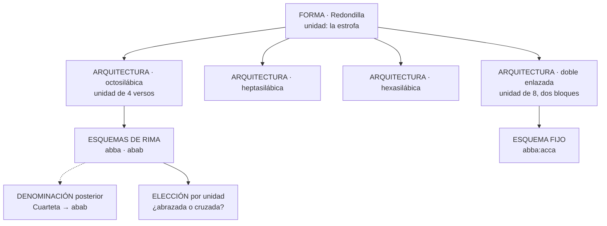
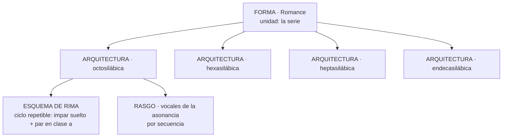
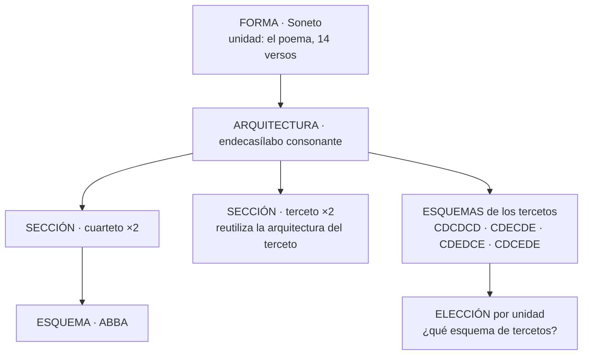
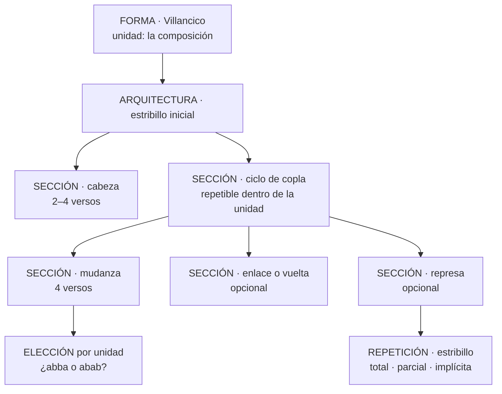
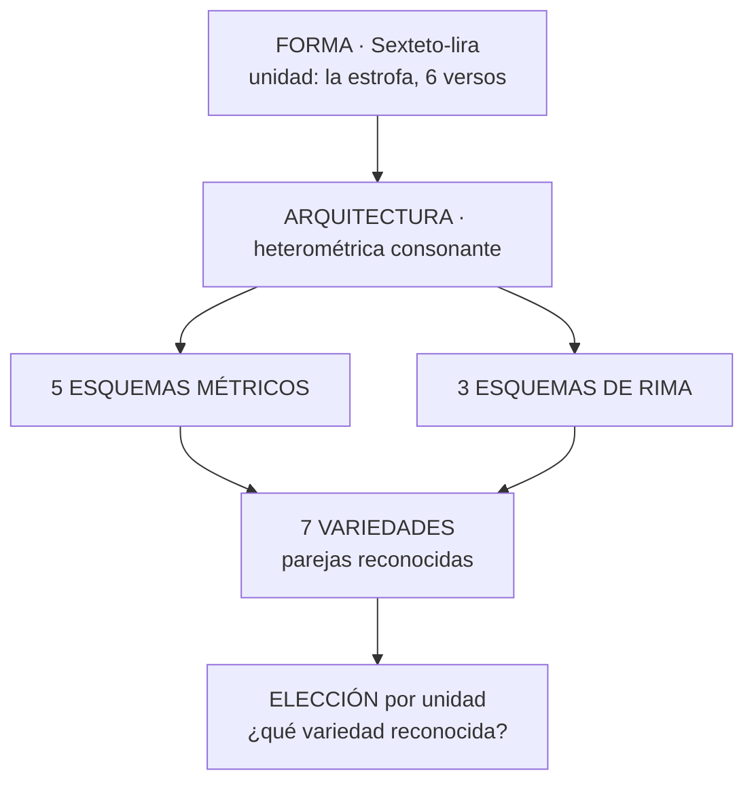

# La ontología métrica de METADRAMA

Estado: vigente · 31 de julio de 2026

Este documento explica **cómo se aplica el [meta-modelo métrico](./meta-modelo-metrico.md) a
la métrica española y qué decidió METADRAMA para su corpus**. Las entidades, las reglas y el
procedimiento de nivel están definidos allí y aquí no se repiten: lo que sigue es la capa
española y la capa del proyecto.

Los [criterios de nivel](./criterios-de-nivel.md) aplican todo esto caso por caso, la
[arquitectura técnica](./arquitectura-dominio-metrica.md) describe la implementación y las
[fichas de revisión](./revisiones-formas/) documentan qué se decidió para cada forma.

> **Cómo leer la separación.** Lo que dice el meta-modelo vale para cualquier tradición de
> verso y es reutilizable. Lo que dice este documento bajo «la métrica española» describe esa
> tradición. Lo que dice bajo «las decisiones del proyecto» **no es un hecho métrico**: es
> una decisión de alcance de METADRAMA, y quien reutilice el catálogo debe saber cuál es
> cuál.

## 1 · Qué problema resolvió aquí

El vocabulario anterior era una jerarquía de padres e hijos. Bajo un mismo árbol convivían
cosas de naturaleza distinta: formas métricas, variantes de una forma, esquemas de rima,
nombres históricos, tradiciones nacionales y propiedades que pueden aparecer en muchas formas
a la vez. `romance` era padre de `romance_e-a`; `redondilla` lo era de `redondilla_cruzada` y
de `redondilla_hexasilaba`. Pero `e-a` es una asonancia observada, `cruzada` es una
disposición de rima y `hexasílaba` es una medida: tres órdenes de realidad distintos colgando
del mismo tipo de arista.

Eso tenía tres consecuencias prácticas. Reorganizar el vocabulario cambiaba cálculos y
comportamiento editorial aunque solo se pretendiera ordenar nombres. El editor tenía que
elegir entre decenas de hijos que no eran alternativas comparables. Y cualquier recuento
—cuántas formas usa un autor, cuánto se parecen dos obras— mezclaba órdenes y producía cifras
que no significaban lo mismo en cada forma.

## 2 · La métrica española en el meta-modelo

Las tres presuposiciones del meta-modelo —verso numerable, medida comparable, correspondencia
por rima— se concretan así.

**El metro se mide por sílabas, no por pies.** El octosílabo tiene ocho, el endecasílabo
once. De ahí se deriva el **arte mayor o menor**, que por tanto no se almacena: se calcula.

**El final acentual altera el cómputo, y por eso pertenece al metro.** Un verso agudo cuenta
una sílaba más y uno esdrújulo una menos. Es una regla de la medida, no del ritmo: el ritmo
acentual queda fuera de alcance, pero esta regla no forma parte de lo excluido.

> **Estado.** El proyecto no almacena el texto de las obras y no verifica cómputos, así que
> esta regla no está implementada: `final_acentual` existe solo como rasgo estilístico de un
> tramo, con el valor `esdrujulo`. Es una omisión consciente de la implementación, no del
> diseño.

**Un metro puede ser compuesto**, con cesura y hemistiquios: el alejandrino son dos
heptasílabos, y el dodecasílabo de la copla de arte mayor son dos hexasílabos, distinto de un
dodecasílabo simple. Los segmentos viven en `metro_segmentos`.

**La asonancia es un tipo de rima de primer orden**, junto a la consonancia. **Las vocales
concretas de una asonancia no forman parte de la identidad de la forma**: el romance en `e-a`
no es otra forma que el romance en `a-o`. Son un rasgo observado, con valores catalogados.

**En la notación de rima, mayúscula y minúscula codifican el arte métrico.** `aBabB` es la
lira: heptasílabos en minúscula, endecasílabos en mayúscula.

## 3 · Las decisiones del proyecto

Nada de lo que sigue es un hecho de la métrica española. Son decisiones de alcance de
METADRAMA, tomadas con el IP para el teatro del Siglo de Oro.

| Decisión | Qué se decidió |
| --- | --- |
| Alcance del catálogo | Cubre lo que el teatro del Siglo de Oro necesita. No pretende ser una ontología universal de la métrica española. |
| Repertorios cerrados | Cuando una forma tiene un repertorio finito de esquemas o medidas, ese cierre es una decisión del corpus y está anotado en la ficha de la forma. |
| Delimitación de formas generales | El sexteto se delimita como seis versos de arte mayor consonantes, más estricto que la definición bibliográfica, que admite combinar arte mayor y menor. |
| Certeza editorial | No se pregunta. La convención de mundo cerrado la hace innecesaria. |
| Ritmo acentual | Fuera de alcance: no se registran patrones del tipo `-+---+-+`, porque no se almacena el texto y la escansión no entra en el análisis. |
| Agrupamientos de formas | No se modelan. Contar por «décimas» o por «formas con estribillo» es una categoría del estudio; se declarará en la capa de proyección. |
| Variantes históricas ajenas al corpus | No se incorporan hasta que aparezcan. |

Las dudas todavía abiertas están en
[cuestiones para el IP](./revisiones-formas/cuestiones-para-el-ip.md).

## 4 · Dónde vive cada hecho, en este catálogo

El [procedimiento de nivel](./meta-modelo-metrico.md#4--el-procedimiento-de-nivel) aplicado a
los casos que se dan aquí:

| Hecho | Ejemplo | Dónde vive |
| --- | --- | --- |
| Medida de una forma isosilábica | la redondilla octosilábica | arquitectura |
| Extensión de la unidad | la redondilla doble, de ocho versos | arquitectura |
| Sucesión de medidas que la norma fija | la lira, `7-11-7-7-11` | esquema métrico |
| Conjunto de medidas que la norma admite | la silva, 7 y 11 sin orden | esquema métrico |
| Esquema de rima que la norma fija | la espinela, `abbaaccddc` | esquema de rima |
| Esquema de rima entre los admitidos | `abba` o `abab` en la redondilla | respuesta por unidad |
| Esquema que inventa el pasaje | la estancia de una canción | respuesta por unidad, con norma declarada |
| Posición de un quebrado que la norma no fija | la copla de pie quebrado | respuesta por unidad |
| Medida de una sección que puede variar | la cabeza del villancico | respuesta por unidad, por sección |
| Grado de organización en pareados | endecasílabo suelto, silva, pareado | rasgo con valores ordenados |

**La medida es arquitectura cuando la forma es isosilábica, y solo entonces.** Una tirada de
redondillas no cambia de medida a mitad de camino. El romance, la sextilla, el sexteto y el
terceto encadenado tienen una arquitectura por medida. Solo se pregunta cuando lo que varía
es una **posición** dentro de la unidad —dónde cae un quebrado y cuánto mide— o la medida de
una **sección**.

El pareado es la excepción, y no por capricho: su norma dice que dos versos riman y nada más,
así que no tiene repertorio de medidas y la medida la declara el pasaje. Lo normativo ahí es
el arte, que se deriva del metro elegido.

**Los dos contrapesos, en este catálogo.** La sexta rima es la variedad del sexteto
endecasílabo que responde `ABABCC`, y «copla manriqueña» es el nombre del esquema
`abcabc:defdef` de la sextilla doble de pie quebrado: un nombre tradicional no crea una
forma. Pero el sexteto-lira sí es forma aparte pese a coincidir con el sexteto en extensión y
rima, porque amplía la lira garcilasiana y su heterometría de 7 y 11 es su principio
constructivo, no una medida más; su parentesco se declara con `derivada_de`.

## 5 · Cinco arquetipos

### Estrofa repetible · redondilla



La medida es constante en la tirada, así que es arquitectura. Ninguna declara una sección: la
unidad es la estrofa y cuántas hay se deriva del rango.

### Serie no estrófica · romance



La secuencia contiene una sola unidad, de extensión libre. Las vocales de la asonancia se
registran como rasgo: no crean subformas.

### Composición cerrada · soneto



Las repeticiones `×2` son internas a la unidad. Que un pasaje contenga tres sonetos seguidos
se deriva del rango, y cada uno conserva su propia elección de tercetos.

El esquema de los tercetos no cuelga de la sección sino de la arquitectura, y es el único
caso de los arquetipos en que eso ocurre: sus seis posiciones describen cómo se entrelazan
las rimas de un terceto con las del otro, así que abarca las dos secciones sin pertenecer a
ninguna. La pregunta se hace una vez por unidad y el editor la presenta uniendo ambos. Que
una pregunta abarque dos secciones no obliga a fundirlas en una.

### Composición con estribillo · villancico



Las secciones opcionales solo se materializan si aparecen, y cada una declara su medida:
una cabeza hexasílaba con coplas octosílabas es un villancico, no dos secuencias. Una
represa implícita no crea versos que no existen.

### Estrofa con variedades · sexteto-lira



Sin variedades, dos preguntas independientes ofrecerían quince parejas y once no existen.

## 6 · Cómo se registra una secuencia

```text
forma
+ arquitectura
+ elecciones entre alternativas admitidas
+ realizaciones de las secciones, cuando la unidad tenga partes
+ desviaciones localizadas
```

Y si no hay forma reconocible:

```text
tramo sin forma + rango + observación directa
```

## 7 · Estado de la implementación

La migración estructural está completa y el catálogo no tiene defectos de conformidad. Lo que
queda son distancias conocidas entre el diseño y lo implementado.

| Diseño | Estado |
| --- | --- |
| La regla del final acentual pertenece al metro | No implementada: sin texto no hay cómputo que verificar |
| La realización se materializa por verso, con su procedencia | **No implementada.** Hoy la realización guarda punteros al catálogo y lo que fija la arquitectura no se escribe: hay que resolverlo uniendo por el catálogo |
| Capa de desviaciones sobre las secuencias reales | No implementada: solo existe en el editor de pruebas |
| Error de transmisión distinto de desviación | No modelado |
| Denominación de un valor de rasgo | No soportada: «silva libre» y «romance heroico» no tienen hoy dónde vivir como nombre |
| Marca de procedencia normativa en el dato | No implementada: la separación entre métrica española y decisión del corpus vive en prosa, no en el catálogo |

La segunda es la que más importa: incumple la
[regla de comparabilidad](./meta-modelo-metrico.md#7--norma-y-realización) del meta-modelo.

## 8 · Vocabulario y correspondencia con la base

Los nombres se eligieron para no chocar con la terminología métrica establecida. Dos avisos:
**combinación** significa en la tradición hispánica la estrofa misma —Domínguez Caparrós
titula así el capítulo dedicado a las estrofas castellanas—, y **patrón métrico** significa en
la métrica computacional el patrón acentual del verso. Ninguno de los dos se usa aquí con
esos sentidos.

| Concepto | Tabla |
| --- | --- |
| Forma · tramo sin forma | `formas_metricas` |
| Arquitectura | `arquitecturas_forma` |
| Esquema métrico | `esquemas_metricos` |
| Esquema de rima | `esquemas_rima` |
| Variedad | `variedades_arquitectura` |
| Metro | `metros` · `metro_segmentos` |
| Sección | `estructuras_secciones` |
| Realización de la unidad y de sus secciones | `realizaciones_editor_metrico` |
| Repetición | `repeticiones_metricas` |
| Rasgo | `rasgos_metricos` · `rasgo_valores` · `arquitectura_rasgos` |
| Elección | `grupos_eleccion_metrica` · `opciones_eleccion_metrica` |
| Respuesta que define la norma | `grupos_eleccion_metrica.define_norma` |
| Denominación | `denominaciones_metricas` |
| Tradición | `tradiciones_metricas` · `formas_tradiciones` |
| Relación | `forma_relaciones` |
| Desviación | `desviaciones_editor_metrico` |
| Niveles estructurales | `formas_metricas.nivel_estructural` |
