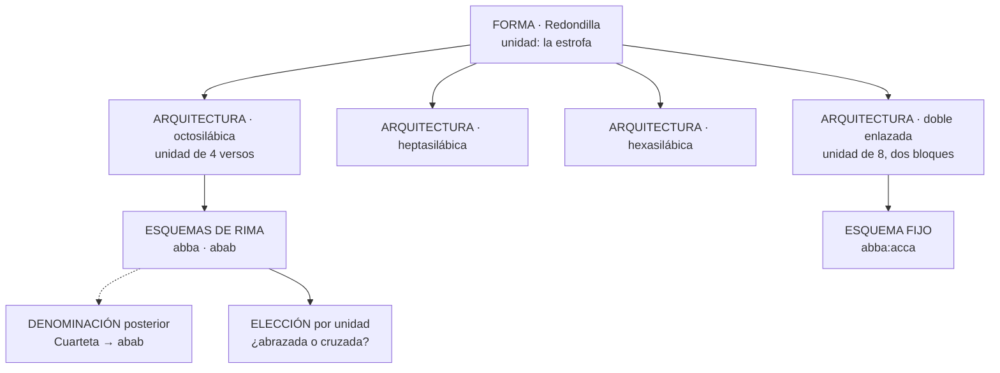
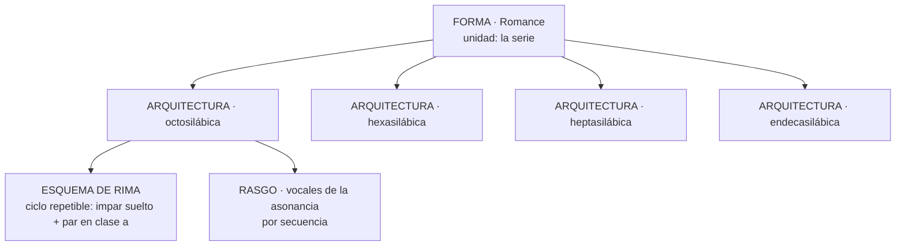
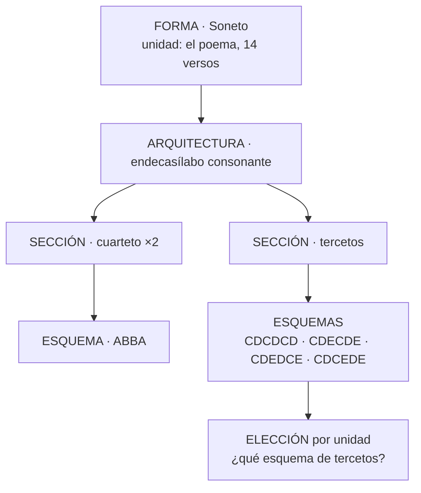
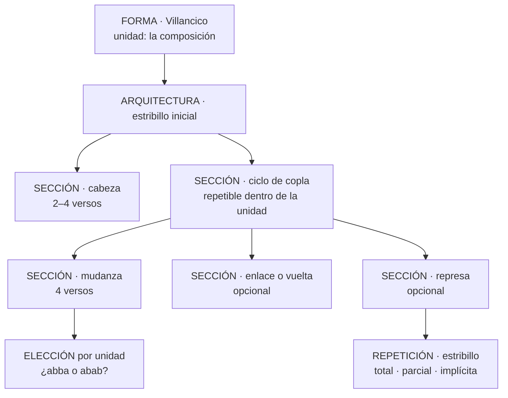
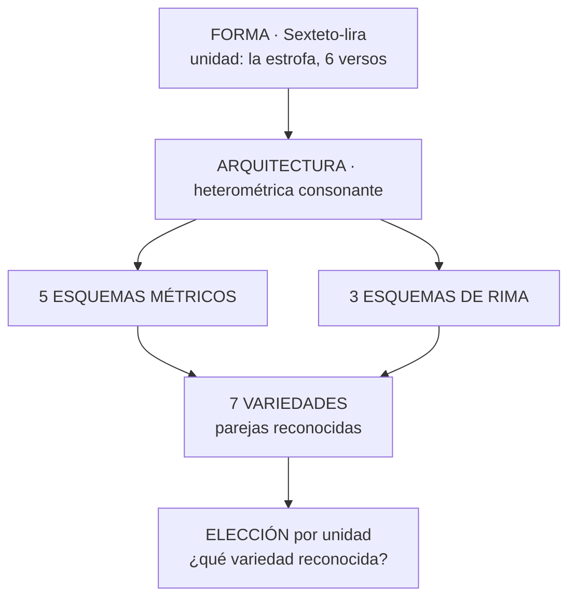

# La ontología métrica de METADRAMA

Estado: vigente · 31 de julio de 2026

Este es el documento que explica **qué entidades componen el dominio métrico, qué
pregunta responde cada una y por qué existe**. Es la lectura previa a todo lo demás: los
[criterios de nivel](./criterios-de-nivel.md) aplican esta ontología caso por caso, la
[arquitectura técnica](./arquitectura-dominio-metrica.md) describe cómo se implementa y
las [fichas de revisión](./revisiones-formas/) documentan qué se decidió para cada forma.

> **Estado de la implementación.** La migración estructural está completa: sus cuatro
> bloques se aplicaron entre el 30 y el 31 de julio de 2026. La base habla este
> vocabulario, la unidad se declara y las secciones describen solo su interior. Lo que
> queda es corrección de datos, detallada en el
> [contrato de implementación](./contrato-implementacion.md).

## 1 · Qué problema resuelve

El vocabulario anterior era una jerarquía de padres e hijos. Bajo un mismo árbol convivían
cosas de naturaleza distinta: formas métricas, variantes de una forma, esquemas de rima,
nombres históricos, tradiciones nacionales y propiedades que pueden aparecer en muchas
formas a la vez. `romance` era padre de `romance_e-a`; `redondilla` lo era de
`redondilla_cruzada` y de `redondilla_hexasilaba`. Pero `e-a` es una asonancia observada,
`cruzada` es una disposición de rima y `hexasílaba` es una medida: tres órdenes de realidad
distintos colgando del mismo tipo de arista.

Eso tenía tres consecuencias prácticas. Reorganizar el vocabulario cambiaba cálculos y
comportamiento editorial aunque solo se pretendiera ordenar nombres. El editor tenía que
elegir entre decenas de hijos que no eran alternativas comparables. Y cualquier recuento
—cuántas formas usa un autor, cuánto se parecen dos obras— mezclaba órdenes y producía
cifras que no significaban lo mismo en cada forma.

La ontología separa esos órdenes. Cada hecho métrico se registra en el nivel que le
corresponde.

## 2 · La secuencia y la unidad

La **secuencia** es el nivel analítico del texto teatral: el pasaje que el editor delimita
por sus versos inicial y final. Dentro de una secuencia hay **siempre una sola forma**, y
bajo una sola arquitectura.

Una **forma define una unidad**. La secuencia contiene **una o más realizaciones** de esa
unidad. Qué sea la unidad lo declara el nivel estructural:

| Nivel | La unidad es | La secuencia contiene |
| --- | --- | --- |
| **Estrofa** | la estrofa | N realizaciones: eso es una tirada |
| **Composición de estructura fija** | el poema completo | N realizaciones: varios sonetos seguidos |
| **Serie no estrófica** | la serie abierta | exactamente una, de extensión libre |

La redondilla es una estrofa, y lo habitual es que se emplee en series de redondillas: esa
serie es la secuencia, no una forma aparte. Por eso el catálogo no contiene «redondilla» y
«tirada de redondillas», igual que no contiene «soneto» y «serie de sonetos».

La extensión de una secuencia es, por tanto, un múltiplo de la unidad cuando la unidad es
cerrada, y libre cuando la unidad es una serie.

### Dos repeticiones distintas

- **Repetición del pasaje** — cuántas unidades contiene la secuencia. **No se declara en
  el catálogo**: se deriva del rango que el editor delimita y de la extensión que la
  arquitectura declara para su unidad.
- **Repetición interna** — cuántas veces se repite una parte dentro de la unidad: los dos
  cuartetos del soneto, las seis estrofas de la sextina, las coplas del villancico, los
  tercetos encadenados dentro de su serie. **Esa pertenece a la arquitectura.**

Una sección expresa siempre la segunda, nunca la primera.

## 3 · La pregunta que ordena todo

> **¿Admite la norma que esto varíe de una unidad a otra dentro de la misma secuencia?**
>
> - **Sí** → es un **esquema**, una **variedad** o un **rasgo**.
> - **No, pero si cambiara seguirías llamándolo igual** → es una **arquitectura**.
> - **No, y si cambiara tendrías que abrir otra secuencia** → es otra **forma**.

La pregunta se responde desde **la norma, no desde lo observado**. Si la norma no admite
la variación y aun así aparece, no es una alternativa: es una desviación, o el final de la
secuencia. La redondilla es isosilábica, así que su medida no puede cambiar entre estrofas
de una tirada; si cambia, o empieza otra secuencia o hay un anisosilabismo.

De aquí sale también el alcance de las preguntas del registrador: lo que puede variar se
pregunta por unidad; lo que es constante ya está dicho por la arquitectura y no se
pregunta.

### Cuándo un cambio rompe la secuencia

- El cambio coincide con el final de una unidad completa y **se sostiene** → son dos
  secuencias, cada una con su arquitectura.
- El cambio afecta a versos sueltos dentro de unidades por lo demás regulares → es una
  **desviación** localizada, y la forma conserva su identidad.

## 4 · Principio de asignabilidad

> **Todo lo que recibe un nombre debe poder registrarse y recuperarse, viva en el nivel
> que viva.**

El nivel decide *dónde* se guarda el dato y *cómo* se pregunta; nunca decide *si* se puede
decir. Una disposición de rima que tiene nombre propio se registra igual esté modelada como
esquema elegido por unidad o como arquitectura: cambia el destino de la denominación y el
lugar del dato, pero la búsqueda por ese nombre llega a la misma realización y el análisis
la recupera mediante el orden de resolución del apartado 8.

Este principio es el que permite que una duda filológica abierta no bloquee el modelo: se
elige la representación más reversible y el nombre sigue siendo asignable mientras tanto.

## 5 · Las entidades

### Forma

Una identidad métrica **asignable a una secuencia**. Es lo primero que elige el editor y
lo que identifica el demarcador. Define una unidad y puede tener varias arquitecturas. No
hereda nada de nadie: la antigua relación padre/hijo no existe.

Dos ejes independientes la califican:

| Eje | Valores | Qué dice |
| --- | --- | --- |
| Tipo de registro | forma · tramo sin forma | Si existe o no una norma |
| Grado de especificación | general · específica | Cuánto acota la norma |

Una **forma general** está definida por rasgos amplios que no llegan a fijar una identidad
cerrada. El sexteto es seis versos de arte mayor con rima consonante y disposición
variable; la copla de pie quebrado, una unidad de cinco a doce versos con octosílabo
dominante, consonancia y quebrados. Son formas plenas, con norma, secciones y esquemas: lo
que no tienen es especialización.

Una **forma específica** fija esa norma. La sexta rima es un sexteto que fija `ABABCC`, y
por eso es su subtipo: el subtipo está más especificado que el tipo.

El demarcador ofrece **la forma más específica que encaje**. Cuando ninguna especialización
corresponde, la general es la respuesta correcta, no un consuelo.

### Tramo sin forma

Declara que ese pasaje **no tiene una norma reconocible**. No es una forma y no tiene
arquitectura, esquemas ni variedades.

- **Versificación irregular**: dos o más versos sin identidad reconocible.
- **Verso aislado**: un solo verso no integrable en las secuencias contiguas.

Que no haya norma no significa que no haya nada que registrar. La diferencia está en el
modo:

| | Con forma | Sin forma |
| --- | --- | --- |
| El catálogo | deriva lo que la norma ya fija | no deriva nada |
| El editor | elige entre alternativas previstas | describe lo que observa |
| Las diferencias | se registran respecto de la norma | no aplican: no hay norma de referencia |

En un tramo sin forma se registran los metros presentes, el régimen de rima si lo hay, los
rasgos observables y la extensión. Todo ello como **observación directa**, no como elección
ni como desviación. Lo que se pierde no es la capacidad de describir, sino la de comparar
contra un modelo.

Comparten el selector con las formas por comodidad operativa, pero no intervienen en los
recuentos de diversidad de formas ni compiten como candidatas en el demarcador. Una
redondilla con un verso hipométrico sigue siendo una redondilla con una desviación; una
tirada que exigiera convertir casi todos sus versos en excepciones es versificación
irregular.

Una precisión: la bibliografía trata el verso libre y el fluctuante como categorías
positivas. Si el corpus documentara alguna, sería una forma con su norma, no un tramo sin
forma.

### Arquitectura

Una realización estructural admitida por una forma: **qué extensión tiene la unidad, cómo
se divide en secciones, cuántas veces se repite cada una dentro de la unidad y cómo enlaza
la rima los bloques entre sí**. Es constante en toda la secuencia.

Dos arquitecturas de una forma difieren en la *forma del recipiente*, no en lo que lo
llena. La redondilla simple —unidad de cuatro versos— y la doble enlazada —unidad de ocho
en dos bloques que comparten la rima exterior— son dos arquitecturas. Y como la redondilla
es isosilábica, sus medidas también lo son: octosilábica, heptasilábica y hexasilábica.

En cambio `abba` y `abab` **no** crean arquitectura por sí mismos, salvo que se confirme
que tampoco pueden alternar dentro de una tirada.

Una forma puede tener una arquitectura prototípica, o ninguna. Cuando tiene una sola
inequívoca, el registrador no pregunta y la resuelve como norma efectiva.

### Metro

Un **tipo de verso**: su medida y, cuando la tiene, su estructura interna.

```text
metro
├── nombre y sílabas        octosílabo · 8    alejandrino · 14
├── tipo                    simple | compuesto
├── segmentos y cesura      solo los compuestos:  7 + 7   ·   6 + 6
└── arte                    mayor o menor, derivado de las sílabas
```

Un octosílabo es un metro simple sin segmentos; un alejandrino es un metro compuesto de
dos heptasílabos; el dodecasílabo de la copla de arte mayor es compuesto de dos
hexasílabos con cesura central, y es distinto de un dodecasílabo simple. **El arte mayor o
menor no se almacena: se deriva del número de sílabas.**

El metro es una entidad del dominio métrico. No vive en el vocabulario genérico del
proyecto, ni se expresa con dos mecanismos distintos según necesite o no hemistiquios.

### Esquema métrico

La sucesión o el conjunto de metros dentro de una arquitectura. La lira es `7-11-7-7-11`;
la sextilla manriqueña, `8-8-4-8-8-4`. El orden importa y no se reduce a un conjunto de
medidas.

Un esquema métrico puede ser una secuencia fija, un conjunto permitido —la silva admite 7
y 11 sin orden—, una secuencia repetible o abierto. Sus posiciones pueden ser opcionales o
alternativas.

### Esquema de rima

La disposición de las correspondencias de rima. Se guarda separando dos cosas:

- la **notación** legible para humanos: `aBabB`, `abba`, `-a-a`;
- el **comportamiento computable**: posiciones con su clase, versos sueltos esperados,
  enlaces entre posiciones y restricciones combinatorias cerradas.

Esa separación es la que permite formalizar el terceto encadenado —`ABA | BCB | CDC`,
donde la rima central de una unidad pasa a las exteriores de la siguiente— o la vuelta del
zéjel al estribillo, sin que la letra suelta tenga que expresarlo todo.

Convenciones: letras iguales representan correspondencia; mayúsculas y minúsculas pueden
codificar arte métrico; el verso sin rima tiene una notación única y documentada; y **las
vocales concretas de una asonancia no forman parte de la identidad de la forma** — son un
rasgo observado.

### Sección

Una parte **del interior de la unidad**, con extensión y repetición propias: la cabeza y
las mudanzas del villancico, los cuartetos y tercetos del soneto, las estancias de la
canción, los tercetos dentro de la serie encadenada.

Una sección no existe nunca para decir que la unidad se repite, ni para ser la unidad. La
redondilla es una estrofa: su arquitectura ya declara que la unidad tiene cuatro versos, y
que un pasaje sea una serie de redondillas se deriva del rango, sin necesidad de una
sección «redondilla». Tampoco la copla real necesita una sección «copla real» que contenga
a sus dos quintillas: la unidad las contiene.

Una sección puede **reutilizar la arquitectura de otra forma** en lugar de copiarla: las
secciones de la novena reutilizan las de la redondilla y la quintilla, y heredan sus
esquemas y sus preguntas. Copiarlos obliga a mantener el mismo repertorio en varios sitios
y rompe la comparación.

### Repetición

Repite material que la rima no puede expresar: la permutación de las seis palabras finales
de la sextina, la reaparición del estribillo en el villancico y el zéjel. Cuando el orden
importa, declara sus posiciones.

### Variedad

Una **pareja de esquema métrico y esquema de rima que el proyecto reconoce**, cuando no
todas las parejas posibles se dan. No crea forma ni arquitectura: es una alternativa con
nombre dentro de la misma norma.

> El sexteto-lira tiene cinco esquemas métricos y tres de rima. De las quince parejas que
> eso permitiría, el proyecto reconoce **siete variedades**.

Sin esta entidad, dos desplegables independientes ofrecerían las quince, once de ellas
inexistentes, o habría que inventar siete arquitecturas artificiales.

Una variedad vive dentro de una arquitectura y no es asignable por sí sola; un subtipo, en
cambio, es una relación entre dos formas. En el registrador se presenta como «variedad
reconocida», para que quede claro que la lista no es combinatoria.

### Rasgo

Una **propiedad predicable de un tramo**, sin posición fija, posible en más de una forma.
El final acentual esdrújulo, el pie quebrado, las vocales de la asonancia, el predominio
de versos sueltos, el dístico final.

Un rasgo se vincula a una arquitectura declarando **con qué modalidad** interviene:
definitoria, habitual, admitida o destacable. Ahí vive el matiz cualitativo, y por eso el
proyecto no traduce «mayoría» a porcentajes inventados.

Prueba de contraste: si necesita una posición, no es un rasgo, es parte del esquema. Un
rasgo booleano repetido doce veces para señalar qué versos son quebrados es un esquema
métrico disfrazado.

### Elección

Lo que el catálogo **pregunta al editor** cuando la respuesta no se puede derivar y la
diferencia tiene valor para el corpus. Cada opción apunta por clave foránea a una entidad
ya normalizada: un metro, un esquema, una sección, una repetición, una variedad o un
valor de rasgo.

No es una capa de atributos libres ni duplica la ontología: **decide qué parte de la
ontología se presenta como pregunta**. Y una elección nunca es una desviación: `abba` y
`abab` son dos respuestas ordinarias a la misma pregunta.

### Respuesta que define la norma

Un caso aparte que conviene no confundir con la elección. Algunas formas no fijan su
esquema de antemano: lo fija la primera realización y las demás lo repiten. La canción
petrarquista mantiene idéntico en todas sus estancias un esquema que el catálogo no
enumera; el sexteto admite cualquier disposición consonante de seis posiciones.

En esos casos el editor no elige entre alternativas catalogadas: **declara la norma de ese
pasaje**, con una respuesta abierta y validada contra la extensión de la unidad. No se crea
una entidad nueva por cada esquema que aparezca en el corpus, y lo declarado rige para toda
la secuencia.

### Denominación

Otro nombre de algo ya formalizado, apuntando **al nivel exacto que nombra**. «Cuarteta»
denomina la disposición `abab` de la redondilla, no la forma entera; «Endecha» denomina una
arquitectura concreta del romance, no el romance.

Una denominación declara además su relación temporal con el corpus. «Cuarteta» es un nombre
**posterior**, moderno, aplicado retrospectivamente: en el Siglo de Oro ambas disposiciones
eran redondillas. Registrarlo como equivalente daría a entender que así se las llamaba
entonces.

Una denominación no es asignable y no crea nada.

### Tradición

El ámbito histórico del que procede una forma: castellana o italiana. Es una **pertenencia,
no una herencia**: no transmite rasgos estructurales, no organiza el selector y no es una
pregunta del demarcador. Sirve como faceta de consulta y como dimensión del análisis
histórico.

Una forma puede pertenecer a más de una tradición; eso ya expresa por sí solo que nació en
una y se aclimató en otra, sin necesidad de tipificar cada pertenencia.

### Relación

Un vínculo tipado entre dos formas: `subtipo_de` para la taxonomía, `compuesta_por` para
la arquitectura, `derivada_de`, `sucede_historicamente_a`, `relacionada_con`,
`contrasta_con`. Ninguna convierte a una forma en padre de otra ni transmite propiedades.

La copla manriqueña es subtipo de la doble sextilla y está compuesta por dos sextillas: ni
una cosa ni la otra hacen de la sextilla un padre taxonómico.

## 6 · Cinco arquetipos

### Estrofa repetible · redondilla



La medida es constante en la tirada, así que es arquitectura. Ninguna arquitectura declara
una sección: la unidad es la estrofa y cuántas hay se deriva del rango.

### Serie no estrófica · romance



La secuencia contiene una sola unidad, de extensión libre. Las vocales de la asonancia se
registran como rasgo: no crean subformas.

### Composición cerrada · soneto



Las repeticiones `×2` son internas a la unidad. Que un pasaje contenga tres sonetos
seguidos se deriva del rango, y cada uno conserva su propia elección de tercetos.

### Composición con estribillo · villancico



Las secciones opcionales solo se materializan si aparecen. Una represa implícita no crea
versos que no existen.

### Estrofa con variedades · sexteto-lira



Sin variedades, dos preguntas independientes ofrecerían quince parejas y once no existen.

## 7 · Cómo se registra una secuencia

```text
forma
+ arquitectura
+ elecciones entre alternativas admitidas
+ realizaciones de las secciones, cuando la unidad tenga partes
+ desviaciones localizadas
```

Y si no hay forma reconocible:

```text
tramo sin forma + rango + observación directa
```

Rige una **convención de mundo cerrado**: una secuencia guardada sin desviaciones se
considera conforme con su norma y con las elecciones registradas. La ausencia no significa
pendiente, desconocido ni sin revisar. Por eso no se pide certeza ni estado de revisión, y
por eso los resultados únicos se derivan en lugar de preguntarse.

La ausencia de una respuesta **obligatoria**, en cambio, impide guardar: eso no se
interpreta como conformidad.

## 8 · Norma y realización

La ontología describe la **norma**: lo que una forma es y admite. La **realización** es lo
que un pasaje concreto hace, y se registra en dos capas distintas:

- lo que la norma prevé y el editor observa → **elecciones**;
- lo que la norma no prevé y aun así ocurre → **desviaciones**, localizadas por rango y
  dimensión, apuntando a las mismas entidades normalizadas del catálogo.

Nunca son lo mismo. `abba` frente a `abab` en una redondilla es una elección. Un verso de
siete sílabas donde la norma espera ocho es una desviación, y la hipometría se deriva de la
comparación: no hace falta una etiqueta que la nombre.

La capa de desviaciones **todavía no está implementada** sobre las secuencias reales; solo
existe en el editor de pruebas.

## 9 · Qué queda fuera a propósito

Estas ausencias son decisiones, no olvidos.

**El ritmo acentual de los versos.** El proyecto no registra patrones del tipo `-+---+-+`.
No almacena el texto de las obras y la escansión queda fuera de su alcance. Si algún día
entrara, su lugar sería el metro más una capa de realización por verso; **nunca** un rasgo
por forma: «soneto de versos sáficos» sería exactamente el error que esta ontología
deshace. El final acentual sí se registra, porque es una propiedad observable de un tramo
y no exige escandir.

**Los agrupamientos de formas para el análisis.** Contar por «décimas» o por «formas con
estribillo» es una categoría del estudio, no de la métrica. Cuando un informe lo necesite,
se declarará en la capa de proyección y se versionará con el informe. La ontología no
congela una elección analítica dentro del modelo del objeto, y las relaciones tipadas ya
dicen —con más precisión que una pertenencia— qué une a la espinela con la copla real.

**Las variantes históricas ajenas al corpus.** El catálogo cubre lo que el teatro del
Siglo de Oro necesita. Puede ampliarse; no pretende ser una ontología universal de la
métrica española.

**La certeza editorial.** No se pregunta. La convención de mundo cerrado la hace
innecesaria.

## 10 · Los seis errores que esta ontología evita

1. **Convertir una variante en una forma.** Un esquema de rima distinto no es otra forma;
   una medida distinta, casi nunca.
2. **Convertir una observación en una definición.** Que una forma admita octosílabos no
   significa que un pasaje los tenga.
3. **Confundir la unidad con el pasaje.** Una tirada de redondillas no es una forma
   distinta de la redondilla.
4. **Hacer que la taxonomía gobierne el comportamiento.** Reordenar nombres no puede
   cambiar cálculos ni lo que el editor puede elegir.
5. **Usar la herencia para no decidir.** Un campo vacío no significa «lo mismo que el
   padre».
6. **Codificar el mismo fenómeno en niveles distintos según la forma.** Es lo que hace
   incomparables las cifras entre obras y autores.

## 11 · Vocabulario y correspondencia con la base

Los nombres se eligieron para no chocar con la terminología métrica establecida. Dos
avisos: **combinación** significa en la tradición hispánica la estrofa misma —Domínguez
Caparrós titula así el capítulo dedicado a las estrofas castellanas—, y **patrón métrico**
significa en la métrica computacional el patrón acentual del verso. Ninguno de los dos se
usa aquí con esos sentidos.

| Concepto | Tabla | Cambio pendiente |
| --- | --- | --- |
| Forma · tramo sin forma | `formas_metricas` | — |
| Arquitectura | `arquitecturas_forma` | — |
| Esquema métrico | `esquemas_metricos` | — |
| Esquema de rima | `esquemas_rima` | — |
| Variedad | `variedades_arquitectura` | — |
| Metro | `metros` · `metro_segmentos` | — |
| Sección | `estructuras_secciones` | — |
| Realización de la unidad y de sus secciones | `realizaciones_editor_metrico` | — |
| Repetición | `repeticiones_metricas` | — |
| Rasgo | `rasgos_metricos` · `arquitectura_rasgos` | poblar con las propiedades cualitativas hoy en restricciones |
| Elección | `grupos_eleccion_metrica` · `opciones_eleccion_metrica` | — |
| Denominación | `denominaciones_metricas` | — |
| Tradición | `tradiciones_metricas` · `formas_tradiciones` | poblar desde `tipo_forma` |
| Relación | `forma_relaciones` | — |
| Niveles estructurales | `formas_metricas.nivel_estructural` | — |
