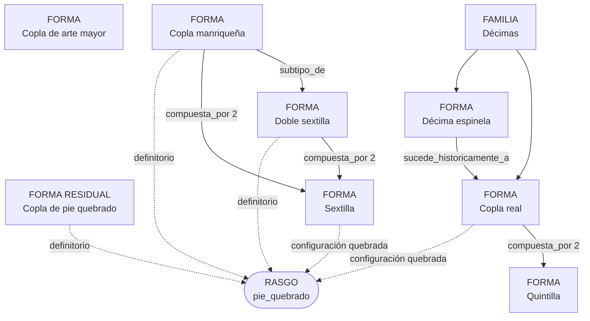

# Coplas y sextillas

Estado: revisado, con decisiones del proyecto por confirmar · 29 de julio de 2026

## Decisión general

«Copla» no constituye por sí sola una familia métrica. Tampoco se mantiene una familia
«coplas de pie quebrado». El catálogo separa:

- identidades métricas, representadas como formas;
- realizaciones admitidas de una forma, representadas como configuraciones;
- esquemas concretos, representados como patrones;
- propiedades compartidas, representadas como rasgos;
- taxonomía entre formas, expresada con `subtipo_de`;
- composición estructural, expresada con `compuesta_por`.

Las formas resultantes son:

- `copla_de_arte_mayor`;
- `copla_de_pie_quebrado`, como salida residual;
- `copla_real`;
- `sextilla`;
- `doble_sextilla`;
- `copla_manriqueña`.

`pie_quebrado` es además un rasgo transversal reutilizado por todas las configuraciones
que incorporan versos más breves que su medida dominante.

## Del vocabulario jerárquico al catálogo

La jerarquía anterior mezclaba formas, configuraciones y patrones dentro de una única
relación padre–hija:

```text
copla_de_arte_mayor
├── copla_de_arte_mayor_tipo_1_ABBAACCA
├── copla_de_arte_mayor_tipo_2_ABBACDCD
└── copla_de_arte_mayor_tipo_3_ABABCDCD

copla_de_pie_quebrado
└── sin hijos

copla_real
├── copla_real_sin_quebrado
└── copla_real_de_pie_quebrado

doble_sextilla
├── copla_manriqueña
└── doble_sextilla_alternativa

sextilla
├── sextilla_sin_quebrado
└── sextilla_de_pie_quebrado
```

| Entrada anterior | Función anterior | Destino actual |
| --- | --- | --- |
| `copla_de_arte_mayor` | Padre | Forma `copla_de_arte_mayor` |
| `copla_de_arte_mayor_tipo_1_ABBAACCA` | Hija | Patrón de rima `ABBAACCA` |
| `copla_de_arte_mayor_tipo_2_ABBACDCD` | Hija | Patrón de rima `ABBACDCD` |
| `copla_de_arte_mayor_tipo_3_ABABCDCD` | Hija | Patrón de rima `ABABCDCD` |
| `copla_de_pie_quebrado` | Raíz sin hijos | Forma residual `copla_de_pie_quebrado` |
| `copla_real` | Padre | Forma `copla_real` |
| `copla_real_sin_quebrado` | Hija | Configuración `sin_pie_quebrado` |
| `copla_real_de_pie_quebrado` | Hija | Configuración `con_pie_quebrado` + rasgo |
| `doble_sextilla` | Padre | Forma `doble_sextilla` |
| `doble_sextilla_alternativa` | Hija | Configuración `otro_esquema_regular` |
| `copla_manriqueña` | Hija | Forma propia, subtipo de doble sextilla |
| `sextilla` | Padre | Forma `sextilla` |
| `sextilla_sin_quebrado` | Hija | Configuración `isometrica` |
| `sextilla_de_pie_quebrado` | Hija | Configuración `pie_quebrado_884884` + rasgo |

Los UUID de las antiguas hijas se conservan como `origen_termino_id` de sus
configuraciones o patrones. Esto permitirá migrar en el futuro las declaraciones reales
sin depender de los nombres.

## Grafo actual



No existe ninguna relación directa entre `copla_de_pie_quebrado` y las otras formas.
Compartir `pie_quebrado` no significa ser subtipo de la forma residual. La relación
genérica `copla_real relacionada_con quintilla` también se ha eliminado: queda solo
`compuesta_por 2`, que expresa la conexión con precisión.

## Formas y configuraciones

| Forma | Configuración | Metro | Rima | Estructura |
| --- | --- | --- | --- | --- |
| Copla de arte mayor | `ocho_dodecasilabos_compuestos` | 8 × `6 + 6` | consonante; tres esquemas admitidos | 4 + 4 |
| Copla de pie quebrado | `variable_5_12` | 8 dominante + quebrados de menos de 8 | consonante, distribución variable | unidades de 5–12 |
| Copla real | `sin_pie_quebrado` | 10 × 8 | consonante; esquema de cada quintilla | 5 + 5 |
| Copla real | `con_pie_quebrado` | 1–2 posiciones de 4; resto de 8 | consonante; esquema de cada quintilla | 5 + 5 |
| Sextilla | `isometrica` | 6 × 6, 6 × 7 o 6 × 8 | consonante, distribución variable | 6 |
| Sextilla | `pie_quebrado_884884` | `8-8-4-8-8-4` | consonante, distribución variable | 3 + 3 |
| Doble sextilla | `otro_esquema_regular` | `8-8-4-8-8-4` × 2 | regular, distinta de `abcabc:defdef` | 6 + 6 |
| Copla manriqueña | `dos_sextillas_abcabc_defdef` | `8-8-4-8-8-4` × 2 | `abcabc:defdef` | 6 + 6 |

La copla de arte mayor conserva los esquemas `ABBAACCA`, `ABBACDCD` y `ABABCDCD`
declarados por el proyecto. Su modelo de verso `6 + 6` referencia también el metro
normalizado de doce sílabas: filtros y demarcador pueden encontrarla como dodecasílaba,
mientras los segmentos conservan su estructura compuesta.

## Relaciones tipadas

| Origen | Relación | Destino | Cantidad | Significado |
| --- | --- | --- | ---: | --- |
| `copla_manriqueña` | `subtipo_de` | `doble_sextilla` | — | Identidad específica dentro de las dobles sextillas |
| `doble_sextilla` | `compuesta_por` | `sextilla` | 2 | Dos sextillas sucesivas |
| `copla_manriqueña` | `compuesta_por` | `sextilla` | 2 | Dos sextillas quebradas con rimas independientes |
| `copla_real` | `compuesta_por` | `quintilla` | 2 | Dos quintillas separadas por la pausa 5 + 5 |
| `decima_espinela` | `sucede_historicamente_a` | `copla_real` | — | Sustitución progresiva como modalidad dominante de décima |

`subtipo_de` expresa taxonomía. `compuesta_por` expresa arquitectura y no convierte la
forma componente en padre taxonómico. La pertenencia común a `decimas` y la relación
histórica sustituyen el contraste genérico anterior; las diferencias `5 + 5` frente a
`4 + 2 + 4` ya se derivan de los datos. Véase [Décimas](./decimas.md).

## Uso del rasgo `pie_quebrado`

| Configuración | Uso |
| --- | --- |
| Copla de pie quebrado `variable_5_12` | Definitorio; se registran medida y posiciones |
| Copla real `con_pie_quebrado` | Definitorio; uno o dos tetrasílabos posicionales |
| Sextilla `pie_quebrado_884884` | Derivado del patrón fijo |
| Doble sextilla `otro_esquema_regular` | Derivado de las posiciones 3, 6, 9 y 12 |
| Copla manriqueña | Derivado de las posiciones 3, 6, 9 y 12 |
| Configuraciones sin quebrado | No se asigna |

El editor no activa manualmente este rasgo. Se deriva de la forma o configuración y solo
se solicitan los datos que concretan la realización observada.

## Registrador

- Copla de arte mayor: elegir uno de los tres esquemas de rima.
- Copla de pie quebrado residual: indicar para cada unidad su extensión de 5–12 versos,
  la medida o medidas de los quebrados y sus posiciones. Debe quedar al menos un
  octosílabo.
- Copla real: elegir si presenta pie quebrado; escoger independientemente el esquema de
  cada quintilla y, si corresponde, marcar una o dos posiciones tetrasílabas.
- Sextilla isométrica: elegir 6, 7 u 8 sílabas.
- Sextilla de pie quebrado: no requiere concretar el metro, pues deriva
  `8-8-4-8-8-4`.
- Doble sextilla: elegir la forma implica otro esquema regular no manriqueño.
- Copla manriqueña: forma, configuración, metro y rima son fijos.

Las ocho distribuciones reutilizadas por las dos quintillas de la copla real son
`ababa`, `abbab`, `abaab`, `aabab`, `aabba`, `abbaa`, `ababb` y `abbba`. Se eligen de
manera independiente: usar el mismo esquema en ambas no afirma que compartan timbres.

La extensión se valida por unidades: 8 versos para la copla de arte mayor, 10 para la
copla real, 6 para la sextilla, 12 para doble sextilla y manriqueña, y 5–12 en cada
copla residual de pie quebrado.

## Ejemplo de registro de una copla real

Copla real de los versos 41–50, con `abaab` en la primera quintilla, `ababb` en la
segunda y quebrados en las posiciones tercera y octava:

### `secuencias_metricas`

| secuencia_id | obra_id | v_ini | v_fin | forma_metrica_id |
| --- | --- | ---: | ---: | --- |
| `SEC-COR-1` | `OBRA-1` | 41 | 50 | `copla_real` |

### `secuencia_configuraciones`

| secuencia_id | configuracion_id |
| --- | --- |
| `SEC-COR-1` | `con_pie_quebrado` |

### `unidades_metricas`

| unidad_id | unidad_padre_id | seccion_id | orden | v_ini | v_fin |
| --- | --- | --- | ---: | ---: | ---: |
| `COR-1` | `NULL` | `copla_real` | 1 | 41 | 50 |
| `QUI-1` | `COR-1` | `primera_quintilla` | 2 | 41 | 45 |
| `QUI-2` | `COR-1` | `segunda_quintilla` | 3 | 46 | 50 |

### `secuencia_elecciones_metricas`

| unidad_id | grupo_eleccion_id | opcion_eleccion_id |
| --- | --- | --- |
| `COR-1` | `rima_primera_quintilla` | `abaab` |
| `COR-1` | `rima_segunda_quintilla` | `ababb` |
| `COR-1` | `posiciones_pie_quebrado` | `verso_3` |
| `COR-1` | `posiciones_pie_quebrado` | `verso_8` |

Las dos opciones posicionales referencian el metro tetrasílabo. Las demás posiciones se
derivan como octosílabas y `pie_quebrado` se deriva de la configuración.

## Demarcador

El demarcador puede distinguir:

1. seis, ocho, diez y doce versos;
2. isometría frente a combinaciones de octosílabos y pies quebrados;
3. copla real por su estructura `5 + 5`;
4. en doce versos, `abcabc:defdef` frente a otro esquema regular;
5. copla de arte mayor por ocho dodecasílabos compuestos `6 + 6`.

Las posiciones exactas de los quebrados y los esquemas internos de una copla real son
datos analíticos del registrador, no necesariamente las primeras preguntas del
demarcador. La salida residual no interviene en el cálculo ordinario de preguntas: solo
se ofrece cuando las respuestas descartan las formas tipificadas compatibles.

## Trazabilidad

- Las hijas antiguas de copla de arte mayor pasan a patrones de rima.
- Las hijas de copla real pasan a sus dos configuraciones.
- Las hijas de sextilla pasan a sus dos configuraciones.
- `doble_sextilla_alternativa` pasa a `otro_esquema_regular`.
- `copla_manriqueña` conserva identidad de forma y la relación `subtipo_de`.
- `copla_de_pie_quebrado` conserva su UUID como forma residual y se vincula con el rasgo
  transversal.

La formalización solo ha eliminado escenarios de prueba V2 asociados a configuraciones
reconstruidas. No se han modificado obras ni secuencias reales.

## Fuentes

José Domínguez Caparrós, *Métrica española* (UNED, 2014), pp. 196–201. Define la
sextilla como estrofa de seis versos de arte menor con rima consonante; caracteriza la
estrofa manriqueña como `8a 8b 4c 8a 8b 4c`; admite su consideración como unidad de doce
versos cuando el sentido enlaza dos sextillas, manteniendo distintas sus rimas; y
describe la copla de arte mayor como ocho versos distribuidos en dos cuartetos.

Maximiano Trapero, «La primera copla real en la poesía castellana», *Analecta
Malacitana*, 39.1-2 (2016-2017), pp. 27–61. Caracteriza la copla real por la doble
quintilla, la pausa `5 + 5`, la variabilidad de las rimas y la independencia estructural
de sus dos mitades.

María Victoria Utrera Torremocha, «Métrica y poética en “Nocturno yanqui”, de Luis
Cernuda», *Rhythmica*, 3-4 (2006), pp. 283–303. Documenta la relevancia de la posición
de los versos cortos en las formas de pie quebrado. No se utiliza para sustituir el
criterio del proyecto sobre la copla real.

## Dudas para el IP

1. ¿La sextilla de pie quebrado del proyecto es exactamente `8-8-4-8-8-4`?
2. ¿Las medidas 6, 7 y 8 de la sextilla isométrica forman un repertorio cerrado?
3. ¿`doble_sextilla` debe reservarse para cualquier esquema regular no manriqueño?
4. ¿Debe registrarse el esquema exacto de las dobles sextillas no manriqueñas?
5. ¿Los tres esquemas de copla de arte mayor son los reconocidos hasta ahora o un
   repertorio cerrado?
6. ¿Los quebrados de la copla real pueden ocupar cualquiera de sus diez posiciones?
7. ¿La copla real quebrada admite solo tetrasílabos o también pentasílabos?
8. ¿Los ocho esquemas de quintilla son el repertorio reconocido para ambas mitades?
9. ¿La configuración quebrada de la copla real es `admitida` o `canónica`?
10. ¿Copla de arte menor y copla castellana se incorporarán solo si aparecen en el
    corpus?
