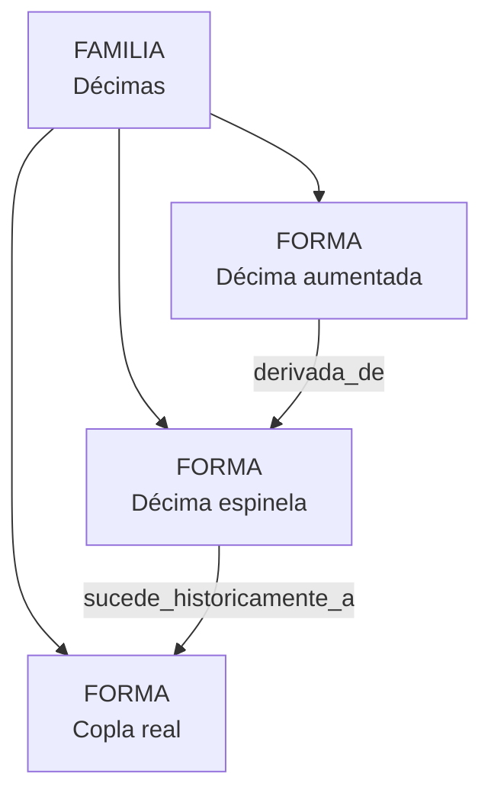

# Décimas

Estado: revisado y aplicado · **revisado de nuevo el 4 de agosto de 2026**

## Decisión vigente

Existe una forma **Décima** con dos arquitecturas:

| Arquitectura | Extensión | Esquema | Denominación |
| --- | ---: | --- | --- |
| **Espinela** · principal | 10 versos | `abba:accddc`, 4 + 2 + 4 | Décima espinela |
| **Aumentada** | 12 versos | `abba:accddeed`, 4 + 8 | Décima aumentada |

La **copla real** queda fuera: son también diez octosílabos consonantes, pero se articula en
5 + 5 y la pausa cae tras el quinto verso, no tras el cuarto. Esa pausa es lo que las separa,
así que la definición de la décima lleva la articulación y no solo la medida.

No se crea arquitectura genérica: en el corpus no hay ninguna décima de diez versos que no
sea espinela. Si aparece una —la décima antigua, la italiana—, se añade entonces.

## Por qué se revisó la decisión anterior

La decisión del 1 de agosto retiraba `decima` y dejaba la espinela y la aumentada como formas
fijas, agrupadas en una familia no seleccionable. Se apoyaba en un hecho cierto: la raíz
`decima` duplicaba la definición y el patrón de la espinela. Comprobado en la base, son
literalmente el mismo texto, el mismo `abbaaccddc` y el mismo tamaño 10, y cada término
declara al otro en `equivalencias`.

Pero de ese hecho no se sigue que la décima no sea una forma. Se sigue que **la raíz vieja
era la espinela**: no había una décima genérica que retirar, había un duplicado.

Y la aumentada había salido fuera por un obstáculo que ya no existe. Doce versos no cabían en
una forma de diez cuando la extensión era de la forma; hoy la declara la arquitectura
—`unidad_versos_min` y `unidad_versos_max`—, y hay precedente en producción: la redondilla,
de cuatro versos, aloja «Doble enlazada», de ocho.

Las familias, además, dejaron de existir en la revisión de la ontología del 30 de julio, así
que la solución anterior ya no era aplicable tal cual.

Lo que no cambia: lo que une a la décima y la copla real son relaciones tipadas
—`sucede_historicamente_a`, `derivada_de`—, no una pertenencia.

## Del vocabulario jerárquico al catálogo

```text
decima
├── decima_espinela
└── decima_aumentada
```

| Entrada anterior | Función anterior | Destino actual |
| --- | --- | --- |
| `decima` | Raíz con los mismos datos que la espinela | Familia `decimas` |
| `decima_espinela` | Hija | Forma `decima_espinela` |
| `decima_aumentada` | Hija | Forma `decima_aumentada` |
| `copla_real` | Raíz independiente | Forma perteneciente también a `decimas` |

Los UUID anteriores se conservan como trazabilidad. Las declaraciones reales de las
obras no se migran todavía.

## Grafo



La relación histórica indica sustitución progresiva en el uso. No afirma que Vicente
Espinel inventara por sí solo la estrofa ni que la espinela proceda exclusivamente de
una única forma anterior.

## Formalización

| Forma | Configuración | Metro | Rima | Estructura |
| --- | --- | --- | --- | --- |
| Copla real | Véase su revisión propia | arte menor; con o sin quebrados | dos esquemas de quintilla | `5 + 5` |
| Décima espinela | `octosilabica` | 10 × 8 | consonante `abbaaccddc` | `4 + 2 + 4` |
| Décima aumentada | `octosilabica` | 12 × 8 | consonante `abbaaccddeed` | `4 + 8` |

En la espinela, los bloques normalizados son:

1. primera redondilla: `abba`;
2. enlace: `ac`;
3. segunda redondilla: `cddc`.

En la aumentada solo se formaliza la pausa documentada tras `abba`: primer bloque de
cuatro versos y continuación de ocho. No se le impone la subdivisión `4 + 2 + 6`,
porque esa lectura no está declarada en los datos del proyecto. Metro y rima se guardan
por posiciones, por lo que el demarcador y los filtros no dependen de interpretar la
prosa.

## Registrador

Ninguna de las dos formas necesita preguntas propias:

- al elegir décima espinela se derivan diez octosílabos, consonancia,
  `abbaaccddc` y `4 + 2 + 4`;
- al elegir décima aumentada se derivan doce octosílabos, consonancia,
  `abbaaccddeed` y pausa `4 + 8`;
- el editor solo añade desviaciones cuando la realización no cumple la norma elegida.

La validación exige rangos múltiplos de 10 para la espinela y de 12 para la aumentada.
Una secuencia de varias estrofas no obliga a responder una vez por estrofa porque no
hay alternativas normativas que distinguir.

## Demarcador

La familia no participa como resultado seleccionable. Las formas se separan por:

- extensión: 10, 12 o 10 con articulación `5 + 5`;
- patrón de rima;
- estructura interna;
- metro y presencia de pie quebrado cuando corresponda.

La distinción se regenera desde el catálogo. No se codifican preguntas manuales
específicas para estas formas.

## Fuentes

- Maximiano Trapero, *Origen y triunfo de la décima: revisión de un tópico de cuatro
  siglos y noticias de nuevas, primeras e inéditas décimas*, Universitat de València,
  2015.
- Maximiano Trapero, «La primera copla real en la poesía castellana», *Analecta
  Malacitana*, 39.1-2 (2016-2017), pp. 27-61.
- S. Griswold Morley y Courtney Bruerton, *Cronología de las comedias de Lope de
  Vega*, Madrid, Gredos, 1968, p. 38.

La bibliografía ayuda a ordenar la historia y confirma que la aumentada no debe
tratarse como defecto. La definición especializada del proyecto sigue gobernando los
patrones admitidos para su corpus.

## Para confirmar con el IP

1. ¿La familia debe limitarse por ahora a estas tres formas?
2. ¿Se mantiene «Décima aumentada» como nombre público preferente?
3. ¿La descripción pública de la espinela debe conservar literalmente la fórmula
   «dos redondillas enlazadas por dos versos puente»?
