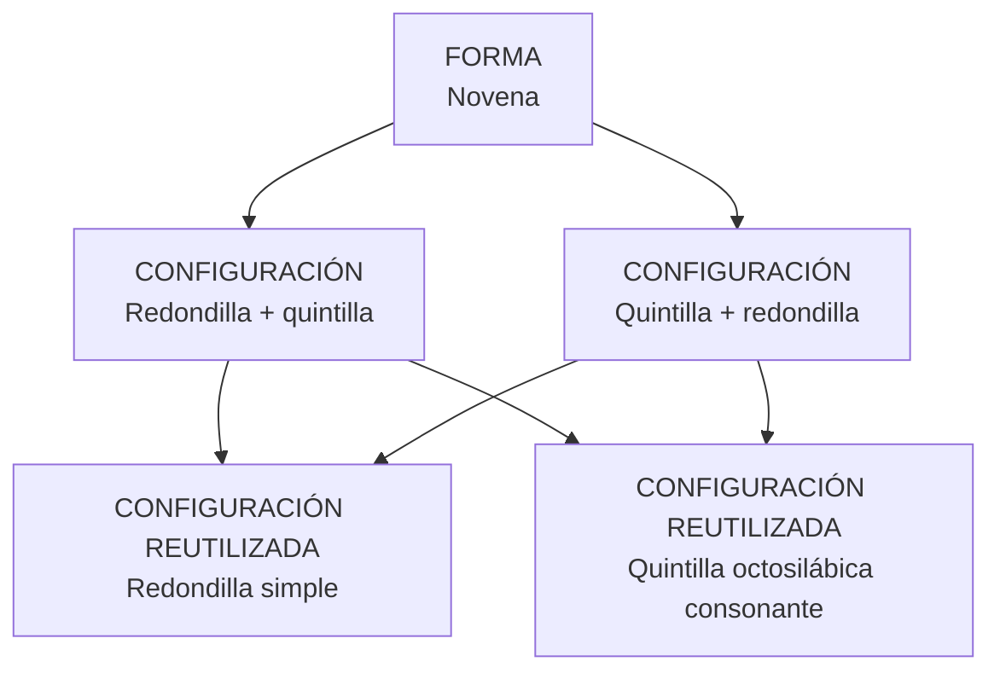

# Novena

Estado: revisada, pendiente de precisiones del IP · 1 de agosto de 2026

## Decisión

Una forma y dos configuraciones estructurales:

- `redondilla_quintilla`: cuatro versos y cinco versos;
- `quintilla_redondilla`: cinco versos y cuatro versos.

El catálogo adopta el alcance del proyecto: nueve octosílabos consonantes. La
bibliografía usa también *novena* para otras estrofas de nueve versos, pero esas
realizaciones no se incorporan sin decisión del IP o evidencia del corpus.

## Formalización



Ambas configuraciones fijan nueve posiciones octosilábicas y la rima consonante. El
orden de las secciones es estructural y diferencia las configuraciones.

## Reutilización

`estructuras_secciones.configuracion_referenciada_id` declara que una sección realiza
otra configuración ya formalizada. La novena no copia los esquemas:

- la sección redondilla referencia `redondilla.simple` y ofrece `abba` o `abab`;
- la sección quintilla referencia `quintilla.octosilabica_consonante` y ofrece las ocho
  variedades reconocidas por el proyecto.

Las opciones guardadas apuntan a los mismos `esquemas_rima`. Un cambio aprobado en esos
repertorios se propaga a las formas compuestas que los reutilizan.

## Registrador

El editor elige una vez el orden de las partes. El rango debe ser múltiplo de nueve y
genera automáticamente una unidad completa por cada novena, con sus dos secciones.

En cada unidad se registran:

1. el esquema de la redondilla;
2. el esquema de la quintilla.

Las respuestas pueden aplicarse a toda la tirada y después corregirse solo en las
unidades que cambien. Medida, consonancia, extensión y orden no se vuelven a preguntar.

## Demarcador

La forma se reconoce por nueve octosílabos consonantes. Para distinguir sus dos
configuraciones, el demarcador pregunta el orden observable de las partes:
«Redondilla + Quintilla» o «Quintilla + Redondilla». Los esquemas internos sirven para
describir y analizar la secuencia, no para crear nuevas formas.

## Trazabilidad

```text
novena
├── novena_canonica  → CONFIGURACIÓN redondilla_quintilla
└── novena_invertida → CONFIGURACIÓN quintilla_redondilla
```

Los UUID anteriores se conservan en `origen_termino_id`.

## Fuente

José Domínguez Caparrós, *Métrica española*, Madrid, UNED, 2014, p. 204: explica que
*novena* designa en general una estrofa de nueve versos y documenta la unión de
redondilla y quintilla. La restricción a octosílabos consonantes y la admisión expresa
del orden inverso proceden del criterio ya estructurado por el proyecto.

## Dudas para el IP

1. ¿Las rimas de redondilla y quintilla son siempre independientes o debe registrarse
   también que alguna clase de rima continúa entre ambas secciones?
2. ¿Las ocho variedades actuales de quintilla son el repertorio que debe ofrecerse
   dentro de toda novena?
3. ¿Se excluyen deliberadamente otras estrofas de nueve versos o se incorporarán solo
   cuando aparezcan en el corpus?
