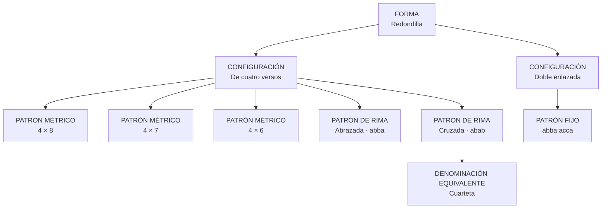

# Redondilla

Estado: revisado con decisiones del proyecto · 29 de julio de 2026

## Decisión

El catálogo contiene una única forma seleccionable, `redondilla`, con dos
configuraciones estructurales:

- `simple`: una unidad repetible de cuatro versos;
- `doble_enlazada`: una unidad repetible de ocho versos formada por dos redondillas
  abrazadas que comparten la rima exterior.

La configuración simple admite:

- patrones métricos de 8, 7 o 6 sílabas;
- patrón de rima abrazado `abba`;
- patrón de rima cruzado `abab`.

«Cuarteta» es una denominación equivalente del patrón cruzado, no una forma ni una
configuración independiente.

## Del vocabulario jerárquico al catálogo

```text
redondilla                         → FORMA Redondilla
├── redondilla_regular            → CONFIGURACIÓN simple
├── redondilla_cruzada            → PATRÓN DE RIMA cruzado abab
├── redondilla_hexasilaba         → PATRÓN MÉTRICO 4 × 6
├── redondilla_heptasilaba        → PATRÓN MÉTRICO 4 × 7
└── redondilla_doble_abbaacca     → CONFIGURACIÓN doble enlazada
```

| Entrada anterior | Destino actual |
| --- | --- |
| `redondilla` | Forma `redondilla` |
| `redondilla_regular` | Configuración `simple` |
| `redondilla_cruzada` | Patrón de rima `cruzada`, esquema `abab` |
| `redondilla_heptasilaba` | Patrón métrico de cuatro heptasílabos |
| `redondilla_hexasilaba` | Patrón métrico de cuatro hexasílabos |
| `redondilla_doble_abbaacca` | Configuración `doble_enlazada` |

La asociación errónea de `redondilla_hexasilaba` con el metro heptasílabo permanece
corregida en el vocabulario legado. Los UUID anteriores se conservan en la traza de
migración siempre que el tipo de entidad lo permite.

## Grafo



No se crea una familia `redondillas`: cuatro versos es una propiedad estructural
consultable, no una familia, y todas estas realizaciones pertenecen a la misma forma.

## Configuración simple

| Dimensión | Posibilidades |
| --- | --- |
| Extensión de la unidad | 4 versos |
| Medida | 8, 7 o 6 sílabas |
| Tipo de rima | consonante |
| Distribución | abrazada `abba` o cruzada `abab` |
| Repetición | una o más unidades |

Los patrones métricos y de rima son dimensiones independientes: cualquiera de las tres
medidas puede combinarse con cualquiera de las dos distribuciones.

En el registrador, ambas preguntas se responden por unidad. El editor puede aplicar la
respuesta de la primera redondilla a toda la tirada y cambiar solo las unidades que
difieran. Una realización admitida distinta no se registra como desviación.

## Configuración doble enlazada

La configuración doble cambia la arquitectura y por eso no es un tercer patrón de rima
de la configuración simple:

```text
unidad de 8 versos
├── primera redondilla:  a b b a
└── segunda redondilla:  a c c a
```

El patrón `abbaacca` se formaliza en dos bloques. Los enlaces declaran que las
posiciones exteriores de ambos bloques comparten la clase `a`. La división interna se
deriva de esas posiciones; no se duplican subunidades en cada registro cuando el editor
no necesita caracterizarlas por separado.

## Cómo se registra una tirada

### Doce redondillas simples

```text
SECUENCIA
forma: Redondilla
configuración: De cuatro versos
rango: 1–48

UNIDADES DERIVADAS
1:  versos 1–4
2:  versos 5–8
...
12: versos 45–48
```

Cada unidad guarda su elección de medida y disposición. Si todas coinciden, la interfaz
permite aplicar las dos respuestas a la tirada completa.

### Seis redondillas dobles

```text
SECUENCIA
forma: Redondilla
configuración: Doble enlazada
rango: 1–48

UNIDADES DERIVADAS
1: versos 1–8
2: versos 9–16
...
6: versos 41–48
```

La primera configuración exige múltiplos de 4; la doble, múltiplos de 8. Un rango
incompatible se rechaza para que el editor revise la delimitación, la fuente o una
posible laguna.

## Denominaciones métricas

`denominaciones_metricas` sustituye el alcance limitado de `forma_aliases`. Cada nombre
apunta exactamente a una sola entidad: forma, configuración, patrón métrico, patrón de
rima, sección o patrón de repetición.

En este caso:

```text
Cuarteta
└── patrón de rima Cruzada · abab
    └── configuración De cuatro versos
        └── forma Redondilla
```

Buscar «Cuarteta» puede conducir a esa realización concreta sin crear una forma falsa ni
aplicar el nombre a las redondillas abrazadas.

## Demarcador

El demarcador obtiene dos candidatos estructurales de la forma:

- redondilla de cuatro versos: medidas admitidas 6, 7 y 8; rima `abba` o `abab`;
- redondilla doble enlazada: ocho octosílabos y `abbaacca`.

Dentro de la configuración simple puede preguntar medida y distribución de la rima. En
el registrador de secuencias, esas mismas posibilidades se guardan como elecciones
normalizadas por unidad.

## Fuentes

- José Domínguez Caparrós, *Diccionario de métrica española*, 3.ª ed., Madrid,
  Alianza Editorial, 2016, voces «redondilla» y «cuarteta».
- Rudolf Baehr, *Manual de versificación española*, Madrid, Gredos, 1970.
- Daniel Devoto, «De la redondilla y su familia», *Boletín de la Real Academia
  Española*, 63 (1983), pp. 475-482.

La bibliografía documenta usos terminológicos distintos. La organización ontológica
expresa el criterio adoptado por el proyecto y conserva las fuentes en las entidades
concretas que sustentan.
