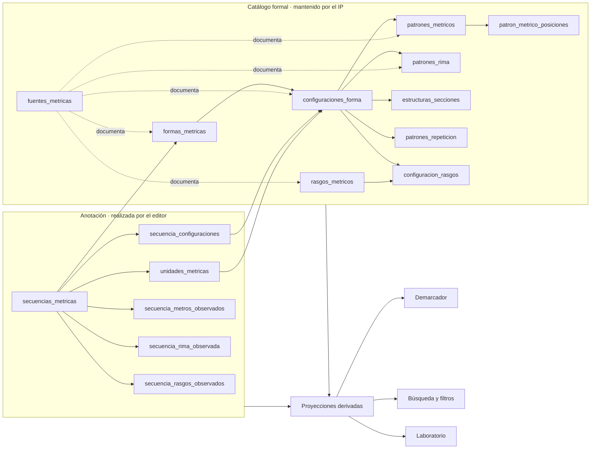
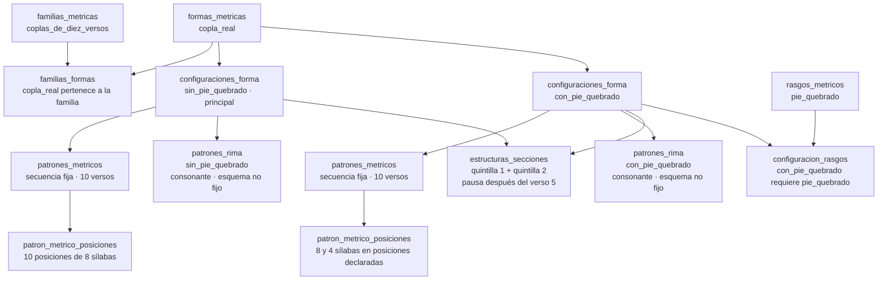
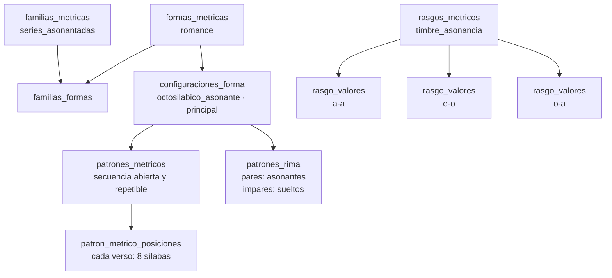
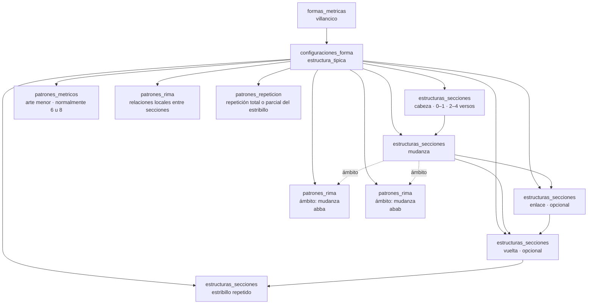
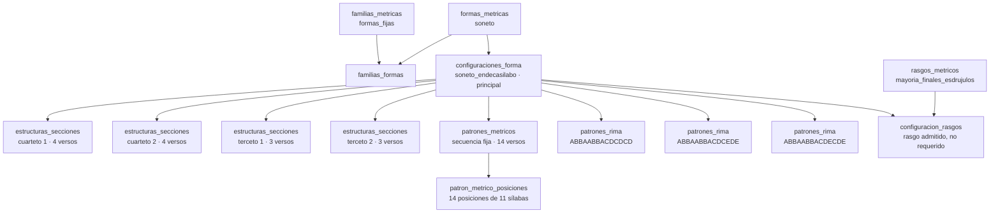
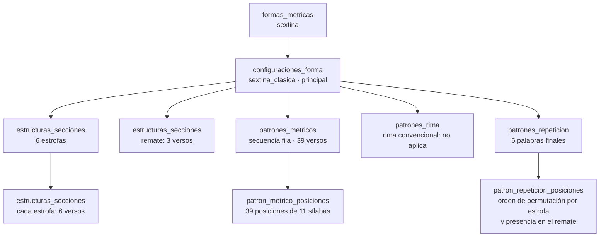
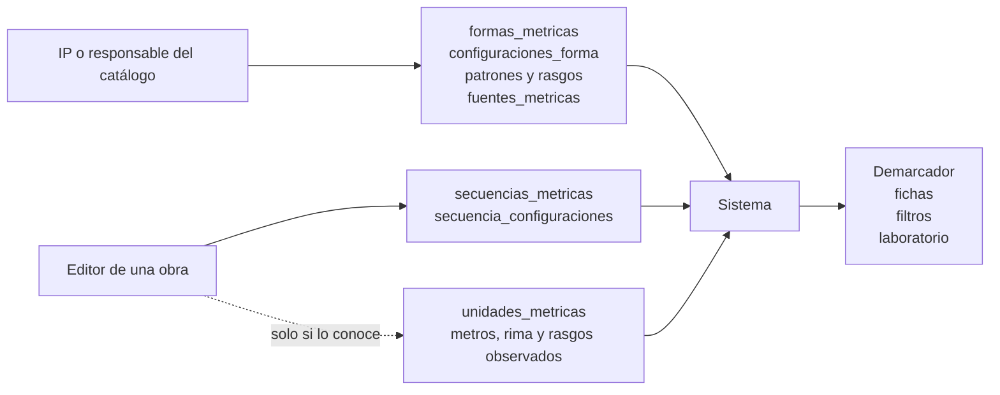

# Ejemplos de formalización con la ontología métrica

Fecha: 28 de julio de 2026

Estado: documento explicativo del modelo propuesto

Documentos relacionados:

- [Propuesta conceptual](./propuesta-dominio-metrica.md)
- [Arquitectura del dominio métrico](./arquitectura-dominio-metrica.md)
- [Matriz de reclasificación](./matriz-reclasificacion-formas-metricas.md)

## 1. Propósito

Este documento muestra cómo se caracterizarán diferentes formas métricas mediante las tablas del dominio. Los ejemplos separan:

1. la definición estable mantenida por el IP;
2. la caracterización de una secuencia realizada por el editor;
3. los datos derivados para demarcación, búsqueda y análisis.

La riqueza del catálogo no implica que el editor tenga que rellenar todas sus tablas. El editor selecciona una forma y, cuando lo sabe, una configuración o una observación adicional. La definición estructurada de la forma ya está disponible en el catálogo.

## 2. Tablas y responsabilidades

### Catálogo formal

Estas tablas definen la ontología y son mantenidas por el IP o por responsables autorizados:

| Tabla | Función |
| --- | --- |
| `formas_metricas` | Identidades métricas asignables. |
| `familias_metricas` | Agrupaciones organizativas no asignables. |
| `familias_formas` | Pertenencia de formas a familias. |
| `forma_aliases` | Nombres alternativos. |
| `forma_relaciones` | Relaciones tipadas entre formas. |
| `configuraciones_forma` | Realizaciones estructurales admitidas por una forma. |
| `patrones_metricos` | Tipo, alcance y longitud de los patrones de medida. |
| `patron_metrico_posiciones` | Medida ordenada de cada posición. |
| `patrones_rima` | Régimen, esquema, alcance y fijeza de la rima. |
| `estructuras_secciones` | Partes internas y repeticiones de una forma compuesta. |
| `patrones_repeticion` | Repetición de palabras, versos, estribillos o secciones. |
| `patron_repeticion_posiciones` | Orden y correspondencias de una repetición. |
| `rasgos_metricos` | Propiedades transversales. |
| `rasgo_valores` | Valores controlados de un rasgo. |
| `configuracion_rasgos` | Rasgos requeridos, admitidos, preferentes o excluidos. |
| `fuentes_metricas` | Fuentes bibliográficas normalizadas. |

### Anotación editorial

Estas tablas describen una obra concreta:

| Tabla | Función |
| --- | --- |
| `secuencias_metricas` | Rango de la secuencia y forma identificada. |
| `secuencia_configuraciones` | Configuración reconocida en la secuencia. |
| `unidades_metricas` | Unidades internas y sus rangos. |
| `secuencia_metros_observados` | Medidas constatadas en la obra. |
| `secuencia_rima_observada` | Régimen, patrón o timbre constatado. |
| `secuencia_rasgos_observados` | Rasgos adicionales constatados. |

### Datos derivados

El sistema combina catálogo y anotación para generar:

- candidatas y preguntas del demarcador;
- facetas de forma, metro, rima, configuración y rasgo;
- perfiles métricos de obras y autores;
- representaciones estructuradas para fichas;
- advertencias de coherencia para los editores.

## 3. Esquema general

## 4. Copla real

### Definición ontológica

### Ejemplo de secuencia

Supongamos una secuencia de diez versos con el patrón observado:

`8, 8, 4, 8, 8 | 8, 8, 4, 8, 8`

| Tabla | Registro conceptual |
| --- | --- |
| `secuencias_metricas` | Rango de diez versos y `forma_metrica_id = copla_real`. |
| `secuencia_configuraciones` | `configuracion_id = con_pie_quebrado`. |
| `secuencia_metros_observados` | Patrón observado con medidas 8 y 4. |
| `secuencia_rasgos_observados` | Opcional: pie quebrado constatado expresamente. |

El rasgo pie quebrado ya puede inferirse de la configuración. Solo se registra también como observación si interesa conservar que fue comprobado directamente.

### Interacción del editor

| Nivel | Acción |
| --- | --- |
| Mínimo | Seleccionar “Copla real”. |
| Recomendado | Indicar “Con pie quebrado”. |
| Avanzado | Registrar la secuencia exacta de medidas. |

### Utilidad

- El demarcador compara dos configuraciones completas sin descartar la forma por aparecer tetrasílabos.
- La búsqueda puede combinar forma `copla_real`, metro 4 y rasgo pie quebrado.
- El perfil general sigue contando una sola forma: copla real.

## 5. Romance

### Definición ontológica

### Ejemplo de secuencia

Una serie octosilábica presenta asonancia `e-o` en los versos pares.

| Tabla | Registro conceptual |
| --- | --- |
| `secuencias_metricas` | Rango de la serie y `forma_metrica_id = romance`. |
| `secuencia_configuraciones` | Puede omitirse si solo existe una configuración principal inequívoca. |
| `secuencia_rima_observada` | Régimen asonante, pares rimados y `timbre_asonancia = e-o`. |
| `secuencia_metros_observados` | Opcional: octosílabos comprobados. |

### Interacción del editor

| Nivel | Acción |
| --- | --- |
| Mínimo | Seleccionar “Romance”. |
| Recomendado | Ninguna acción adicional. |
| Avanzado | Registrar el timbre de asonancia, si se conoce. |

### Utilidad

- El demarcador usa metro, extensión y régimen de rima, pero no exige el timbre.
- El buscador puede ofrecer `e-o` como faceta avanzada.
- Todos los timbres pertenecen a la misma forma y pueden estudiarse como una dimensión independiente.

## 6. Villancico

### Definición ontológica

### Ejemplo de secuencia

Un villancico presenta cabeza de tres versos, mudanza octosilábica `abba`, vuelta y repetición del estribillo.

| Tabla | Registro conceptual |
| --- | --- |
| `secuencias_metricas` | Rango completo y `forma_metrica_id = villancico`. |
| `secuencia_configuraciones` | `configuracion_id = estructura_tipica`. |
| `unidades_metricas` | Rangos de cabeza, mudanza, vuelta y estribillo. |
| `secuencia_metros_observados` | Octosílabos en la mudanza. |
| `secuencia_rima_observada` | Esquema `abba` en el rango de la mudanza. |

### Interacción del editor

| Nivel | Acción |
| --- | --- |
| Mínimo | Seleccionar “Villancico”. |
| Recomendado | Ninguna acción adicional. |
| Avanzado | Abrir “Describir estructura interna” y delimitar sus secciones. |

### Utilidad

- La ficha puede representar la arquitectura real de la composición.
- El buscador puede localizar villancicos con mudanza en redondilla o con determinada medida.
- El demarcador pregunta por estribillo, mudanza y vuelta solo cuando esas preguntas ayudan.

## 7. Soneto

### Definición ontológica

### Ejemplo de secuencia

Un soneto endecasílabo presenta el esquema `ABBAABBACDCEDE` y mayoría de finales esdrújulos.

| Tabla | Registro conceptual |
| --- | --- |
| `secuencias_metricas` | Rango de 14 versos y `forma_metrica_id = soneto`. |
| `secuencia_configuraciones` | Configuración endecasílaba principal. |
| `secuencia_rima_observada` | Referencia al patrón `ABBAABBACDCEDE`. |
| `secuencia_rasgos_observados` | Mayoría de finales esdrújulos. |
| `unidades_metricas` | Opcional: dos cuartetos y dos tercetos con sus rangos. |

### Interacción del editor

| Nivel | Acción |
| --- | --- |
| Mínimo | Seleccionar “Soneto”. |
| Recomendado | Ninguna acción adicional para el soneto prototípico. |
| Avanzado | Elegir esquema de tercetos y registrar rasgos prosódicos. |

### Utilidad

- Los esquemas de tercetos se comparan sin multiplicar el número de formas.
- El rasgo esdrújulo puede cruzarse con otras formas métricas.
- El demarcador identifica el soneto por su estructura básica antes de preguntar por el esquema exacto.

## 8. Sextina

### Definición ontológica

### Ejemplo de secuencia

Una sextina conserva seis palabras finales, las permuta a lo largo de seis estrofas y las recupera en el remate.

| Tabla | Registro conceptual |
| --- | --- |
| `secuencias_metricas` | Rango completo y `forma_metrica_id = sextina`. |
| `secuencia_configuraciones` | `configuracion_id = sextina_clasica`. |
| `unidades_metricas` | Seis estrofas y un remate con sus rangos. |
| `secuencia_metros_observados` | Endecasílabos, si se desea registrar su comprobación. |
| `secuencia_rima_observada` | No se crea una falsa rima; el régimen es no aplicable. |

Las palabras concretas pertenecen a la realización de la obra. Podrán almacenarse como valores observados del patrón de repetición cuando se defina ese nivel de edición.

### Interacción del editor

| Nivel | Acción |
| --- | --- |
| Mínimo | Seleccionar “Sextina”. |
| Recomendado | Ninguna acción adicional. |
| Avanzado | Delimitar estrofas y remate o registrar las palabras finales. |

### Utilidad

- La forma se describe sin forzarla dentro de un patrón de rima convencional.
- La ficha puede mostrar 6 × 6 + 3.
- El demarcador puede preguntar por la permutación de palabras finales cuando las demás respuestas todavía dejan varias candidatas.

## 9. Qué escribe cada persona

El IP formaliza una vez las propiedades generales. El editor identifica la forma de una secuencia y añade únicamente la información específica de esa obra que conoce y considera útil.

## 10. Regla de diseño de la interfaz

Para cualquier forma:

1. **Siempre visible:** rango y forma.
2. **Pregunta contextual:** configuración, solo cuando diferencia alternativas relevantes.
3. **Detalle desplegable:** unidades, patrón exacto y rasgos observados.
4. **No determinado:** disponible siempre que el dato no sea imprescindible.
5. **Datos derivados:** no se vuelven a pedir al editor.

La ontología aumenta la precisión y la reutilización de los datos, pero la interfaz aplica divulgación progresiva para mantener una edición breve.
